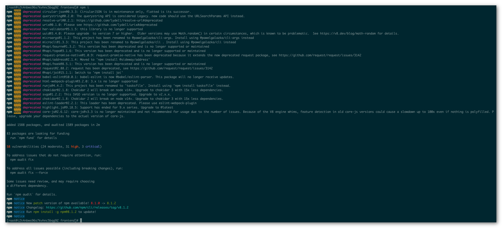
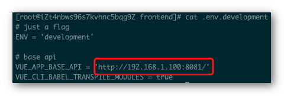
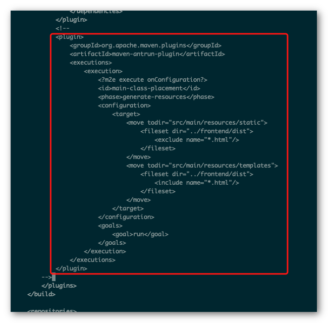

!!! Abstract ""
	**本文以 CentOS 8.3 为例，举例说明如何以源码的形式编译 DataEase 工程，并进行前后端分离部署。**  
	本文所有操作均在阿里云（新加坡区）4C8G 环境中执行。

## 工具准备

### 1.安装 Git 和 jdk 11

!!! Abstract ""
	```shell
	yum install -y git java-1.8.0-openjdk*
	```

### 2.安装配置 Maven

!!! Abstract ""
	```shell
	# 下载并安装 Maven
	wget https://dlcdn.apache.org/maven/maven-3/3.8.4/binaries/apache-maven-3.8.4-bin.tar.gz
	
	tar zxvf apache-maven-3.8.4-bin.tar.gz
	
	mv apache-maven-3.8.4 /opt
	
	echo "export M2_HOME=/opt/apache-maven-3.8.4" >> ~/.bashrc
	
	echo "export PATH=\$PATH:\$M2_HOME/bin" >> ~/.bashrc
	
	source ~/.bashrc
	```
    默认安装 Maven 后，在 Maven 安装目录中有配置文件 settings.xml，**该文件中默认开启了 mirror，可以将该 mirror 设置注释掉：**
	```xml
		<mirror>
		  <id>maven-default-http-blocker</id>
		  <mirrorOf>external:http:*</mirrorOf>
		  <name>Pseudo repository to mirror external repositories initially using HTTP.</name>
		  <url>http://0.0.0.0/</url>
		  <blocked>true</blocked>
		</mirror>
	```

### 3.安装配置 nodejs

!!! Abstract ""
	```shell
	wget https://nodejs.org/dist/v16.13.0/node-v16.13.0-linux-x64.tar.xz
	
	tar xvf node-v16.13.0-linux-x64.tar.xz
	
	mv node-v16.13.0-linux-x64 /opt
	
	echo "export PATH=\$PATH:/opt/node-v16.13.0-linux-x64/bin" >> ~/.bashrc
	
	source ~/.bashrc
	```

## 配置及环境准备

### 1.操作系统参数设置

!!! Abstract ""
	增加系统监听文件数量：
	```shell
	echo fs.inotify.max_user_watches=524288 | sudo tee -a /etc/sysctl.conf && sudo sysctl -p
	```

### 2.MySQL 配置

!!! Abstract ""
	以下是推荐的 MySQL 配置：
	```inf
	[mysqld]
	datadir=/var/lib/mysql
	default-storage-engine=INNODB
	character_set_server=utf8
	lower_case_table_names=1
	table_open_cache=128
	max_connections=2000
	max_connect_errors=6000
	innodb_file_per_table=1
	innodb_buffer_pool_size=1G
	max_allowed_packet=64M
	transaction_isolation=READ-COMMITTED
	innodb_flush_method=O_DIRECT
	innodb_lock_wait_timeout=1800
	innodb_flush_log_at_trx_commit=0
	sync_binlog=0
	group_concat_max_len=1024000
	sql_mode=STRICT_TRANS_TABLES,NO_ZERO_IN_DATE,NO_ZERO_DATE,ERROR_FOR_DIVISION_BY_ZERO,NO_AUTO_CREATE_USER,NO_ENGINE_SUBSTITUTION
	skip-name-resolve
	```

	**特别注意以下几个参数的设置：**
	```
	character_set_server=utf8
	lower_case_table_names=1
	group_concat_max_len=1024000
	```

### 3.创建 MySQL 数据库

!!! Abstract ""
	登录要连接的 MySQL 服务器，创建 DataEase 运行时使用的数据库，此处示例数据库名为 dataease-wei。

	```mysql
	CREATE DATABASE `dataease-wei` DEFAULT CHARACTER SET utf8mb4 COLLATE utf8mb4_general_ci;
	```

### 4.创建 DataEase 配置文件及日志相关

!!! Abstract ""
	```shell
	mkdir -p /opt/dataease/conf
	mkdir -p /opt/dataease/logs
	
	# 添加 DataEase 运行配置文件，除了 MySQL 连接信息必须正确外，Kettle 和 Doris 如不用的话，相关信息可不修改
	cat <<EOF>> /opt/dataease/conf/dataease.properties
	# 数据库配置
	spring.datasource.url=jdbc:mysql://192.168.1.100:3306/dataease-wei?autoReconnect=false&useUnicode=true&characterEncoding=UTF-8&characterSetResults=UTF-8&zeroDateTimeBehavior=convertToNull&useSSL=false
	spring.datasource.username=root
	spring.datasource.password=Password123@mysql
	
	carte.host=kettle
	carte.port=18080
	carte.user=cluster
	carte.passwd=cluster
	
	doris.db=dataease
	doris.user=root
	doris.password=Password123@doris
	doris.host=doris-fe
	doris.port=9030
	doris.httpPort=8030
	
	#新建用户初始密码
	dataease.init_password=DataEase123456
	#登录超时时间单位min  如果不设置 默认8小时也就是480
	dataease.login_timeout=480
	
	logger.level=INFO
	EOF
	```


## 源码准备

### 1.下载代码

!!! Abstract ""
	此处以 v1.4 分支举例
	```shell
	git clone -b v1.4 https://github.com/dataease/dataease.git
	```

### 2.地图库准备

!!! Abstract ""
	DataEase 从 1.2 版本开始支持地图组件。在 DataEase 源码工程的目录下有一个地图文件目录 mapFiles/full，需要将该目录下的文件放置到 /opt/dataease/data/feature/full 目录下
	```shell
	mkdir -p /opt/dataease/data/feature
	cd dataease
	cp -r mapFiles/full /opt/dataease/data/feature/full
	```

### 3.驱动库准备

!!! Abstract ""
	DataEase 从 1.4 版本开始将数据源连接用的驱动库独立在 drivers 目录中。 在 DataEase 源码工程的目录下有一个驱动文件目录 drivers，需要将该目录放置到 /opt/dataease/drivers 下
	```shell
	mkdir -p /opt/dataease/drivers
	cp -rp drivers/* /opt/dataease/drivers/
	```

## 编译运行（v1.7.0 及以前）

### 1.编译前端

!!! Abstract ""
	```shell
	cd frontend
	npm i
	```

{width="800px"}

!!! Abstract ""
	**注意：国内使用 npm 时经常会遇到网络问题，可以考虑将 npm 源替换为国内的源。**  
	可以参考文档 https://segmentfault.com/a/1190000023314583。

### 2.运行前端

!!! Abstract ""
	前端运行有两种方式：

    - npm 运行（适用于开发场景）
    - nginx 运行（适用于稳定运行场景）

!!! Abstract "方式一、npm 运行"
	进入前端目录 frontend，修改 .env.development 文件中的 VUE_APP_BASE_API，将 IP 地址设置为本机 IP，后端默认运行端口为 8081:
{width="800px"}

!!! Abstract ""
	修改后执行命令运行：
	```shell
	npm run serve
	```

!!! Warning "注意"
	以 npm 方式运行前端，默认会运行在本地的 9528 端口上，通过浏览器访问 http://ip:9528 即可。

!!! Abstract "方式二、nginx 运行"
	以 nginx、apache 等运行前端，则修改 .env.production 文件中的 VUE_APP_BASE_API，将 IP 地址设置为本机 IP，后端默认运行端口为 8081:
{width="800px"}

!!! Abstract ""
	修改后执行命令进行编辑，生成 dist 目录：
	```shell
	npm run build
	# 将 dist 目录放置到 /opt/dataease/frontend/dist
	mkdir -p /opt/dataease/frontend
	cp -r dist /opt/dataease/frontend/dist
	```
    配置 nginx：  
	此处假设 DataEase 前端运行在 8000 端口，后端运行在 8081，且 DataEase 前端编译后生成的 dist 目录存放到路径为 /opt/dataease/frontend/dist，相应的 nginx 配置如下：
	```conf
	server {
		listen      8000;
		server_name localhost;
		location / {
			root    /opt/dataease/frontend/dist;
			index   index.html index.htm;
		}
	
		# 此处为公共链接请求转发，8081 为后端运行端口
		location /link/ {
			proxy_pass http://$host:8081;
			proxy_set_header X-Real-IP $remote_addr;
			proxy_set_header Host $http_host;
			proxy_set_header X-Forwarded-For $proxy_add_x_forwarded_for;
		}
	
	}
	```

!!! Warning "注意"

	nginx 默认以 nobody 用户身份运行，可能会遇到 403 的错误。可以授予 dist 目录访问权限，或者将 nginx 设置为 root 用户运行。

### 3.编译后端

!!! Abstract ""
	进入后端代码目录 backend，修改 pom.xml，去掉默认的打包前端代码的部分
{width="800px"}

!!! Abstract ""
	执行编译命令：
	```shell
	mvn clean package
	```

!!! Warning "注意"
	在编译后端代码时如遇到依赖无法下载的问题，可以在百度网盘上下载一下最小化的 dataease 依赖包。链接: https://pan.baidu.com/s/1fWv_ze-QKUew3ND4NAdt8Q 提取码: rpzi

### 4.运行后端

!!! Abstract ""
	后端代码编译完成后，会在 backend/target 目录下生成一个 backend-1.4.0.jar，可以通过命令运行后端：
	```shell
	nohup java -jar backend-1.4.0.jar &
	```

## 编译运行（v1.8.0 及以后）

### 1.源码编译打包

!!! Abstract ""
	**打包 backend**  
	在backend目录下，执行下面命令。

	```shell
	mvn clean package -Pstage
	```

	**注意:**  

    1. 在 backend 目录下，不是 dataease 目录；
	2. 命令一定要加 -Pstage；
	3. 运行文件为 target/backend-1.8.0.jar。

	**打包 frontend**  
	在 frontend 目录下，执行下面命令，注意命令后缀。

	```shell
	npm run build:stage
	```

	**打包 mobile**  
	在 mobile 目录下，执行下面命令，注意命令后缀。
	
	```shell
	npm run build:stage
	```

### 2.nginx 配置

!!! Abstract ""
	假设各个文件分别按如下路径放置：  

	- frontend 编译后文件存放目录
  	/opt/dataease/frontend/dist
	- mobile 编译后文件存放目录
  	/opt/mobile/frontend/dist
	- nginx 配置文件路径
  	/usr/local/etc/nginx/nginx.conf

	在dataease工程目录下执行：
	```shell
	mkdir -p /opt/dataease/frontend/dist
	cp -r frontend/dist/* /opt/dataease/frontend/dist
	
	mkdir -p /opt/dataease/mobile/dist
	cp -r mobile/dist/* /opt/dataease/mobile/dist
	mv /opt/dataease/mobile/dist/index.html /opt/dataease/mobile/dist/app.html
	```

	**修改 nginx.conf 配置**
	```
	server {
    	listen      8000;
    	server_name localhost;

    	location / {
        	root    /opt/dataease/frontend/dist/;
        	index   index.html;
    	}

    	location /app.html {
        	root    /opt/dataease/mobile/dist/;
    	}

    	location /de-app/ {
        	alias   /opt/dataease/mobile/dist/;
    	}

    	location /de-api/ {
        	proxy_pass http://localhost:8081/;
        	proxy_set_header X-Real-IP $remote_addr;
        	proxy_set_header Host $host:8000;
        	server_name_in_redirect on;
    	}
	}
	```

### 3.运行测试

!!! Abstract ""
	访问 http://localhost:8000。

## 其他注意事项

!!! Abstract ""
	内置示例数据以 flyway 的形式在 DataEase 启动时自动插入到了 MySQL 数据库中，在源码运行的情况下，需要登录到 DataEase 控制台，进入到【数据源】页面，选择 "demo" 数据源，将 "demo" 数据源的相关连接信息修改正确，保存后即可正常使用内置示例数据。 
{width="800px"}


