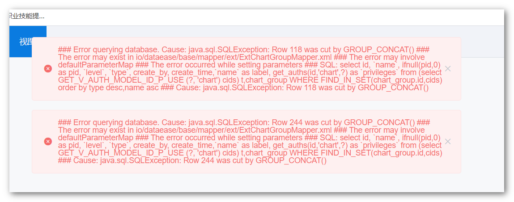

## DataEase 默认的登录信息是什么？

>DataEase 成功安装后，默认内置了两个用户：

>
  - 管理员用户为 admin ，密码为 dataease
  - 体验用户为 demo ，密码为 dataease


## 如何查看 DataEase 相关的日志信息？

>在 DataEase 的运行目录下有专门存放组件日志的目录（默认路径 /opt/dataease/logs)，各个组件的日志分别存放在以各自命名的目录下，如 dataease 目录存放的是 dataease 的运行日志，fe 目录存放的是 doris-fe 的运行日志等。可以通过查看相应的运行日志来定位一些使用中遇到的问题。

>另外，也可以通过 docker logs 命令来查看容器中的一些日志输出，例如：
```shell
docker logs -n 30 -f dataease
```


## 重置 DataEase 安装参数的通用方法

以下为重置 DataEase 安装参数的通用方法，该方法设计到重新安装 DataEase 的过程，耗时相对会长一些，如果只是简单的调整安装参数的话，可以参考具体的调整方案。

1. 清除存放原有配置参数的相关文件
```shell
# dectl - 文件中包含了默认运行目录
rm -f /usr/bin/dectl

# .env - 文件中包含了运行时参数，在默认运行目录 /opt/dataease 下，如有改动，请在相应的目录下查找
rm -rf /opt/dataease/.env

# (可选)如果要比较彻底的删除之前创建的相关文件的话，可以删除整个运行目录（默认为 /opt/dataease)
rm -rf /opt/dataease
```

2. 进入 DataEase 安装包中，修改安装包中的 install.conf 文件，改为最新的配置参数

3. 重新执行安装脚本 bash install.sh，等待服务启动即可


## 如何修改已安装的 DataEase 的配置参数？

>第一次安装 DataEase 后，会在运行目录下创建一个 .env 文件(默认路径 /opt/dataease/.env)，install.conf 配置文件中的配置项会记录在此。后续的安装和升级操作，不会去修改 .env 文件。

>修改运行端口，请参考[80 端口被占用了，如何修改为其他端口？](#80)

>修改运行目录，请参考[如何迁移已有的运行目录到其他路径上？](#migration)。

>修改 MySQL 相关配置，请参考[如如何修改内置 MySQL 端口？](#mysql-port) 、[在安装完 DataEase 后如何切换外部 MySQL？](#mysql-switch-ext)、 [如何将 DataEase 数据库由外部 MySQL 切换为 内置 MySQL？](#mysql-switch-inn)等


## 80 端口被占用了，如何修改为其他端口？

>v1.0.2 及以后的版本，支持配置文件方案管理 DataEase 服务的运行，可以在 DataEase 运行目录下找到 .env 文件（(默认路径 /opt/dataease/.env)，修改文件里的 DE_PORT，保存后执行 dectl reload 即可。

>v1.0.2 以前的版本，可以登录到 DataEase 服务器上，找到 .env 文件(默认路径 /opt/dataease/.env)，把 dataease 的运行端口 80 端口改为其他端口，然后执行 dectl reload 即可。


## <span id="migration">如何迁移已有的运行目录到其他路径上？</span>

1. 修改 /usr/bin/dectl，将 DE_BASE 改为新的目标路径，如: /home/test

2. 将原运行目录迁移到新的目标路径下
```shell
# 假设源运行目录为 /opt，新目标路径为 /home/test
mv /opt/dataease /home/test/
```

3. 修改 .env 配置文件。源运行目录迁移到新路径下之后，修改该路径下 dataease/.env 文件，将 DE_BASE 改为新的目标路径，如: /home/test

4. 重启 DataEase 服务
```shell
service dataease restart
```

## 执行一键安装脚本时报错，提示脚本错误。
>


>一键安装脚本会与 Github 进行连接，从 Github 上获取 DataEase 最新的版本信息以及最新的安装包。由于国内网络与 github 连接存在不稳定，所以有可能会导致无法获取安装所需的相关信息。
遇到这种情况的话，可以多尝试执行几次安装脚本，或者也可以到 https://github.com/dataease/dataease/releases 上下载 DataEase 的离线安装包安装。


## 如何修改 DataEase 运行的 docker 网段？

>DataEase 暂时还不支持修改 docker 运行网段。


## 无法通过一键安装脚本在线安装 docker 和 docker-compose

>在线安装脚本使用的下载源为境外源，可能会存在网络不稳定，或者网速慢的情况。可以在百度网盘上下载 docker 离线安装包进行安装，链接: https://pan.baidu.com/s/1WUbObtcPgPqpaNK6TGCOrA 提取码: gbut

>解压后执行安装包里的安装脚本即可： bash install-docker.sh


## 服务无法完全启动，查看 dataease 日志，发现 docker 访问出现 Permission denied。

>这种情况一般是由于 selinux 导致的，可以临时关闭 selinux 试试：
```shell
setenforce 0
```
>然后重启 DataEase 服务：
```shell
service dataease restart
```

## 非 root 用户能不能安装 DataEase？

>可以支持非 root 的 sudoer 用户，在执行安装脚本的时候，加上 sudo 执行即可，例如：
```shell
sudo bash install.sh
```


## 如何与 MeterSphere 安装在同一台服务器上？
>DataEase 与 MeterSphere 安装在同一台服务器上时，有可能会发生以下冲突：
>
- docker 网段冲突
- mysql 容器名冲突

!!! tips ""
由于 MeterSphere 在运行时并没有指定运行网段，所以不一定会产生 docker 网段冲突，如没有网段冲突，则可以直接跳到第三步执行。

1. 修改 MeterSphere 的网段
> 修改 /opt/metersphere/docker-compose-base.yml，网络部分定义如下：
```yml
networks:
  ms-network:
    driver: bridge
    ipam:
      driver: default
      config:
        - subnet: 172.20.0.0/16
          gateway: 172.20.0.1
```

2. 重启 MeterSphere 服务
>
```shell
# uninstall 可以在停止 MeterSphere 服务的同时，删除其对应的 docker network
msctl uninstall
# reload 会重新启动 MeterSphere 服务，并按照第一步的设置创建新的 docker network
msctl reload
```

3. 修改 DataEase MySQL 容器相关配置
> 修改 /opt/dataease/docker-compose.yml，将 dataease 的 depends_on 里的 mysql 改为 mysql-de，例如：
```yml
  dataease:
    image: registry.cn-qingdao.aliyuncs.com/dataease/dataease:v1.0.0
    container_name: dataease
    ports:
      - 80:8081
    mem_limit: 4096m
    volumes:
      - dataease-conf:/opt/dataease/conf
      - dataease-logs:/opt/dataease/logs
      - dataease-plugins:/opt/dataease/plugins/thirdpart
      - dataease-kettle-data:/opt/dataease/data/kettle
    depends_on:
      mysql-de:
        condition: service_healthy
```
> 修改 /opt/dataease/docker-compose-mysql.yml，将 mysql 相关的容器名改为 mysql-de，将 mysql 的运行端口改为 53306，例如：
```yml
  mysql-de:
    image: registry.cn-qingdao.aliyuncs.com/dataease/mysql:5.7.25
    container_name: mysql-de
    healthcheck:
      test: ["CMD", "mysqladmin" ,"ping", "-h", "localhost"]
      interval: 5s
      timeout: 3s
      retries: 10
    env_file:
      - ./conf/mysql.env
    ports:
      - 53306:3306
    volumes:
      - /opt/dataease/conf/my.cnf:/etc/mysql/conf.d/my.cnf
      - /opt/dataease/bin/mysql:/docker-entrypoint-initdb.d/
      - dataease-mysql-data:/var/lib/mysql
    networks:
      - dataease-network
```
> 修改 /opt/dataease/conf/dataease.properties，将数据库 URL 信息改为如下：
```properties
spring.datasource.url=jdbc:mysql://mysql-de:3306/dataease?autoReconnect=false&useUnicode=true&characterEncoding=UTF-8&characterSetResults=UTF-8&zeroDateTimeBehavior=convertToNull&useSSL=false
```

4. 修改 DataEase 服务启动端口（可选）
> 修改 /opt/dataease/docker-compose.yml，将 dataease 的运行端口改为如8088（注意，后端容器运行端口8081不能修改)：
```yml
  dataease:
    image: registry.cn-qingdao.aliyuncs.com/dataease/dataease:v1.0.0
    container_name: dataease
    ports:
      - 8088:8081
```

5. 启动 DataEase 服务
>
```shell
dectl reload
```


## MySQL 相关问题

### <span id="mysql-port">如何修改内置 MySQL 端口？</span>

>
1. 修改运行目录下 /opt/dataease/docker-compose-mysql.yml 文件，将 MySQL 外部运行端口参数 ${DE_MYSQL_PORT} 改为新端口，如 3307:
```yml
    ports:
      - 3307:3306
```
>
2. 重启 DataEase 服务： service dataease restart

### <span id="mysql-changename">如何修改内置 MySQL 容器名？</span>

>
1. 修改运行目录下 /opt/dataease/docker-compose.yml 文件，将 dataease 的 depends_on 里的 mysql 改为 mysql-de，例如：
```yml
  dataease:
    image: registry.cn-qingdao.aliyuncs.com/dataease/dataease:v1.0.0
    container_name: dataease
    ports:
      - 80:8081
    mem_limit: 4096m
    volumes:
      - dataease-conf:/opt/dataease/conf
      - dataease-logs:/opt/dataease/logs
      - dataease-plugins:/opt/dataease/plugins/thirdpart
      - dataease-kettle-data:/opt/dataease/data/kettle
    depends_on:
      mysql-de:
        condition: service_healthy
```
>
2. 修改 /opt/dataease/docker-compose-mysql.yml，将 mysql 相关的容器名改为 mysql-de，例如：
```yml
  mysql-de:
    image: registry.cn-qingdao.aliyuncs.com/dataease/mysql:5.7.25
    container_name: mysql-de
    healthcheck:
      test: ["CMD", "mysqladmin" ,"ping", "-h", "localhost"]
      interval: 5s
      timeout: 3s
      retries: 10
    env_file:
      - ./conf/mysql.env
    ports:
      - 53306:3306
    volumes:
      - /opt/dataease/conf/my.cnf:/etc/mysql/conf.d/my.cnf
      - /opt/dataease/bin/mysql:/docker-entrypoint-initdb.d/
      - dataease-mysql-data:/var/lib/mysql
    networks:
      - dataease-network
```
>
3. 修改 /opt/dataease/conf/dataease.properties，将数据库 URL 信息改为如下：
```properties
spring.datasource.url=jdbc:mysql://mysql-de:3306/dataease?autoReconnect=false&useUnicode=true&characterEncoding=UTF-8&characterSetResults=UTF-8&zeroDateTimeBehavior=convertToNull&useSSL=false
```
>
4. 重启 DataEase 服务： service dataease restart


### <span id="mysql-switch-ext">在安装完 DataEase 后如何切换外部 MySQL？</span>

>
!!! info "外部 MySQL 配置参数要求"
    特别注意，使用外部 MySQL 时，需要注意几个地方：

      - lower_case_table_names=1
      - group_concat_max_len=1024000
      - default-character-set=utf8
      - innodb_large_prefix=on

>
1. 修改运行目录下 .env (默认路径 /opt/dataease/.env) 文件中 MySQL 的相关配置，包括 DE_EXTERNAL_MYSQL、DE_EXTERNAL_MYSQL、DE_MYSQL_HOST、DE_MYSQL_PORT、DE_MYSQL_DB、DE_MYSQL_USER、DE_MYSQL_PASSWORD，DE_EXTERNAL_MYSQL=true
>
2. 修改 dataease.properties (默认路径 /opt/dataease/conf/dataease.properties)，将 spring.datasource 开头的几个参数里，MySQL 的配置参数进行相应的修改，包括：数据库地址、数据库端口、数据库库名、数据库用户名、数据库密码
>
3. 内置 MySQL 切换为外置 MySQL，修改运行目录下 /opt/dataease/docker-compose.yml 文件，将其中 depends_on 相关设置删除：
```yml
    depends_on:
      mysql:
        condition: service_healthy
```
>
4. 重启 DataEase 服务： service dataease restart


### <span id="mysql-switch-inner">如何将 DataEase 数据库由外部 MySQL 切换为 内置 MySQL？</span>

>
1. 修改运行目录下 .env (默认路径 /opt/dataease/.env) 文件中 MySQL 的相关配置，包括 DE_EXTERNAL_MYSQL、DE_EXTERNAL_MYSQL、DE_MYSQL_HOST、DE_MYSQL_PORT、DE_MYSQL_DB、DE_MYSQL_USER、DE_MYSQL_PASSWORD，DE_EXTERNAL_MYSQL=false
>
2. 修改 dataease.properties (默认路径 /opt/dataease/conf/dataease.properties)，将 spring.datasource 开头的几个参数里，MySQL 的配置参数进行相应的修改，包括：数据库地址、数据库端口、数据库库名、数据库用户名、数据库密码
>
3. 修改运行目录下 /opt/dataease/docker-compose.yml 文件，为 dataesae 服务加上 depends_on 相关设置，类似(镜像版本注意按实际情况替换)：
```yml
version: '2.1'
services:

  dataease:
    image: registry.cn-qingdao.aliyuncs.com/dataease/dataease:v1.3.0
    container_name: dataease
    ports:
      - ${DE_PORT}:8081
    mem_limit: 4096m
    volumes:
      - ${DE_BASE}/dataease/conf:/opt/dataease/conf
      - ${DE_BASE}/dataease/logs:/opt/dataease/logs
      - ${DE_BASE}/dataease/plugins/thirdpart:/opt/dataease/plugins/thirdpart
      - ${DE_BASE}/dataease/data/kettle:/opt/dataease/data/kettle
    depends_on:
      mysql:
        condition: service_healthy
    networks:
      - dataease-network

networks:
  dataease-network:
    driver: bridge
    ipam:
      driver: default
      config:
        - subnet: 172.19.0.0/16
          gateway: 172.19.0.1
```
>
4. 重启 DataEase 服务： service dataease restart


### 使用 DataEase 的时候提示 "Row 30153 was cut by GROUP_CONCAT()" 的错误

>

>当出现类似上图的错误时，可以通过任选以下方式之一处理：

>
1. 修改 my.cnf 文件的 group_concat_max_len 参数，如：group_concat_max_len=1024000，然后重启 MySQL 服务
>
2. 进入 MySQL，执行 SET GLOBAL group_concat_max_len=1024000; 临时修改该参数的值


### 安装 DataEase 后内置 MySQL 的配置参数未生效

>出于安全考虑，当 MySQL 配置文件 my.cnf 权限过高时，会被 MySQL 忽略加载。请确认配置文件目录(默认路径 /opt/dataease/conf)下的配置文件的访问权限为 644。

>可以通过命令修改文件权限：
```shell
chmod 644 /opt/dataease/conf/*
```

>修改文件属性后，重启 DataEase 服务: service dataease restart


### 使用 DataEase 的时候提示 "Table 'datashowdb.V_AUTH_MODEL' doesn't exist" 的错误

>出现该问题一般是由于 DataEase 使用的外部 MySQL 配置参数 lower_case_table_names 设置为 0 了，需要将该参数设置为 lower_case_table_names=1，重启 MySQL 服务即可。

>


### <span id="demo-datasource">内置演示数据无效怎么办？</span>

>在使用外部 MySQL，或者修改了内置 MySQL 容器名后，会出现内置演示数据无效的情况，如示例仪表板无法展示等待。可以登录 DataEase 控制台，进入到【数据源】页面，选择 "demo" 数据源，点击下方的编辑按钮，将 demo 数据源的相关连接信息按实际情况进行设置，校验通过后，保存即可。


### 使用 DataEase 的时候提示 "illegal mix of collations (latin1_bin implicit) and (utf8_general_ci coercible)" 的错误

>该问题是由于字符集编码不同导致，可以参考一下下图的配置

>


>
1. 更改 MySQL 的 my.cnf，把 client 和 server 的字符集改为 utf8
>
2. 修改 collation 编码
```mysql
set collation_database=utf8_general_ci;
set collation_connection=utf8_general_ci;
set collation_server=utf8_general_ci;
```


