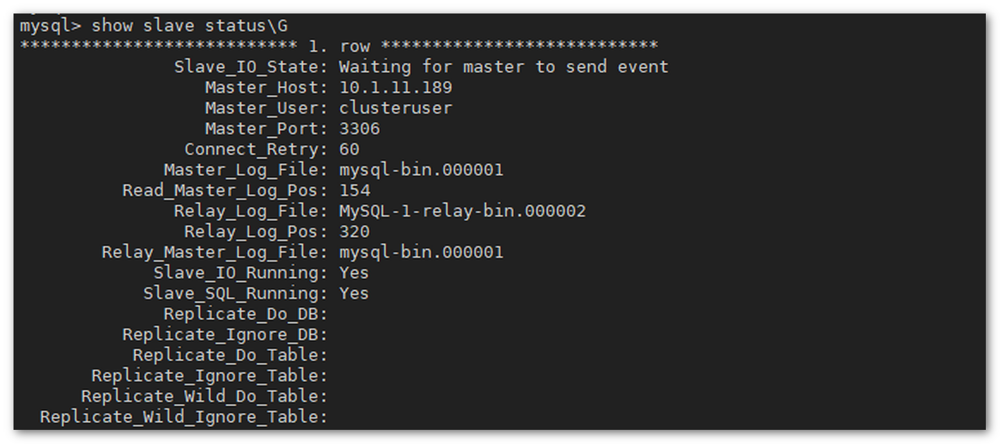
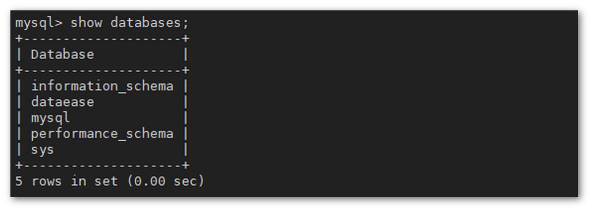

!!! Abstract ""
    DataEase HA 部署模式依赖外部高可用 MySQL 数据库方案，您可自行选择自身已有的成熟 MySQL 数据库方案；    
    **本文仅提供参考的 MySQL 数据库部署方案（以下涉及到节点 IP 的地方，请自行替换成实际 IP）。**

## 1 准备工作

!!! Abstract ""
	**本文数据库采用主主配置，两个节点分别部署数据库，后续进行主主配置，下面提供两种参考安装方式。**

	**提示：** 以下操作均需要通过 SSH 分别登录到 MySQL 的两个节点上执行。

    MySQL HA 环境的搭建需要准备以下服务器：

    * 节点 A： 10.1.11.180
    * 节点 B： 10.1.11.181

    **注意：**
    
     1. 每个 MySQL 节点上安装的 MySQL 版本需要保持一致；
     2. 实际部署时，可根据自身需求和规模调整节点数量及配置。


## 2 环境要求

!!! Abstract ""
    **部署 MySQL 服务器要求：**

    * 操作系统：CentOS 7.x
    * CPU/内存：4 核 8G
    * 磁盘空间：500G


## 3 安装 MySQL

### 3.1 方式一（在线安装）：

!!! Abstract ""
	**分别登录到 MySQL 的两个节点上，通过执行以下命令来安装 MySQL：**  
    ```
    yum localinstall -y https://dev.mysql.com/get/mysql57-community-release-el7-11.noarch.rpm
    yum install -y mysql-server
    systemctl enable mysqld
    systemctl start mysqld
    ```

### 3.2 方式二（rpm 离线安装）：

!!! Abstract ""
	**分别登录到 MySQL 的两个节点上，将 MySQL 的离线 rpm 包下载到两个节点上，然后执行以下命令进行 MySQL 的离线安装：**
    ```
    rpm -ivh mysql-community-common-5.7.12-1.el6.x86_64.rpm
    rpm -ivh mysql-community-libs-5.7.12-1.el6.x86_64.rpm
    rpm -ivh mysql-community-devel-5.7.12-1.el6.x86_64.rpm
    rpm -ivh mysql-community-client-5.7.12-1.el6.x86_64.rpm
    rpm -ivh mysql-community-server-5.7.12-1.el6.x86_64.rpm
    ```

## 4 MySQL 初始化及开启远程访问

!!! Abstract ""
	**分别登录到 MySQL 的两个节点上，获取 MySQL 初始化安装密码：**  
    ```
    grep 'temporary password' /var/log/mysqld.log
    ```
{ width="900px" }

!!! Abstract ""
    
    **以下命令假设 MySQL 初始化密码为 "MYSQL_INIT_PASSWORD"，请根据实际情况对命令中涉及到此密码的地方进行替换。**

!!! Abstract ""
    **登录到 MySQL 节点上，执行命令完成以下工作：**
    
    1. 修改初始化密码；
    2. 开启远程访问；
    3. 添加节点复制用户及其相关授权。


### 4.1 MySQL 节点 A 设置

!!! Abstract ""
	**登录 MySQL：**  
    ```
    mysql -uroot -p'MYSQL_INIT_PASSWORD'
    ```

!!! Abstract ""
    
    **MySQL 有密码设置的规范，具体与 validate_password_policy 的值有关。默认情况下过于简单的密码可能会有提示密码存在问题。仍需设置简单密码的话，需要登录 MySQL 后，执行以下命令：**
    ```shell
    
    # 更改密码长度
    mysql> set global validate_password_length=0;

    # 更改密码策略为 LOW
    mysql> set global validate_password_policy=0;
    ```

    在执行 MySQL 操作时，有时候会提示需要重置密码：
    ```shell
    ERROR 1820 (HY000): You must reset your password using ALTER USER statement before executing this statement.
    ```

    解决方法：
    
     MySQL 版本 5.7.6 版本以前用户可以使用如下命令：
        ```mysql
        mysql> SET PASSWORD = PASSWORD('Password123@mysql');
        ```
     MySQL 版本 5.7.6 版本开始的用户可以使用如下命令：
        ```mysql
        mysql> ALTER USER USER() IDENTIFIED BY 'Password123@mysql';
        ```
!!! Abstract ""
	登录 MySQL 后，进行 MySQL 配置操作： 
    ```
    # 修改 MySQL root 用户的密码为 "Password123@mysql"，且 root 用户可远程访问
    mysql> grant all privileges on *.* to 'root'@'%' identified by 'Password123@mysql';
    
    # 添加 MySQL 主从复制用户 clusteruser，并授权 MySQL 节点 B 可访问 MySQL 节点 A
    mysql> grant replication slave,file on *.* to 'clusteruser'@'10.1.11.181' identified by 'Replication@123';
    
    mysql> flush privileges;
    ```

!!! Abstract ""
    
    **我们在 MySQL 节点 A 上添加一个复制账户 'clusteruser'，允许 '10.1.11.181' 客户端来访问，密码为 'Replication@123'。**
    
    **提示：** 如果有多个从服务器需要共享这一个复制账号，可以使用 '10.1.11.%' 来替代整个网段。

### 4.2 MySQL 节点 B 设置

!!! Abstract ""
	**登录 MySQL：** 
    ```
    mysql -uroot -p'MYSQL_INIT_PASSWORD'
    ```
    登录 MySQL 后，进行 MySQL 配置操作：
    ```
    # 修改 MySQL root 用户的密码为 "Password123@mysql"，且 root 用户可远程访问
    mysql> grant all privileges on *.* to 'root'@'%' identified by 'Password123@mysql';

    # 添加 MySQL 主从复制用户 clusteruser，并授权 MySQL 节点 A 可访问 MySQL 节点 B
    mysql> grant replication slave,file on *.* to 'clusteruser'@'10.1.11.180' identified by 'Replication@123';

    mysql> flush privileges;
    ```

    在 MySQL 节点 B 上添加一个复制账户 'clusteruser'，允许 '10.1.11.180' 客户端来访问，密码为 'Replication@123'。
    
    **提示：** 如果有多个从服务器需要共享这一个复制账号，可以使用 '10.1.11.%' 来替代整个网段。

## 5 修改 MySQL 配置

!!! Abstract ""
    **分别登录到 MySQL 的两个节点上，对 MySQL 的配置文件进行修改。**

### 5.1 修改 MySQL 节点 A 配置文件

!!! Abstract ""
	**登录到 MySQL 节点 A 上，将 /etc/my.cnf 文件内容修改如下：** 
    ```
    [mysqld]
    datadir=/var/lib/mysql
    
    default-storage-engine=INNODB
    character_set_server=utf8
    lower_case_table_names=1
    table_open_cache=128
    max_connections=2000
    max_connect_errors=6000
    innodb_file_per_table=1
    innodb_buffer_pool_size=1G
    max_allowed_packet=64M
    transaction_isolation=READ-COMMITTED
    innodb_flush_method=O_DIRECT
    innodb_flush_log_at_trx_commit=0
    sync_binlog=0
    group_concat_max_len=1024000
    innodb_lock_wait_timeout=1800
    bind-address=0.0.0.0
    
    sql_mode=STRICT_TRANS_TABLES,NO_ZERO_IN_DATE,NO_ZERO_DATE,ERROR_FOR_DIVISION_BY_ZERO,NO_AUTO_CREATE_USER,NO_ENGINE_SUBSTITUTION
    
    skip-name-resolve
    
    server-id=101
    log-bin=mysql-bin
    auto_increment_increment=2
    auto_increment_offset=1
    expire_logs_days=30
    
    [mysql]
    default-character-set=utf8
    
    [mysql.server]
    default-character-set=utf8
    ```

	配置完成后重启 MySQL 服务： 
    ```
    systemctl restart mysqld
    ```

### 5.2 修改 MySQL 节点 B 配置文件

!!! Abstract ""
	**登录到 MySQL 从节点上，将 /etc/my.cnf 文件内容修改如下：** 
    ```
    [mysqld]
    datadir=/var/lib/mysql
    
    default-storage-engine=INNODB
    character_set_server=utf8
    lower_case_table_names=1
    table_open_cache=128
    max_connections=2000
    max_connect_errors=6000
    innodb_file_per_table=1
    innodb_buffer_pool_size=1G
    max_allowed_packet=64M
    transaction_isolation=READ-COMMITTED
    innodb_flush_method=O_DIRECT
    innodb_flush_log_at_trx_commit=0
    sync_binlog=0
    group_concat_max_len=1024000
    innodb_lock_wait_timeout=1800
    bind-address=0.0.0.0
    
    sql_mode=STRICT_TRANS_TABLES,NO_ZERO_IN_DATE,NO_ZERO_DATE,ERROR_FOR_DIVISION_BY_ZERO,NO_AUTO_CREATE_USER,NO_ENGINE_SUBSTITUTION
    
    skip-name-resolve
    
    server-id=102
    log-bin=mysql-bin
    auto_increment_increment=2
    auto_increment_offset=2
    expire_logs_days=30
    
    [mysql]
    default-character-set=utf8
    
    [mysql.server]
    default-character-set=utf8
    ```

	配置完成后重启 MySQL 服务： 
    ```
    systemctl restart mysqld
    ```

## 6 配置 MySQL 主从关系

!!! Abstract ""
    **分别登录到 MySQL 的两个节点上，配置相互的主从关系。**

### 6.1 查询 MySQL 节点状态

!!! Abstract ""
	**登录节点 A 的 MySQL（前文已重置密码为 "Password123@mysql"）：**
    ```
    mysql -uroot -p'Password123@mysql'
    ```


	执行命令：
    ```
    mysql> flush tables with read lock\G
    mysql> show master status;
    ```

	可以获取到节点状态，如下示例图：
    
{ width="900px" }

### 6.2 配置 MySQL 节点 A 的主从关系

!!! Abstract ""
	**在节点 A 上 MySQL 中执行以下命令：**
    ```
    mysql> change master to master_host='10.1.11.181', master_user='clusteruser', master_password='Replication@123', master_log_file='mysql-bin.000001', master_log_pos=154;
    mysql> start slave;
    mysql> show slave status\G
    ```

    **提示：
    master_host 为节点 B 的 IP，master_log_file 为节点 B 上查询到的 "File" 值，master_log_pos 为节点 B 上查询到的 "Position" 值。**  
	当 "show slave status\G" 命令执行结果中，查询到 Slave_IO_Running 和 Slave_SQL_Running 都为 Yes 则表明配置成功。

{ width="900px" }

!!! Abstract ""
	最后执行 MySQL 命令解锁：
    ```
    mysql> UNLOCK TABLES;
    ```

### 6.3 配置 MySQL 节点 B 的主从关系

!!! Abstract ""
	**在节点 B 上 MySQL 中执行以下命令：**
    ```
    mysql> change master to master_host='10.1.11.180', master_user='clusteruser', master_password='Replication@123', master_log_file='mysql-bin.000001', master_log_pos=154;
    mysql> start slave;
    mysql> show slave status\G
    ```


    **提示：
    master_host 为节点 A 的 IP，master_log_file 为节点 A 上查询到的 "File" 值，master_log_pos 为节点 A 上查询到的 "Position" 值。**

	当 "show slave status\G" 命令执行结果中，查询到 Slave_IO_Running 和 Slave_SQL_Running 都为 Yes 则表明配置成功。
    
{ width="900px" }

!!! Abstract ""
	最后执行 MySQL 命令解锁：
    ```
    mysql> UNLOCK TABLES;
    ```

## 7 创建 DataEase 所需的数据库

!!! Abstract ""
	**配置好主主节点后，登录到任意节点上的 MySQL 中创建 DataEase 所需的数据库：**
    ```
    mysql> CREATE DATABASE `dataease` DEFAULT CHARACTER SET utf8mb4 COLLATE utf8mb4_general_ci;
    ```
    在另一个节点上，用 MySQL 命令可以同样查看到新建的数据库：
    ```
    mysql> show databases;
    ```
{ width="900px" }

