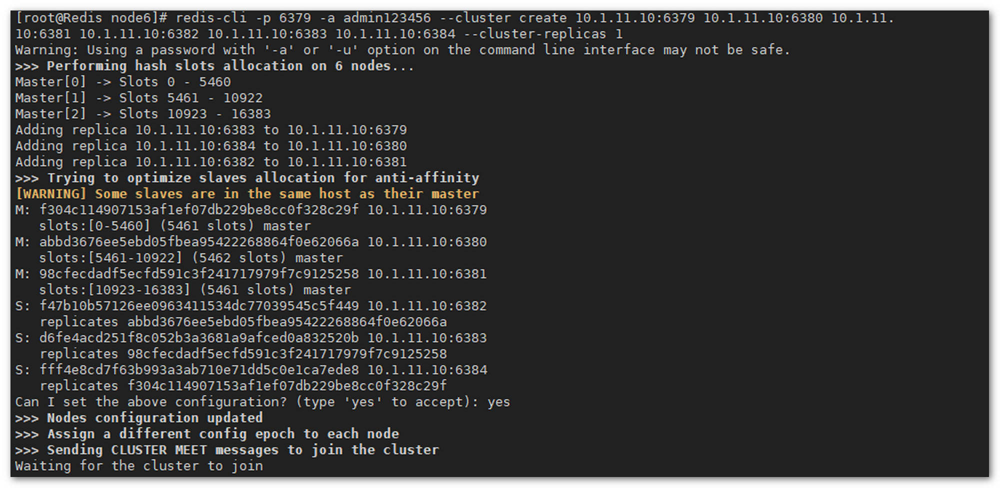

## 1 标准安装

!!! Abstract ""
    可以参考源码部署文档：
    https://cloud.tencent.com/developer/article/1786951

## 2 Docker-Compose 安装

!!! Abstract ""
    **需要在服务器上提前安装 Docker 与 Docker-Compose，**
    此处在一台服务器上以 Docker-Compose 方式部署了 6 个 Redis 节点，组建 3 主 3 从的 Redis Cluster 集群。

### 2.1 准备工作

!!! Abstract ""
    **Redis 服务器信息：**

    * IP： 10.1.11.197

### 2.2 环境要求

!!! Abstract ""
    **部署 Redis 服务器要求：**

    * 操作系统: CentOS 7.x
    * CPU/内存: 4 核 8G
    * 磁盘空间: 500G
    
### 2.3 准备相关环境及文件

!!! Abstract ""
	**创建 Redis 文件目录：**
    ```
    mkdir /opt/redis
    ```


    准备 Redis 配置文件 redis.conf，放置于 /opt/redis 目录下，内容如下：


    **示例设置密码为 admin123456。**

    ```conf
    port 6379
    daemonize no
    protected-mode no
    maxmemory-policy allkeys-lru
    requirepass admin123456
    masterauth admin123456
    cluster-enabled yes
    cluster-config-file nodes-c.conf
    ```
!!! Abstract ""
	**准备 docker-compose 运行时所需的 docker-compose.yml 文件，放置于 /opt/redis 目录下，内容如下：**
    ```
    version: '3'
    
    services:
      node1:
        image: redis:6.2.6-alpine3.15
        container_name: redis-node1
        command: /bin/sh -c "redis-server /usr/local/etc/redis/redis.conf"
        volumes:
          - /opt/redis/node1:/usr/local/etc/redis
          - /opt/redis/node1:/data
          - /opt/redis/node1:/log
    	network_mode: "host"
    
      node2:
        image: redis:6.2.6-alpine3.15
        container_name: redis-node2
        command: /bin/sh -c "redis-server /usr/local/etc/redis/redis.conf"
        volumes:
          - /opt/redis/node2:/usr/local/etc/redis
          - /opt/redis/node2:/data
          - /opt/redis/node2:/log
        network_mode: "host"
    
      node3:
        image: redis:6.2.6-alpine3.15
        container_name: redis-node3
        command: /bin/sh -c "redis-server /usr/local/etc/redis/redis.conf"
        volumes:
          - /opt/redis/node3:/usr/local/etc/redis
          - /opt/redis/node3:/data
          - /opt/redis/node3:/log
        network_mode: "host"
    
      node4:
        image: redis:6.2.6-alpine3.15
        container_name: redis-node4
        command: /bin/sh -c "redis-server /usr/local/etc/redis/redis.conf"
        volumes:
          - /opt/redis/node4:/usr/local/etc/redis
          - /opt/redis/node4:/data
          - /opt/redis/node4:/log
        network_mode: "host"
    
      node5:
        image: redis:6.2.6-alpine3.15
        container_name: redis-node5
        command: /bin/sh -c "redis-server /usr/local/etc/redis/redis.conf"
        volumes:
          - /opt/redis/node5:/usr/local/etc/redis
          - /opt/redis/node5:/data
          - /opt/redis/node5:/log
        network_mode: "host"
    
      node6:
        image: redis:6.2.6-alpine3.15
        container_name: redis-node6
        command: /bin/sh -c "redis-server /usr/local/etc/redis/redis.conf"
        volumes:
          - /opt/redis/node6:/usr/local/etc/redis
          - /opt/redis/node6:/data
          - /opt/redis/node6:/log
        network_mode: "host"
    ```

### 2.4 创建 Redis 节点目录及配置文件

!!! Abstract ""
    ```shell
    cd  /opt/redis
    mkdir node{1..6}
    for i in {1..6};do \cp redis.conf node$i;done
    # 修改各个 node 目录下的 redis.conf，将 port 依次改为 6379 6380 6381 6382 6383 6384
    ```

### 2.5 启动 Redis Cluster

!!! Abstract ""
    ```shell
    docker-compose up -d
    ```
{ width="900px" }
### 2.6 配置集群

!!! Abstract ""
    **服务启动后，登录其中任意一个节点，进行主从集群的配置：**
    ```shell
    docker exec -it redis-node1 sh

    # 将 6 个节点设置为 3 主 3 从模式
    redis-cli -a admin123456 --cluster create 10.1.11.197:6379 10.1.11.197:6380 10.1.11.197:6381 10.1.11.197:6382 10.1.11.197:6383 10.1.11.197:6384 --cluster-replicas 1
    ```
{ width="900px" }
### 2.7 验证集群

!!! Abstract ""
    **登录到任意一个 Redis 节点上：**
    ```shell
    docker exec -it redis-node1 sh

    # 查看集群节点，可以看到 3 主 3 从的节点信息
    redis-cli -a admin123456 -c cluster nodes

    # 如果存在防火墙问题，可以将 Redis 的端口打开
    firewall-cmd --add-port=6379-6384/tcp --zone=public --permanent
    firewall-cmd --reload
    ```
{ width="900px" }
