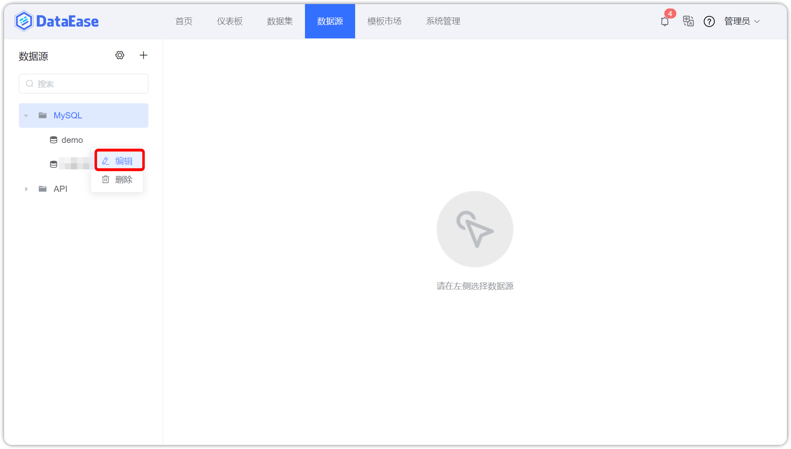

## 1 环境要求

!!! Abstract ""
    **部署服务器要求：**

    * 操作系统: CentOS 7.x
    * CPU/内存: 4核8G
    * 磁盘空间: 200G
    * **可访问互联网**

    **提示：支持云平台部署，安装成功后请检查公有云端口开通情况。**

## 2 安装部署

!!! Abstract ""
    GitHub release 链接: https://github.com/dataease/dataease/releases  

    **在服务器上执行一键安装命令：**
    ```properties
    curl -sSL https://dataease.oss-cn-hangzhou.aliyuncs.com/quick_start.sh | sh
    ```

!!! Abstract ""
    如果使用外部数据库进行安装，推荐使用 MySQL 5.7 版本。同时 DataEase 对数据库部分配置项有要求，请参考下附的数据库配置，修改环境中的数据库配置文件

    ```
    [mysqld]
	datadir=/var/lib/mysql

	default-storage-engine=INNODB
	character_set_server=utf8
	lower_case_table_names=1
	table_open_cache=128
	max_connections=2000
	max_connect_errors=6000
	innodb_file_per_table=1
	innodb_buffer_pool_size=1G
	max_allowed_packet=64M
	transaction_isolation=READ-COMMITTED
	innodb_flush_method=O_DIRECT
	innodb_lock_wait_timeout=1800
	innodb_flush_log_at_trx_commit=0
	sync_binlog=0
	group_concat_max_len=1024000
	sql_mode=STRICT_TRANS_TABLES,NO_ZERO_IN_DATE,NO_ZERO_DATE,ERROR_FOR_DIVISION_BY_ZERO,NO_AUTO_CREATE_USER,NO_ENGINE_SUBSTITUTION
	skip-name-resolve

	[mysql]
	default-character-set=utf8

	[mysql.server]
	default-character-set=utf8
    ```

	**特别注意以下几个参数的设置：**
	```
	character_set_server=utf8
	lower_case_table_names=1
	group_concat_max_len=1024000
	```

    请参考文档中的建库语句创建 DataEase 使用的数据库，DataEase 服务启动时会自动在配置的库中创建所需的表结构及初始化数据。
    ```mysql
    CREATE DATABASE `dataease` DEFAULT CHARACTER SET utf8mb4 COLLATE utf8mb4_general_ci;
    ```

!!! Abstract ""
    安装脚本使用 /opt/dataease 作为默认安装目录，DataEase 的配置文件、数据及日志等均存放在该安装目录  

    **安装目录目录结构说明：**  
    ```
    /opt/dataease/
	├── bin                                         #-- 安装过程中需要加载到容器中的脚本
	├── conf                                        #-- DataEase 各组件及数据库等中间件的配置文件
    ├── custom-drivers                              #-- DataEase 自定义驱动程序目录 
	├── data                                        #-- DataEase 各组件及数据库等中间件的数据持久化目录
	├── docker-compose-doris.yml                    #-- DataEase 内建的 Doris 所需的 Docker Compose 文件
    ├── docker-compose-kettle.yml                   #-- DataEase 内建的 Kettle 所需的 Docker Compose 文件 
	├── docker-compose-mysql.yml                    #-- DataEase 内建的 MySQl 所需的 Docker Compose 文件 
	├── docker-compose.yml                          #-- DataEase 基础 Docker Compose 文件，定义了网络等基础信息 
	├── logs                                        #-- DataEase 各组件的日志文件持久化目录
    ├── plugins                                     #-- DataEase 第三方插件目录 
	└── templates                                   #-- DataEase 各组件及数据库等中间件的配置文件的原始文件
    ```

!!! Abstract ""
    **安装成功后，通过浏览器访问如下页面登录 DataEase：**
    ```
    地址: http://目标服务器IP地址:服务运行端口
    用户名: admin
    密码: dataease
    ```

## 3 其他注意事项

!!! Abstract ""
    内置示例数据以 flyway 的形式在 DataEase 启动时自动插入到了 MySQL 数据库中，如果使用了外部 MySQL 或者修改了内置 MySQL 的容器名称的话，需要登录到 DataEase 控制台，进入到【数据源】页面，选择 "demo" 数据源，将 "demo" 数据源的相关连接信息修改正确，保存后即可正常使用内置示例数据。

{ width="900px" }

{ width="900px" }

!!! Abstract ""
    获取更多部署相关帮助可访问[**安装配置**](https://dataease.io/docs/faq/configuration_faq/configuration/)与[**安全启动**](https://dataease.io/docs/faq/configuration_faq/installation_starts/)。