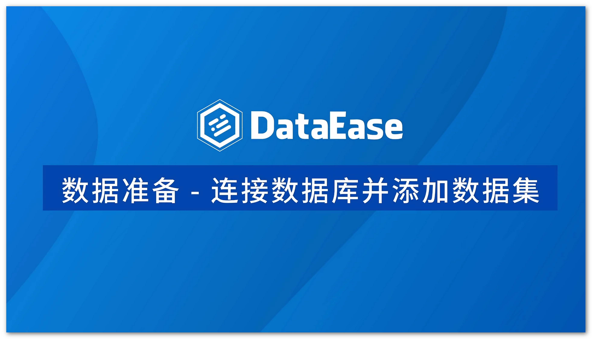

## 1 数据准备

[{ width="280"}](https://www.bilibili.com/video/BV15P4y1u7Pa?spm_id_from=333.999.0.0)
[{ width="280"}](https://www.bilibili.com/video/BV1cU4y1d77S?spm_id_from=333.999.0.0)
[{ width="280"}](https://www.bilibili.com/video/BV1zY411n7Q1?spm_id_from=333.999.0.0)  
[{ width="280"}](https://www.bilibili.com/video/BV1a3411s7MU/?spm_id_from=333.788.recommend_more_video.-1)