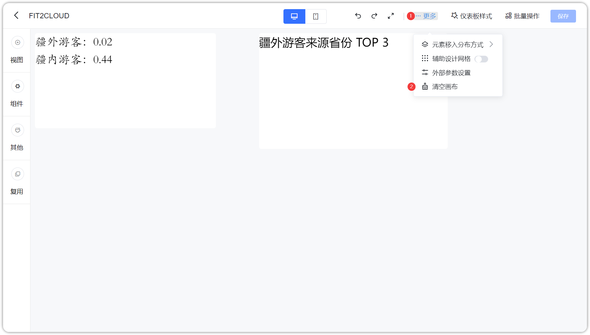
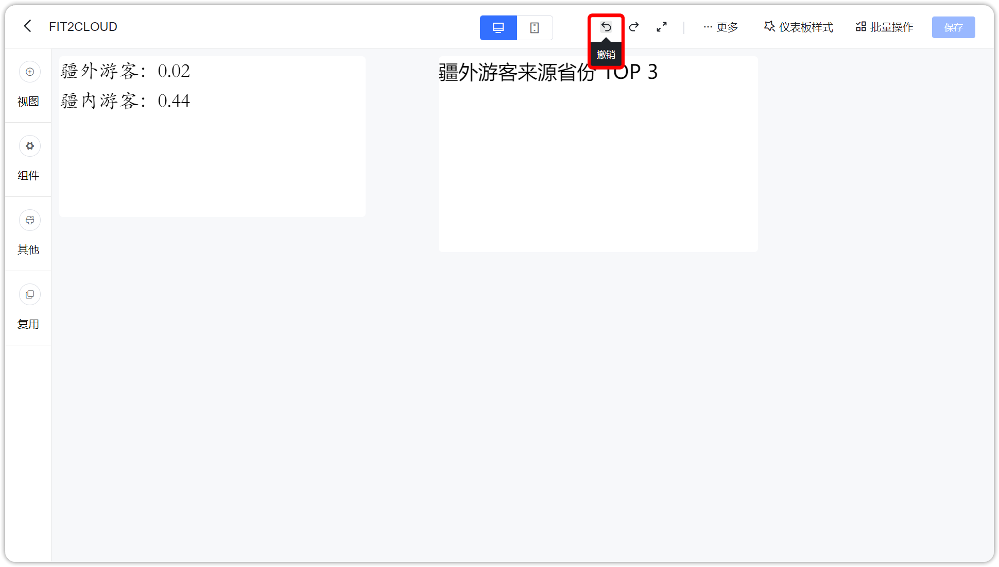
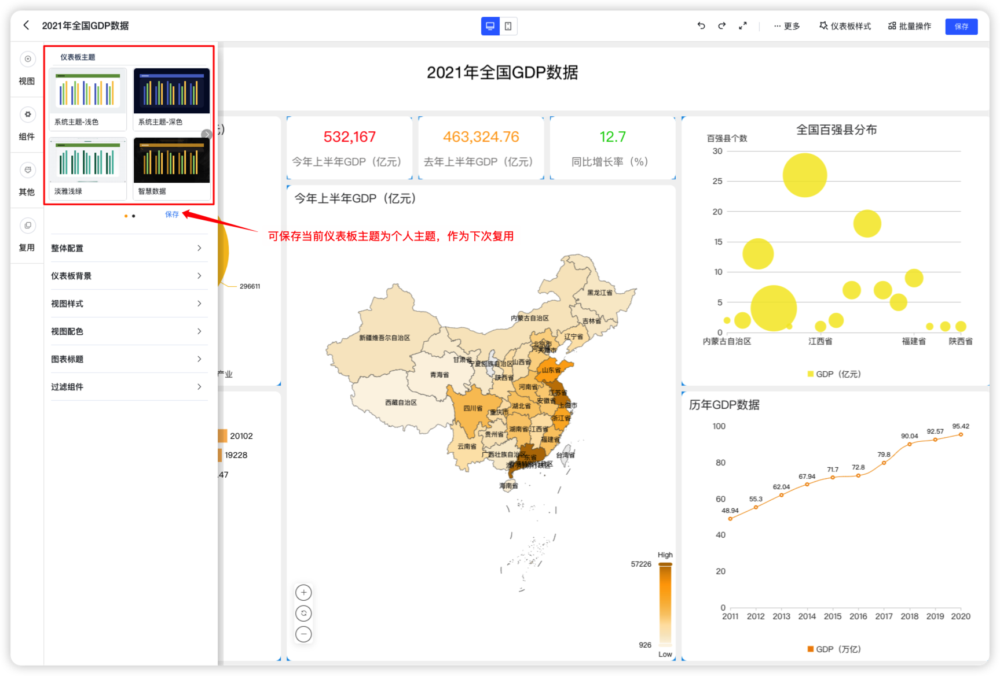
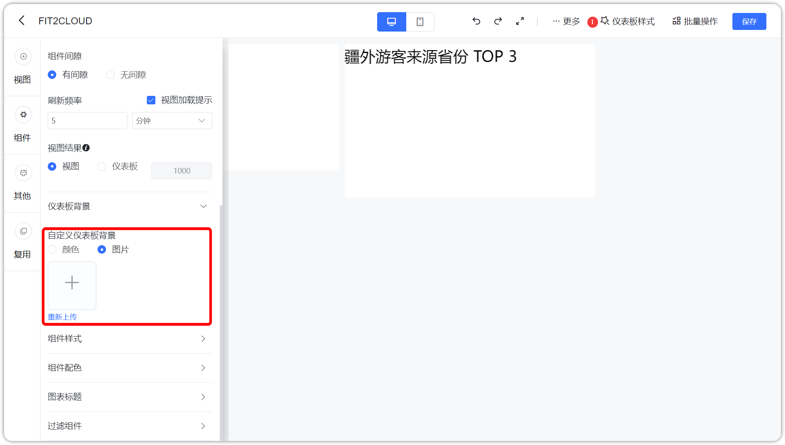
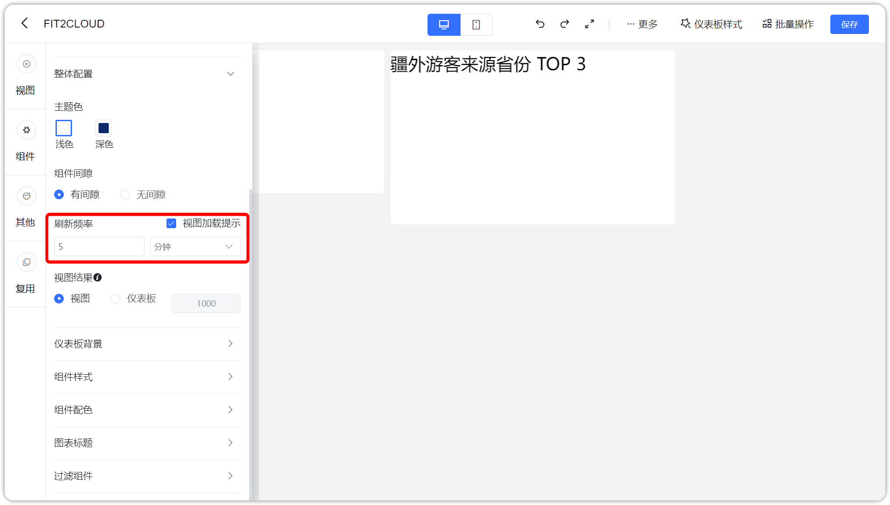
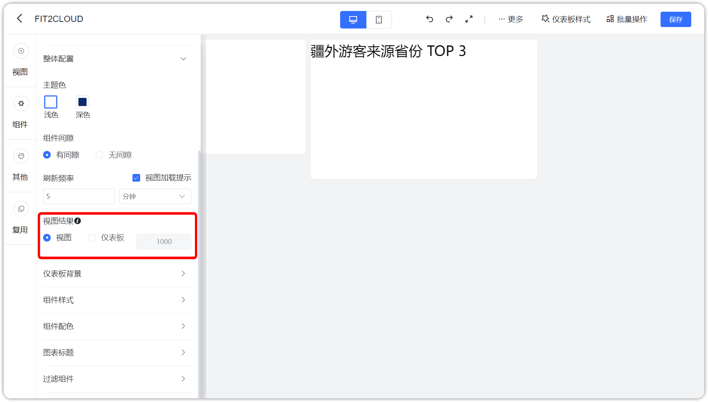
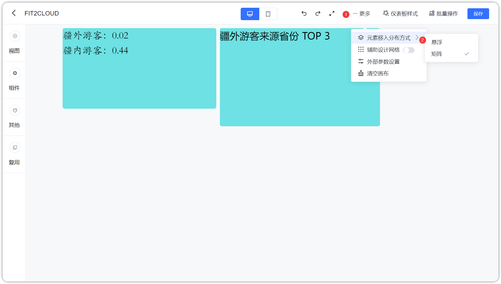

## 1 清空画布

!!! Abstract ""
	点击下图的按钮，清空画布，可以重新添加组件。

{ width="900px" }

## 2 重做

!!! Abstract ""
	点击下图按钮，可以对组件重做。

{ width="900px" }

## 3 撤销

!!! Abstract ""
	点击下图按钮，撤销操作。

{ width="900px" }

## 4 样式

!!! Abstract ""
	点击【样式】按钮，左侧弹出仪表板样式编辑页面。

{ width="900px" }

### 4.1 仪表板主题

!!! Abstract ""
	可在此位置设置仪表板的主题，包括系统主题与自定义主题，如下图所示，点击【保存】，保存仪表板主题。
	
{ width="900px" }

### 4.2 仪表板属性

!!! Abstract ""
	如下图所示，点击【背景】，设置仪表板背景颜色或图片。

{ width="900px" }

!!! Abstract ""
	如下图所示，点击【组件间隙】，设置组件间隙有或无。

{ width="900px" }

!!! Abstract ""
	如下图所示，点击【刷新时间】，设置仪表板的刷新时间，支持秒级刷新时间。

{ width="900px" }

!!! Abstract ""
	如下图所示，点击【视图展示结果】，选择【仪表板】，则覆盖视图的结果展示数量。

{ width="900px" }

### 4.3 其他属性

!!! Abstract ""
	如下图所示，此处可以设置组件样式（背景），图形属性（颜色）和表格属性（颜色）。  
	**提示：** 此处设置需要将视图样式设置为 [「样式优先级」](../view_module/view_design/#3) 跟随仪表板才会生效。

{ width="900px" }

## 5 元素移入分布方式

!!! Abstract ""
	可设置元素移入仪表板后的分布方式为"矩阵"或"悬浮"：

    - 矩阵：元素可自动对齐，具有相同的间隔距离，用户放置时元素会自动挤压分布，不可多层叠加；
    - 悬浮：元素可完全按照用户移动位置放置，可多个元素叠加，不受其它组件挤压。  

    **提示：新移入仪表板的元素受该设置影响，已存在仪表板的元素不受其修改的影响，可单独修改元素的属性。**

{ width="900px" }
{ width="900px" }

