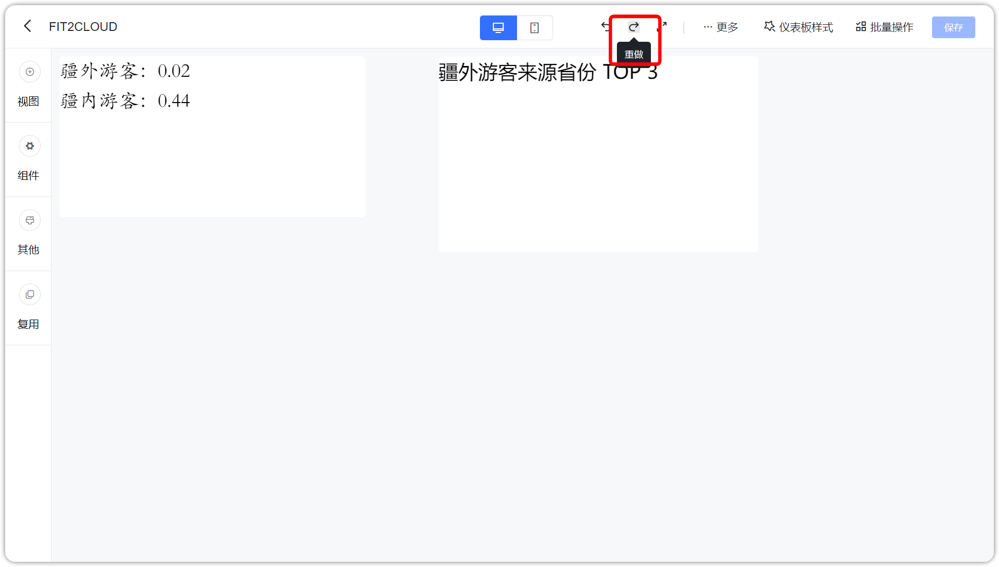
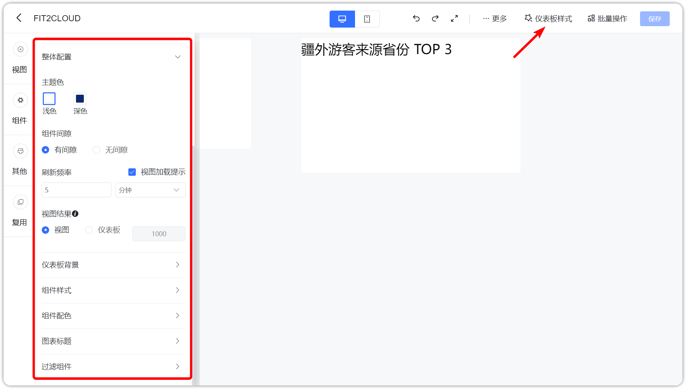

## 1 清空画布

!!! Abstract ""
	点击下图的按钮，清空画布，可以重新添加组件。

## 2 重做

!!! Abstract ""
	点击下图按钮，可以对组件重做。

## 3 撤销

!!! Abstract ""
	点击下图按钮，撤销操作。

## 4 样式

!!! Abstract ""
	点击【样式】按钮，左侧弹出仪表板样式设置页，可以修改仪表板的主题、组件样式、图形属性和表格属性。  
	**提示：** 此处可以设置仪表板的刷新时间。

## 5 当前元素移入分布方式

!!! Abstract ""
	在仪表盘画板中，可以调整仪表板组件移入为矩阵或悬浮模式。

