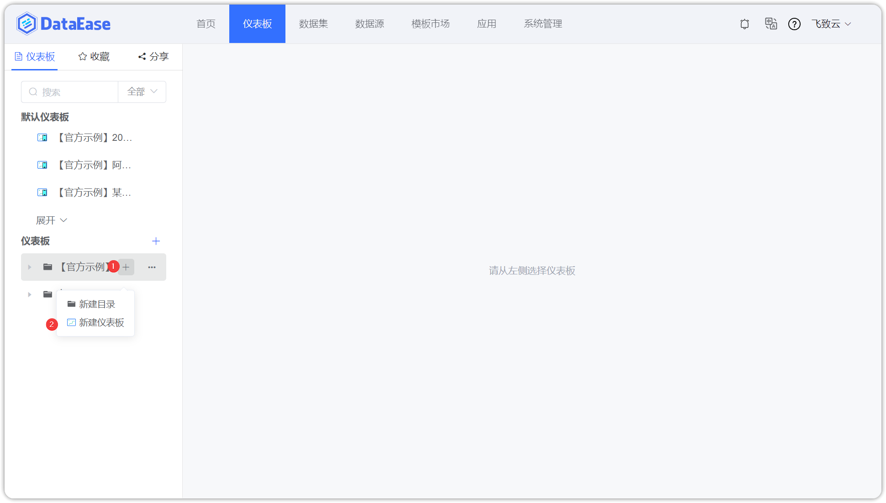
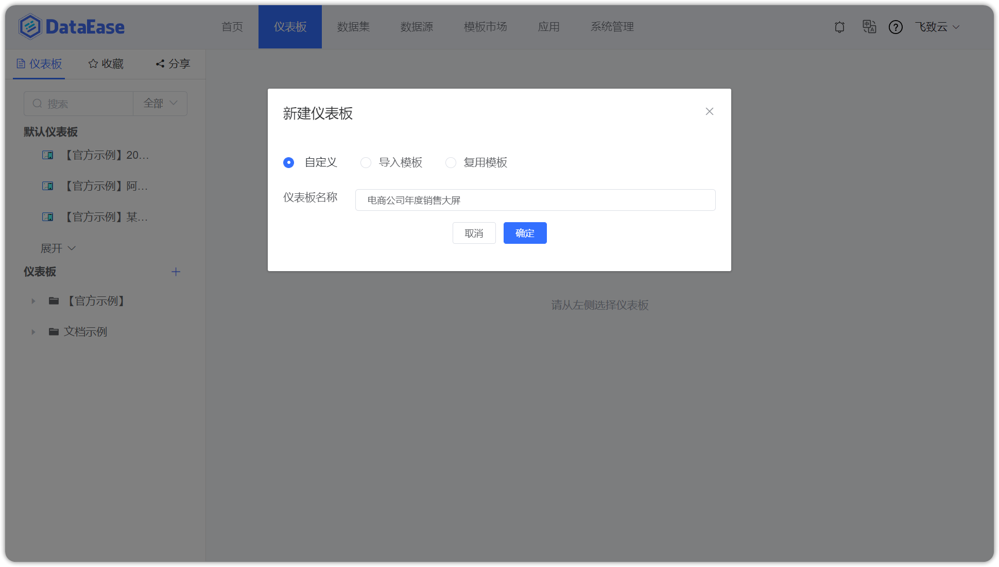
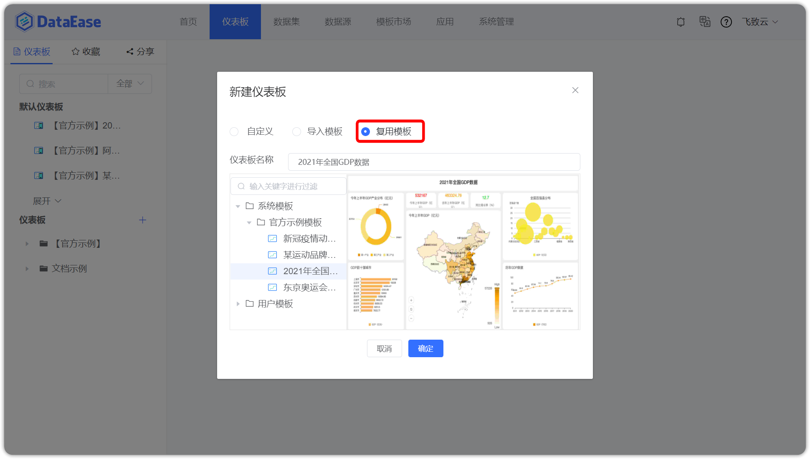

!!! Abstract ""
	点击【新建仪表板】，根据下图所示操作，在目录下新建仪表板。

!!! Abstract ""
	支持两种模版（自定义模板、复用模版），选择模版后，输入仪表板名称，点击【确定】，仪表板即创建成功。
## 1 自定义仪表板

!!! Abstract ""
	自定义模版，即按照下图所示，新建空白仪表板。

## 2 复用仪表板

!!! Abstract ""
	复用模版，按下图所示，选择系统内保存的模板，新建仪表板。

