## 功能概述
选择【仪表板】菜单，进入仪表板功能模块。此模块支持仪表板的添加、编辑、重命名、预览、查看等，仪表板制作完成后，还可支持仪表板的收藏、分享、下载等等。

## 1 仪表板新建
### 1.1 开始创建仪表板
点击【新建仪表板】，根据下图所示操作，在目录下新建仪表板。

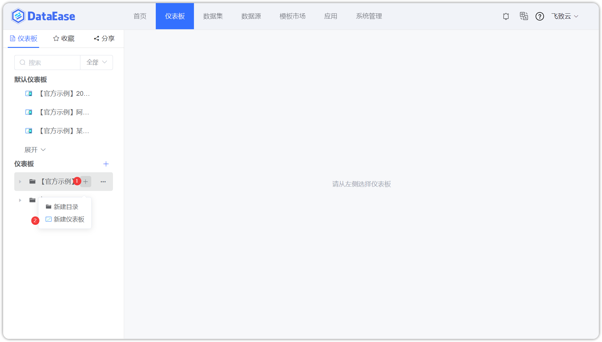
### 1.2 创建仪表板
支持两种模版（自定义模板、复用模版），选择模版后，输入仪表板名称，点击【确定】，仪表板即创建成功。

#### 1.2.1 自定义
自定义模版，即按照下图所示，新建空白仪表板。

#### 1.2.2 复用模版
复用模版，按下图所示，选择系统内保存的模板，新建仪表板。

## 2 仪表板编辑
### 2.1 开始编辑仪表板
按照下图所示操作，点击【编辑】，进入仪表板编辑页面，进行视图和组件的各种组合，设计需要的仪表板看板。

### 2.2 添加视图
点击左侧【视图】，弹出视图选择框,可通过以下两种方式添加视图： 1、新建视图 2、选择已有视图

### 2.3 添加过滤组件
#### 2.3.1 添加过滤组件
点击左侧【组件】，弹出组件选择框，可拖拉组件至仪表板的画板中，弹出组件编辑框。

#### 2.3.2 过滤组件通用功能
- 选择【按表选择】或者【按组件选择】，页面左侧列出可选择的组件列表
- 选择多个数据集的字段，用一个过滤组件过滤多个视图的数据
- 控制单选、多选
- 设置组件默认值
- 设置组件标题
- 自定义过滤组件的控制范围

#### 2.3.3 年份组件
可通过与视图组件的日期字段绑定，按年过滤视图组件的数据。

#### 2.3.4 年月组件
可通过与视图组件的日期字段绑定，按年份和月份过滤视图组件的数据。

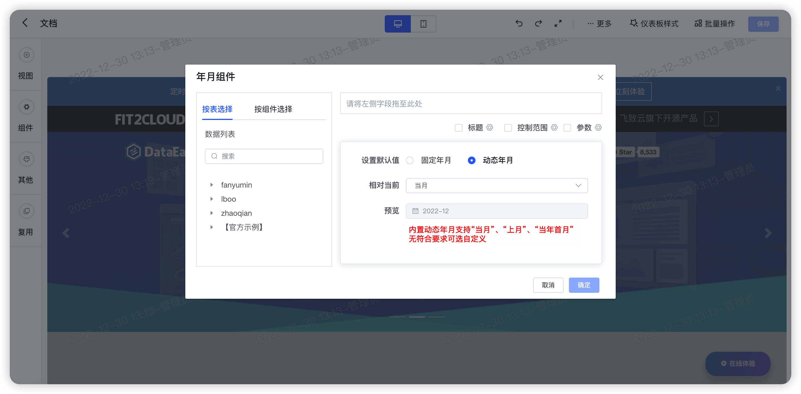
#### 2.3.5 日期组件
可通过与视图组件的日期字段绑定，按日期过滤视图组件的数据。支持动态设置默认日期，比如需要看当天的数据，即可将该组件的默认值设置为当天，那么不论何时打开仪表板，均展示当天数据。

#### 2.3.6 日期范围组件
可通过与视图组件的日期字段绑定，自定义日期范围过滤视图组件的数据。支持动态设置日期范围，比如需要看本月的数据，可通过设置组件的默认起始日期来实现，那么不论何时打开仪表板，均展示当月数据。

#### 2.3.7 文本下拉组件
可通过与视图组件的文本型字段绑定，过滤视图组件的数据。

#### 2.3.8 文本列表组件
可通过与视图组件的文本型字段绑定，过滤视图组件的数据。

#### 2.3.9 文本搜索组件
可通过与视图组件的文本型字段绑定，搜索并展示符合条件的视图组件的数据。

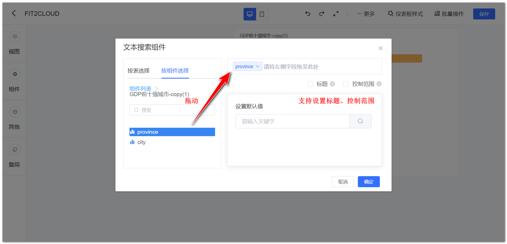
#### 2.3.10 数字下拉组件
可通过与视图组件的数值型字段绑定，过滤视图组件的数据。

#### 2.3.11 数字列表组件
可通过与视图组件的数值型字段绑定，过滤视图组件的数据。

#### 2.3.12 数值区间组件
可通过与视图组件的数值型字段绑定，自定义数值区间过滤视图数据。

### 2.4 添加其他组件
#### 2.4.1 添加其他组件
点击左侧【其他】，弹出其他组件选择框，支持文字、矩形、tab选项卡、图片、视频、时间等，可通过拖拽，将组件放入仪表盘的画板中，并设置组件属性。

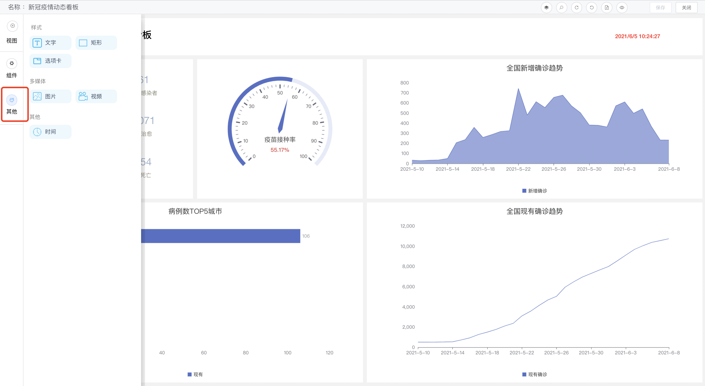
#### 2.4.2 文字
文本型组件，可设置文字的大小、颜色、粗细、背景色、超链接等

#### 2.4.3 矩形框
辅助类组件，如可作为组件的背景、边框等

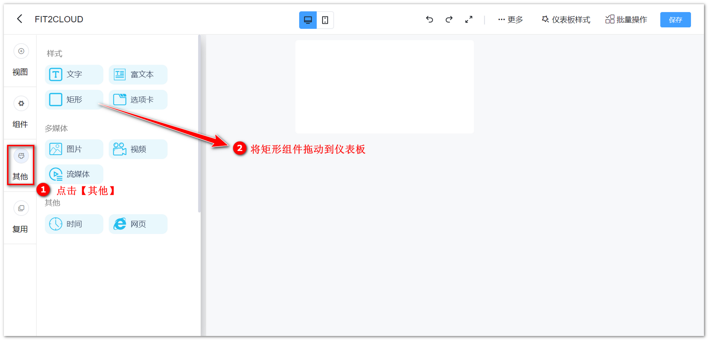
#### 2.4.4 选项卡
用户在制作仪表板时，可通过选项卡展示多个视图，并通过切换查看。

#### 2.4.5 图片
仪表板中可上传图片，并设置图片的透明度、边框、链接等属性

#### 2.4.6 视频
可配置视频信息，如视频链接、播放频率等，在仪表板中播放在线视频。

#### 2.4.7 时间
选择时间组件，可显示当前时间。可根据需要设置展示风格、日期格式等。

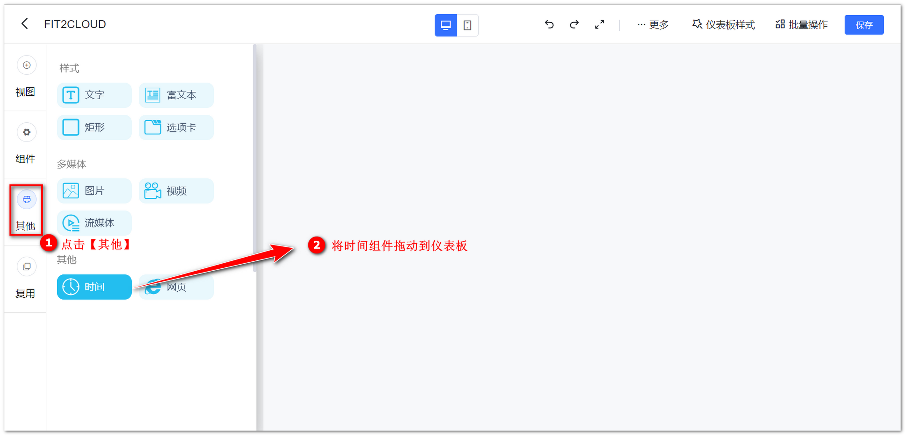
### 2.5 仪表板设计
#### 2.5.1 仪表盘样式设计
在仪表盘画板中，如下图右上角所示，不仅可以调整仪表板组件移入为矩阵或悬浮模式，还可以调整仪表盘的样式、清空画布、保存、预览等

#### 2.5.2 视图或组件基础功能
在仪表盘设计窗口，点击视图或者组件的右上角，展开功能操作菜单，如下图所示： 序号1：编辑，点击进行视图或者组件的编辑窗口 序号2：复制，点击进行视图或者组件的复制 序号3：删除，删除视图或者组件 序号4：置顶，画布中组件或者视图可以多层叠放，置顶后位于最顶层 序号5：置底，画布中组件或者视图可以多层叠放，置底后位于最底层 序号6：上移，画布中组件或者视图可以多层叠放，点击【上移】，层级上移一层 序号7：下移，画布中组件或者视图可以多层叠放，点击【下移】，层级下移一层 序号8：联动设置，对某个视图设置联动，使其他视图跟随其变动 序号9：跳转设置，可通过设置跳转目标，跳转至系统内其他仪表板，或者第三方链接

### 2.6 视图联动
#### 2.6.1 联动设置入口
如下图，点击展开功能菜单，开始【联动设置】。

#### 2.6.2 联动设置
如下图，当设置两个视图联动时，设置相对应的数据集的联动字段。设置完成后，点击【确定】，联动设置完成。

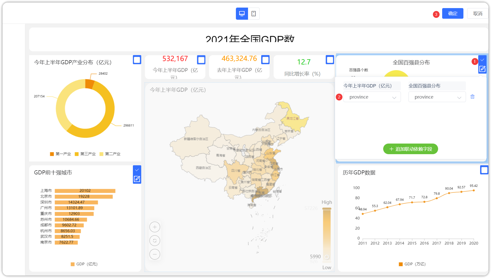
#### 2.6.3 联动展示
第一步，点击【浙江省】，并选择【联动】。请注意：如果视图同时设置了联动和钻取，那么当点击时由用户选择执行联动，或者钻取；当只设置了联动时，默认执行联动；当只设置了钻取时，默认执行钻取。

第二步，联动结果展示，如下图，设置了联动的视图，只展示浙江省的数据。

第三步，可点击下图所示位置，清除局部联动和所有联动。

### 2.7 跳转
#### 2.6.1 跳转设置入口
如下图，点击展开功能菜单，开始【跳转设置】。

#### 2.6.2 跳转设置
第一种，仪表板间跳转，如下图所示，设置原视图与目标仪表板的视图的联动字段（请注意：当前用户至少拥有目标仪表板的查看权限）。设置完成后，点击【确定】，跳转设置完成。

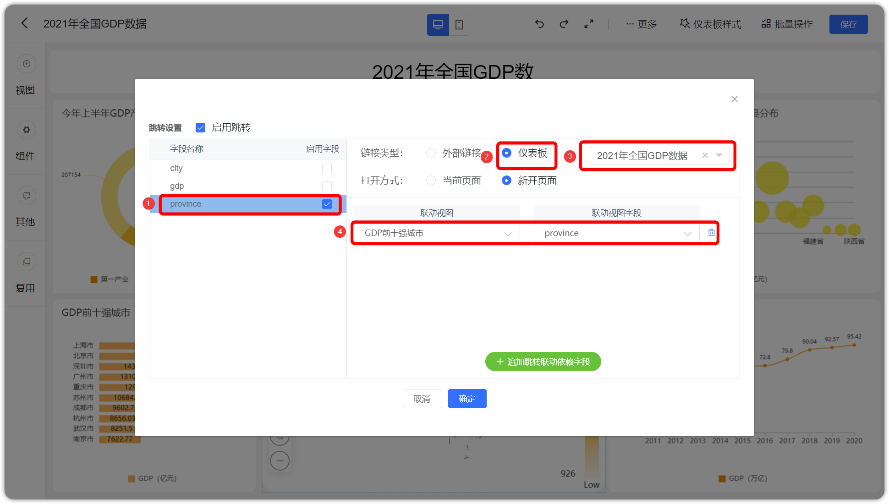
第二种，外部链接跳转，如下图所示，输入链接 URL。设置完成后，点击【确定】，跳转设置完成。

#### 2.6.3 跳转展示
点击下图所示位置，触发跳转。

如果选择的是仪表板跳转，那么跳转至目标仪表板，并联动目标仪表板的视图，如果不需要，可点击右上角清除联动。

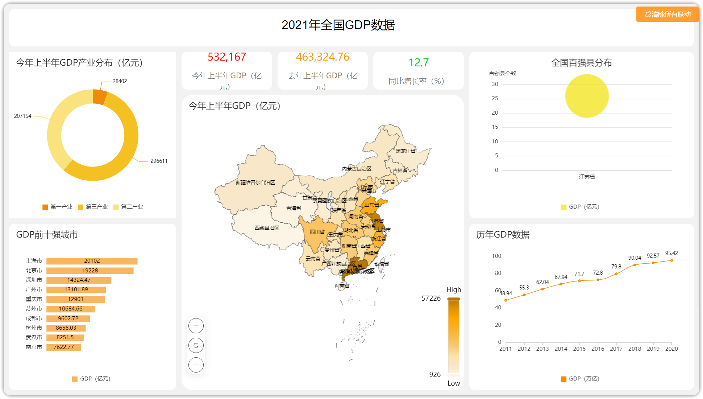
第二种，如果选择的是外部链接跳转，那么跳转至第三方平台。

## 3 仪表板的使用
### 3.1 仪表板-查看
点击下图中所示位置，查看仪表板

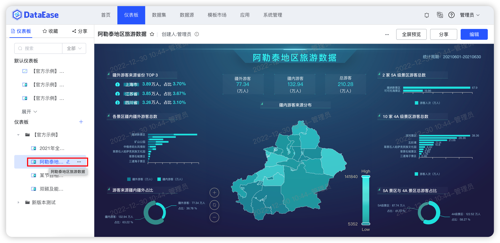
### 3.2 仪表板-预览
支持两种预览方式，第一种：新打开页面预览，第二种：全屏预览仪表盘

预览模式下，视图可放大，可查看明细并下载

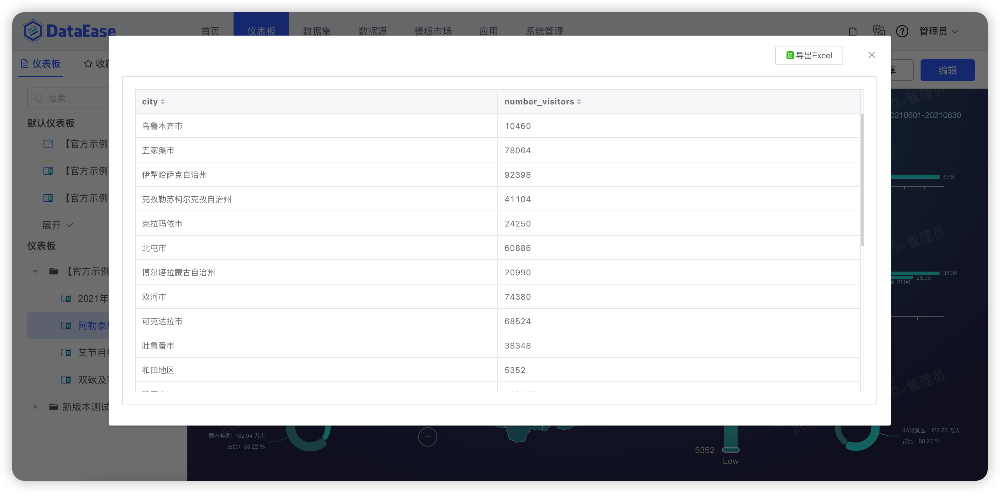
### 3.3 仪表板-分享
点击下图中所示位置，点击【分享】。

分享仪表板给系统内的组织、角色、或者用户。

可在下图所示位置：1）查看其它组织或用户分享给自己的仪表板；1）我分享给其他组织、角色、用户的仪表板，并支持编辑（添加、删除）分享对象、甚至一键取消分享；

### 3.4 仪表板-收藏
点击下图中所示位置，收藏仪表板。

收藏后，可在下图所示位置查看收藏列表。

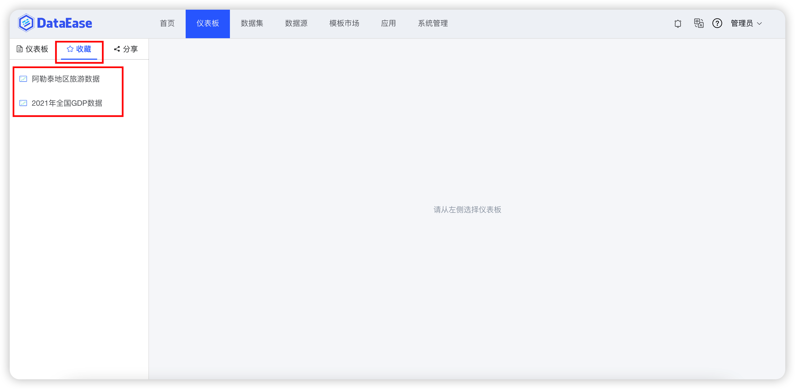
### 3.5 仪表板-导出为模版
点击下图中所示位置，导出模板到本地，可在本地的下载目录中查看，亦可用此模板创建仪表板。

### 3.6 仪表板-保存为模版
点击下图中所示位置，保存为模板，在创建仪表板时使用。

### 3.7 仪表板-创建公共链接
点击下图中所示位置，创建公共链接

打开下图中所示链接分享的按钮，链接自动生成，点击【复制链接】，可把链接分享给任何组织或个人。

### 3.8 仪表板-复制
点击下图所示【复制】，在当前目录下创建一个一样的仪表板。

### 3.9 仪表板-移动
使用方式，请查阅通用功能 [「移动」](../general/#_4)
### 3.10 仪表板-导出pdf
点击下图中所示位置，点击可弹出pdf的预览窗口

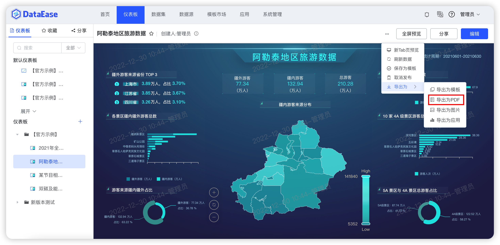
预览导出的pdf样式，另外还支持带参数下载，比如：仪表板名称、导出时间、导出人等。点击【导出pdf】，下载pdf文件至本地；点击【取消】，取消下载pdf文件。

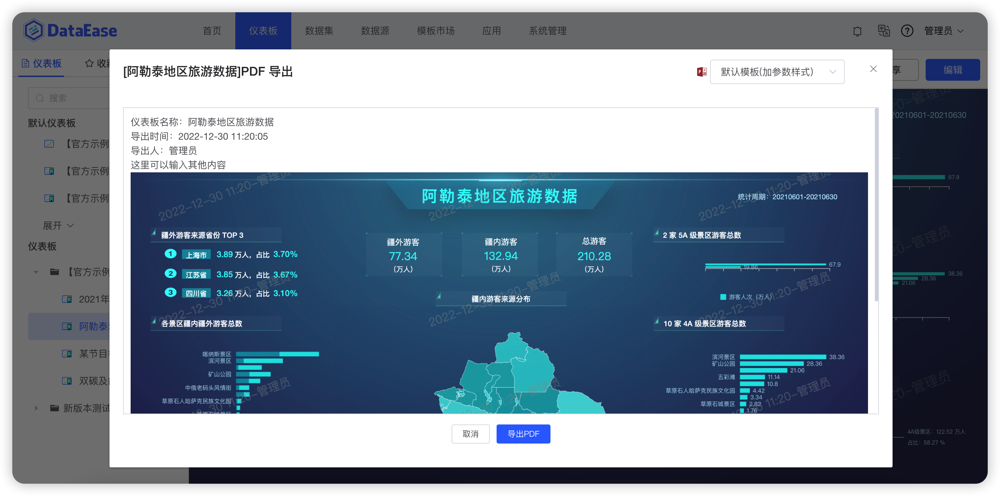

