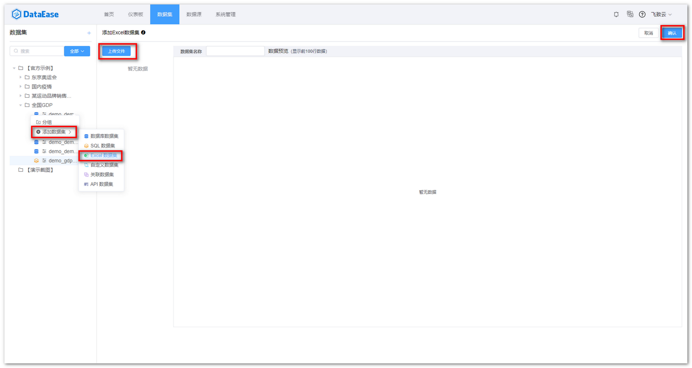
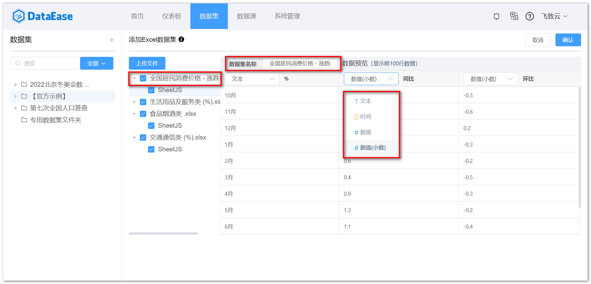

## 1 上传 Excel 文件

!!! Abstract ""
    如下图所示，点击【添加数据集】并选择【 Excel 数据集】，点击【上传文件】，将 Excel 文件上传到 DataEase, 新建 Excel 数据集可上传多个 Excel 文件。
    


## 2 调整合适的字段类型
    
!!! Abstract ""
    选择 Excel 文件后，填入数据集名称，调整对应的字段类型，Excel 数据展示在【数据预览】区，若预览符合预期，点击【确认】，生成 Excel 数据集。

