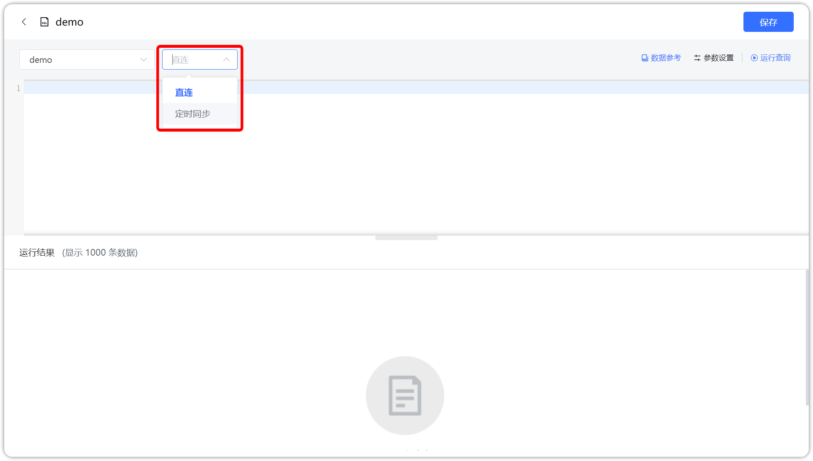
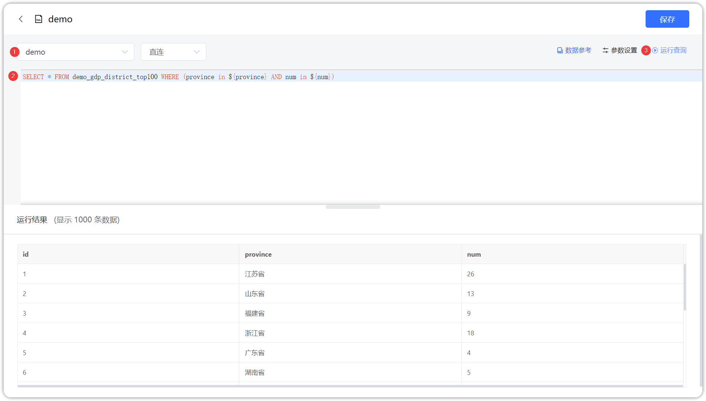

## 1 新建 SQL 数据集

!!! Abstract ""
    如下图所示，点击【添加数据集】并选择【 SQL 数据集】。



## 2 选择连接方式

!!! Abstract ""
    支持两种连接方式：直连和定时缓存，具体使用与【数据库数据集】一致



## 3 输入正确的SQL语句

!!! Abstract ""
    支持丰富多样的 SQL 语法，如调用 CTE 临时表等。  
    【序号1】位置输入即将添加的数据集名称；  
    【序号2】位置为SQL语句输入区，在此区域输入正确的sql语句；  
    【序号3】点击可展示预览数据；  
    【序号4】点击后提交，SQL数据集生成成功。

