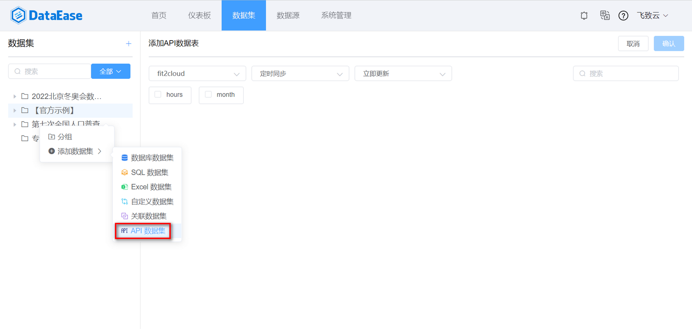
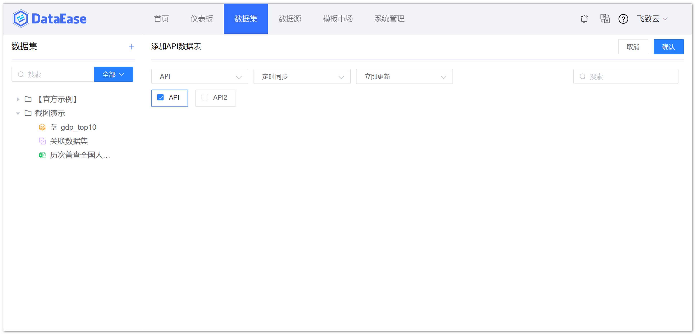

## 1 添加 API 数据集

!!! Abstract ""
    添加 API 数据集时需选择 API 类型的数据源，API 数据集没有【直连】模式，只能选择【定时同步】，同步后的数据会存在 Doris 中。

{ width="900px" }

## 2 保存 API 数据集

!!! Abstract ""
    如下图所示，选定 API 数据表后，点击【确认】，生成 API 数据集。

{ width="900px" }


