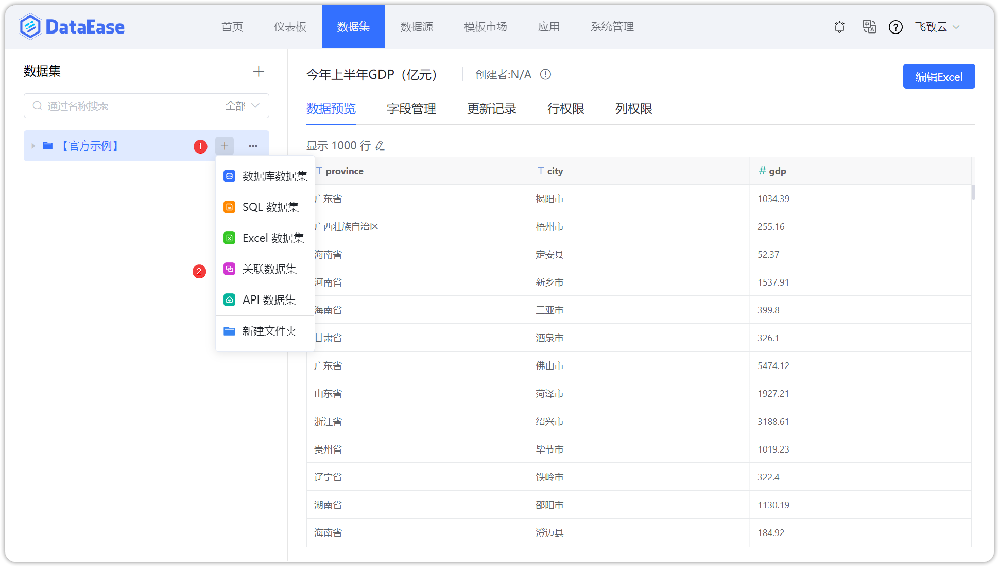
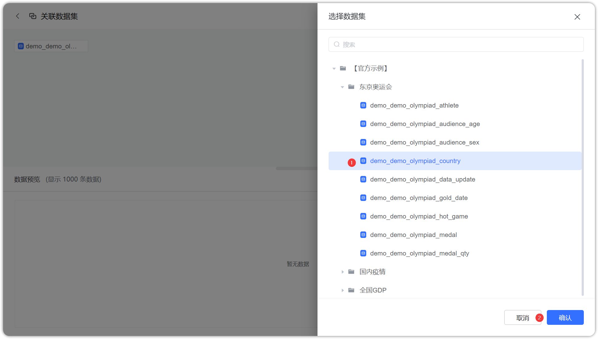
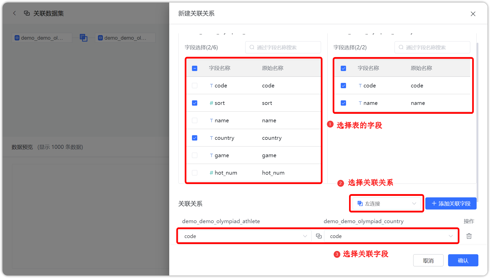

## 1 新建关联数据集

!!! Abstract ""
    点击【添加数据集】并选择【关联数据集】，跳转到添加关联数据集页面，点击【选择数据集】，弹出选择数据集页面，选定一个数据集。




## 2 建立关联关系

!!! Abstract ""
    - 如下图，点击【关联】，跳转到新的选择数据集页面，选定需要关联的数据集，弹出新建关联关系页面，勾选关联表的字段，填写数据关联方式和关联字段，点击【确认】；

    - 关联数据集是改版后的自定义数据集，如下图所示，多数据集间关联关系的构建以及数据集字段的选择一并完成，更易理解，使用更方便；  
    
    - **注意** 被关联的数据集必须是来自同一个数据源。




## 3 预览数据

!!! Abstract ""
    如下图所示，点击【预览结果】查看数据集，若数据集符合预期，点击【确认】成功添加关联数据集。

