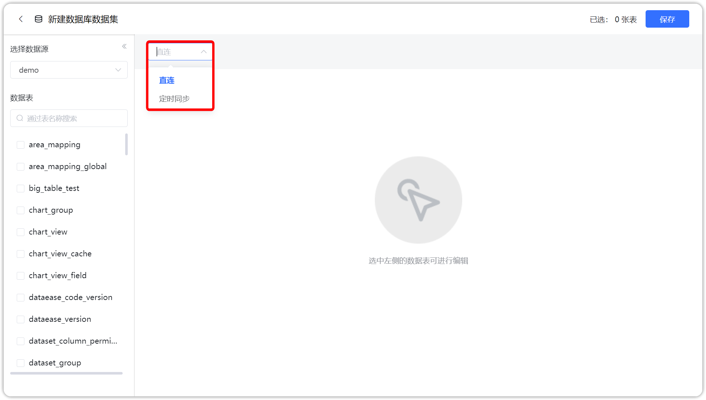
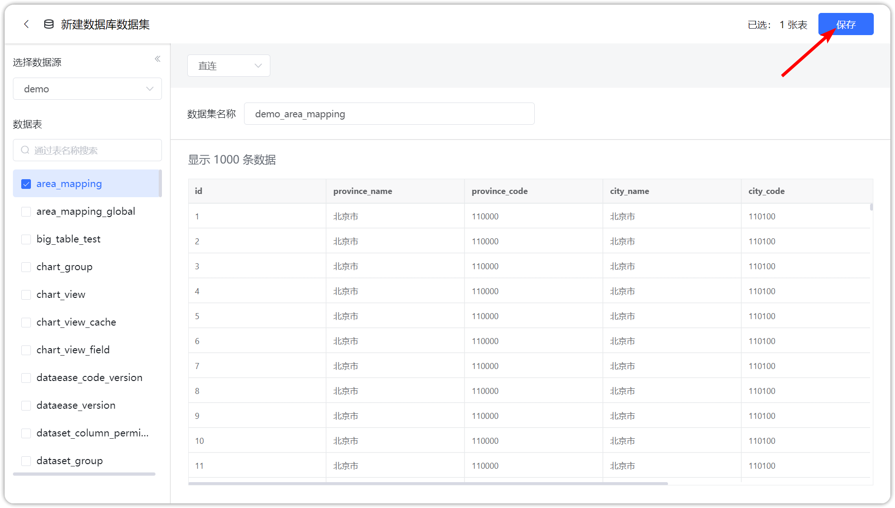

## 1 新建数据库数据集

!!! Abstract ""
    如下图所示，点击【添加数据集】并选择【数据库数据集】，跳转到添加数据库数据集页面。

{ width="900px" }

## 2 选择连接方式

!!! Abstract ""
    - 连接方式支持直连模式和定时同步模式。
    - 在数据库数据集页面，选择数据源和连接方式，勾选需要添加的数据库表。  
    **提示：定时同步模式下有两个概念，立即更新和稍后同步，立即更新即此次操作会即时更新数据，稍后同步需要设置定时任务或手动去更新数据。**

{ width="900px" }

## 3 保存数据库数据集

!!! Abstract ""
    如下图所示，点击【确定】，即成功添加数据库数据集。

{ width="900px" }
