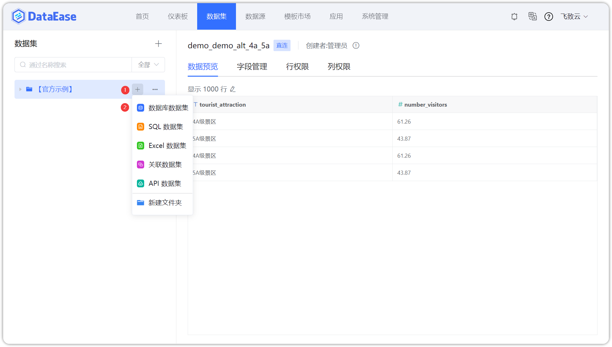

## 1 新建数据库数据集

!!! Abstract ""
    如下图所示，点击【添加数据集】并选择【数据库数据集】，跳转到添加数据库数据集页面。



## 2 选择连接方式

!!! Abstract ""
    连接方式支持直连模式和定时同步模式，直连即直接访问数据库，定时同步即设定定时任务，将数据从数据库定时抽取到 DataEase 内置的数据库下；

    在数据库数据集页面，选定连接的数据源，点击【直连】，弹出下拉框，选择连接方式，勾选需要添加的数据库表，点击【确定】后返回数据集页面；

    **定时同步模式下有两个概念，立即更新和稍后同步，立即更新即此次操作会即时更新数据，稍后同步需要设置定时任务或手动去更新数据。**


