## 1 数据集预览

!!! Abstract ""
    点击左侧数据表，右侧默认展示预览数据。  
    **两种连接模式的差异：**  

    1. 如果数据集为【直连】模式，那么没有【更新信息】模块，数据实时获取；  
    2. 如果数据集为【定时同步】模式，可通过【更新信息】设置定时任务，更新数据。

    从字段管理 Tab 页，切换至数据预览 Tab 页时，若字段管理中没有任何更变，这些更变包括 2 【字段管理】中的操作，则不向后端发起数据请求，否则重新请求数据；  
    是否变更的判定标准：在字段管理 Tab 页中，向后端发起任何修改请求，即判定为发生变更，包括：新建、编辑 、删除计算字段，同步字段，对字段进行任意修改（比如是否选中、字段名、类型、维度指标转换）。
 
{ width="900px" }  
{ width="900px" }

## 2 数据集导出

!!! Abstract ""
    支持按条件将数据导出 Excel。  
    **注意：** 最多支持导出 10 万条数据。

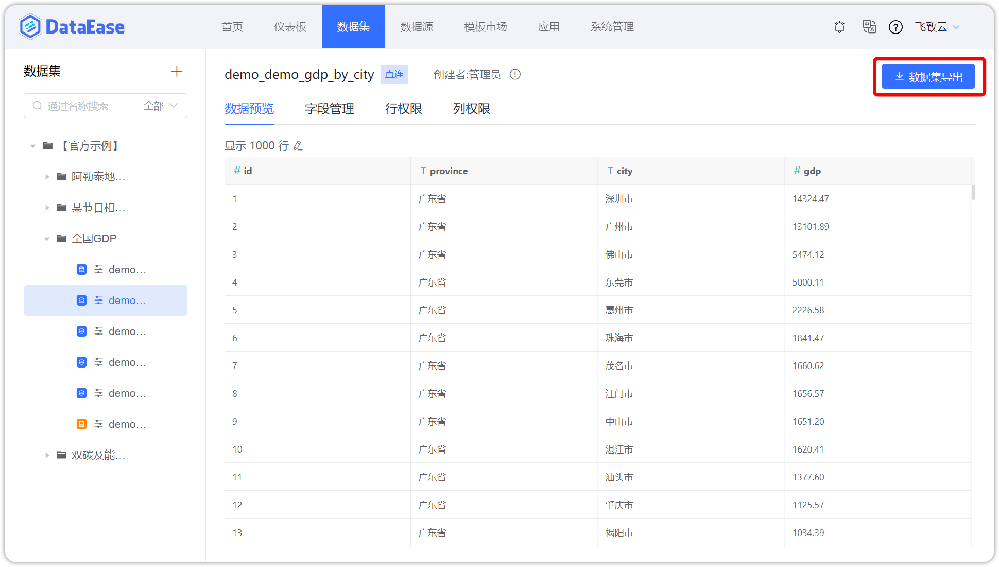{ width="900px" }

{ width="900px" }

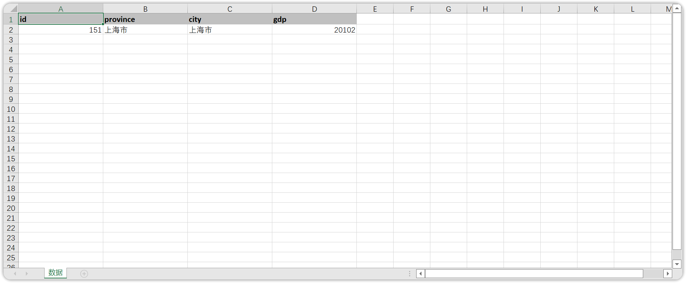{ width="900px" }

## 3 字段管理

### 3.1 字段重命名

!!! Abstract ""
    如下图所示，切换到字段管理页，修改字段名。

{ width="900px" }

### 3.2 字段选中

!!! Abstract ""
    字段显示支持全选/全不选，也可单独勾选。

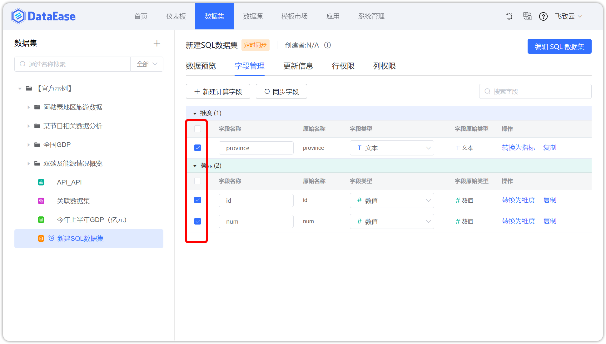{ width="900px" }

### 3.3 更换字段类型

!!! Abstract ""
    如下图所示，支持更换字段类型。

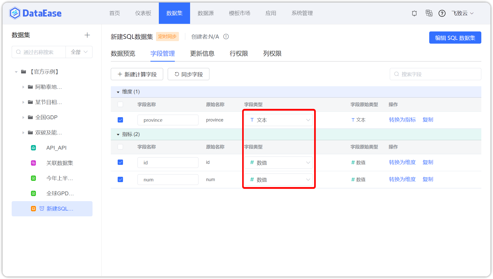{ width="900px" }

### 3.4 日期字段解析

!!! Abstract ""
    示例：数据库中以 2000/01/01 文本存储的数据，由于格式差异性，日期类过滤组件无法过滤出来这些数据；  
    可将该文本字段改为时间类型，并选择 Y/m/d 格式（具体格式看数据源），则日期类过滤组件可以过滤出来这些数据。  
    **注意：** 目前 Kylin 数据源还不支持。

{ width="900px" }

### 3.5 更换指标维度

!!! Abstract ""
    如下图所示，支持将字段转换为维度或指标。

{ width="900px" }

### 3.6 新建计算字段

!!! Abstract ""
    点击【新建计算字段】按钮，弹出新建计算字段页面，在此页面输入字段名，字段表达式，通过引用函数，生成新的数据集字段。

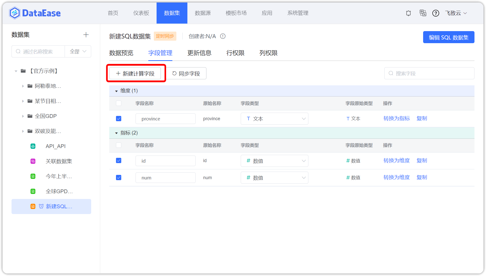{ width="900px" }
 
!!! Abstract ""
    - 【序号 1】在此输入新建字段的名称；
    - 【序号 2】字段表达式由引用的字段和函数组成，也可手动添加四则运算符号；
    - 【序号 3】选择新建字段的数据类型，包括维度或指标；
    - 【序号 4】根据引用的字段及函数计算结果，调整新建字段的字段类型；
    - 【序号 5】引用字段栏，点击数据集原有的字段，字段表达式栏引用到对应的字段；
    - 【序号 6】函数栏，使用的函数支持对应数据集的数据库函数。

{ width="900px" }

!!! Abstract ""
    **请注意：** 字段表达式支持所有的数据库函数以及简单的加减乘除，不仅是右侧列出的示例函数。比如：直连模式，数据源为 MySQL 数据库，那么字段表达式中可输入所有 MySQL 数据库的函数，包括 IF、CASE WHEN 等用法。已增加的计算字段不支持二次计算。  
    **提示：** 相关函数的使用可参考 [DataEase 数据集的计算字段使用说明](https://kb.fit2cloud.com/archives/dataease%E6%95%B0%E6%8D%AE%E9%9B%86%E7%9A%84%E8%AE%A1%E7%AE%97%E5%AD%97%E6%AE%B5%E4%BD%BF%E7%94%A8%E8%AF%B4%E6%98%8E)。

### 3.7 同步新的字段
    
!!! Abstract ""
    点击【同步字段】，弹出确认同步页面，点击【确定】对字段进行同步。

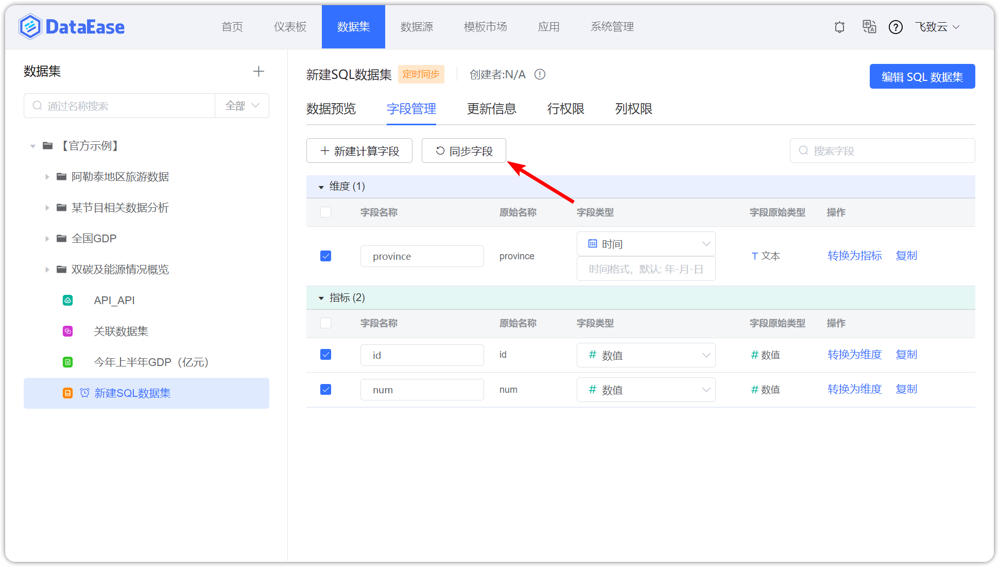{ width="900px" }

### 3.8 复制字段

!!! Abstract ""
    支持对字段进行【复制】操作，复制后的字段相当于新建一个计算字段，复制后的字段，字段名：原字段名_Copy。  
    **注意：** 仅数据集字段管理的字段支持复制。

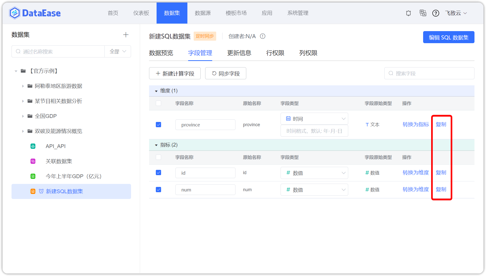{ width="900px" }

## 4 数据关联

### 4.1 左连接

!!! Abstract ""
    如下图，在关联数据集设置页面，选择左连接，即 LEFT JOIN，连接取左表所有数据记录，当关联字段中匹配到右表的字段，则检索出右表的数据记录，否则以 null 显示。

{ width="900px" }


### 4.2 右连接

!!! Abstract ""
    如下图，在关联数据集设置页面，选择右连接，即 RIGHT JOIN，连接取右表所有数据记录，当关联字段中匹配到左表的字段，则检索出左表的数据记录，否则以 null 显示。

{ width="900px" }

### 4.3 内连接

!!! Abstract ""
    如下图，在关联数据集设置页面，选择内连接，即 INNER JOIN，当左表和右表的数据记录存在匹配时，数据记录才被检索出来。

{ width="900px" }

## 5 更新信息

!!! Abstract ""
    点击左侧数据表（定时同步模式下），右侧默认展示预览数据，可点击【更新信息】，切换至更新信息页面，可设置定时任务。

!!! Abstract ""
    **请注意：** 如果数据集是首次添加，而且是【定时同步】模式，那么需要设置定时任务更新数据到缓存区，否则无法用此数据集创建视图。

{ width="900px" }

!!! Abstract ""
    如下图所示，支持查看和删除任务。

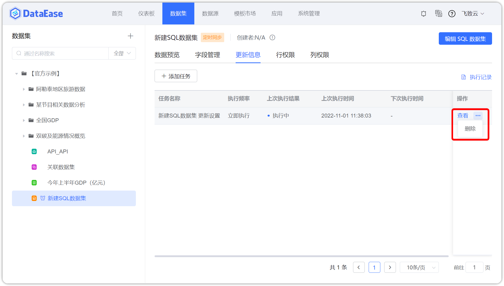{ width="900px" }

### 5.1 添加任务

!!! Abstract ""
    点击【添加任务】，在添加任务页面，设置任务名称，更新方式（有全量更新、增量更新两种方式），选择执行频率（支持三种设置方式，立即执行、简单重复、表达式设定），任务信息添加完毕后，点击【确认】，任务添加成功。  
    **提示：** 表达式可参考 [Cron 在线表达式生成器](http://cron.ciding.cc/)。

{ width="900px" }

### 5.2 全量更新

!!! Abstract ""
    如下图所示，点击【添加任务】，弹出添加任务页面，先修改任务名称，选定【全量更新】更新方式，调整执行频率，点击【确定】，全量更新任务添加成功。

{ width="900px" }

### 5.3 增量添加

!!! Abstract ""
    【增量更新方式】，选择同步数据的增量方式，若勾选增量添加，那么数据增量添加；若勾选增量删除，那么对数据实行增量删除。同时也可在【参数】区域，输入 SQL 语句的时间参数。  
    **注意，定时同步模式下：**

    - **API 数据集：支持增量添加，增量更新即与历史数据做全量对比，同步的是新增的数据；**
    - **SQL 数据集与数据库数据集：支持增量添加与增量删除，支持写增量 SQL 语句；**
    - **系统自带的 ${__current_update_time__}、${__last_update_time__} 为 13 位的时间戳，传参时，需要把原始时间字段转化为时间戳再做比较。**

!!! Abstract "" 
    如下图所示，增量更新方式选择【增量添加】，在输入框中输入 SQL 语句，并拖拉参数【上次更新时间】，即更新数据的方式为：把订单时间大于上次更新时间的数据抽取至缓存区；  
    点击【确认】，增量添加任务建立成功。

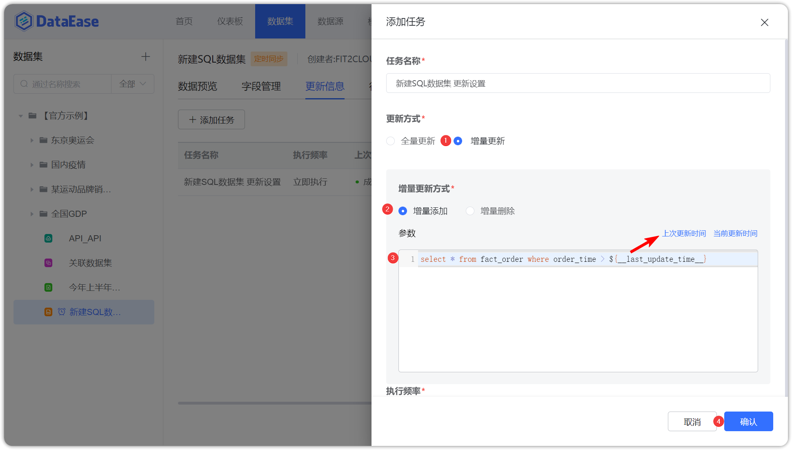{ width="900px" }

!!! Abstract ""
    **如下示例演示如何配置增量添加任务。**  
    假设业务库（MySQL）有订单明细表 Orders，明细表展示如下图所示。

| Order_date | Years | Quantity | Product_ID | Customer_ID | Transaction_Type |
|------------|-------|----------|------------|-------------|------------------|
| 2022-06-01 | 2022  | 1        | 528        | 17186BA     | 1                |
| 2022-06-02 | 2022  | 1        | 528        | 16472BA     | 1                |
| 2022-06-03 | 2022  | 1        | 528        | 13816BA     | 1                |
| 2022-06-04 | 2022  | 1        | 528        | 16750BA     | 1                |
| 2022-07-01 | 2022  | 1        | 528        | 14999BA     | 1                |
| 2022-07-02 | 2022  | 1        | 528        | 14461BA     | 1                |
| 2022-07-03 | 2022  | 1        | 528        | 13713BA     | 1                |
| 2022-07-04 | 2022  | 1        | 528        | 13725BA     | 1                |

{ width="900px" }

!!! Abstract ""
    八月新增数据如下表所示。

| Order_date | Years | Quantity | Product_ID | Customer_ID | Transaction_Type |
|------------|-------|----------|------------|-------------|------------------|
| 2022-06-01 | 2022  | 1        | 528        | 17186BA     | 1                |
| 2022-06-02 | 2022  | 1        | 528        | 16472BA     | 1                |
| 2022-06-03 | 2022  | 1        | 528        | 13816BA     | 1                |
| 2022-06-04 | 2022  | 1        | 528        | 16750BA     | 1                |
| 2022-07-01 | 2022  | 1        | 528        | 14999BA     | 1                |
| 2022-07-02 | 2022  | 1        | 528        | 14461BA     | 1                |
| 2022-07-03 | 2022  | 1        | 528        | 13713BA     | 1                |
| 2022-07-04 | 2022  | 1        | 528        | 13725BA     | 1                |
| 2022-08-01 | 2022  | 1        | 528        | 14432BA     | 1                |
| 2022-08-02 | 2022  | 1        | 528        | 18741BA     | 1                |
| 2022-08-03 | 2022  | 1        | 528        | 27988BA     | 1                |
| 2022-08-04 | 2022  | 1        | 528        | 25710BA     | 1                |

!!! Abstract ""
    新建同步任务指定将 2022 年 8 月份数据更新到本地库（Doris），SQL 语句及操作如下。
    ```SQL
    select  * from orders where DATE_FORMAT(Order_date,'%Y-%m') = '2022-08';
    ```

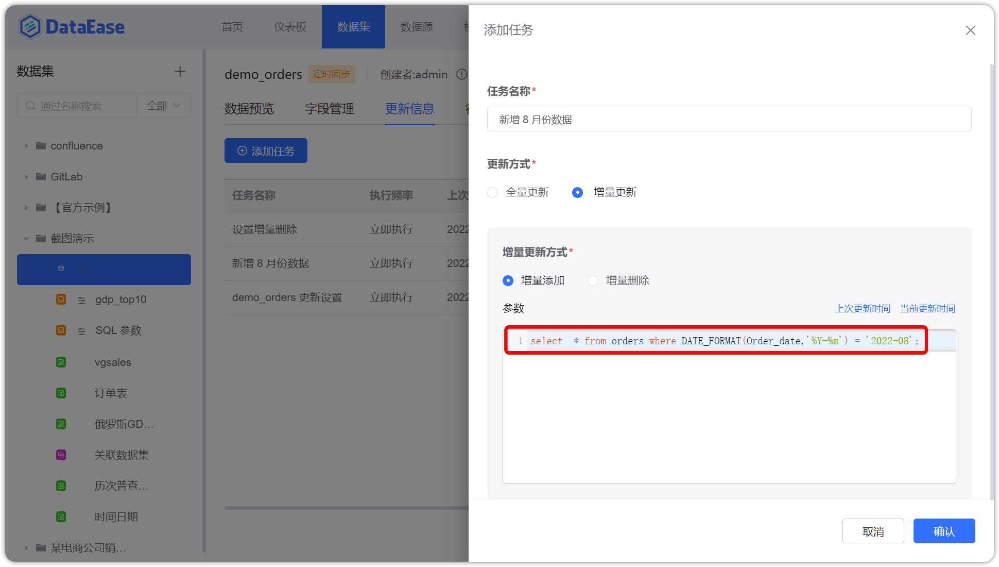{ width="900px" }

!!! Abstract ""
    如下图所示，2022 年 08 月份数据已更新。

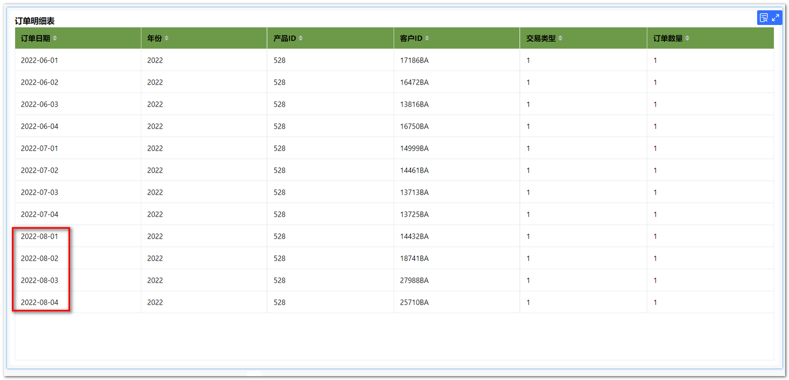{ width="900px" }

### 5.4 增量删除

!!! Abstract ""
    如下图所示，增量更新方式选择【增量删除】，在输入框中输入 SQL 语句，并拖拉参数【上次更新时间】，即更新数据的方式为：把订单时间大于上次更新时间的数据从缓存区删除；  
    点击【添加任务】，修改任务名称，选定【增量更新】，点击【确定】，增量删除任务添加成功。  
    **注意：系统自带的 ${__current_update_time__}、${__last_update_time__} 为 13 位的时间戳，传参时，需要把原始时间字段转化为时间戳再做比较。**

{ width="900px" }

!!! Abstract ""
    **如下示例演示如何配置增量删除任务。**  
    假设有订单明细表 Orders，第一次已全量同步数据，明细表展示如下。

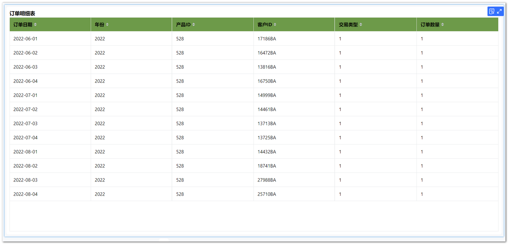{ width="900px" }

!!! Abstract ""
    新建同步任务指定将 2022 年 6 月份数据从本地库（Doris）删除，SQL 语句及操作如下。
    ```SQL
    select  * from orders where DATE_FORMAT(Order_date,'%Y-%m') = '2022-06';
    ```

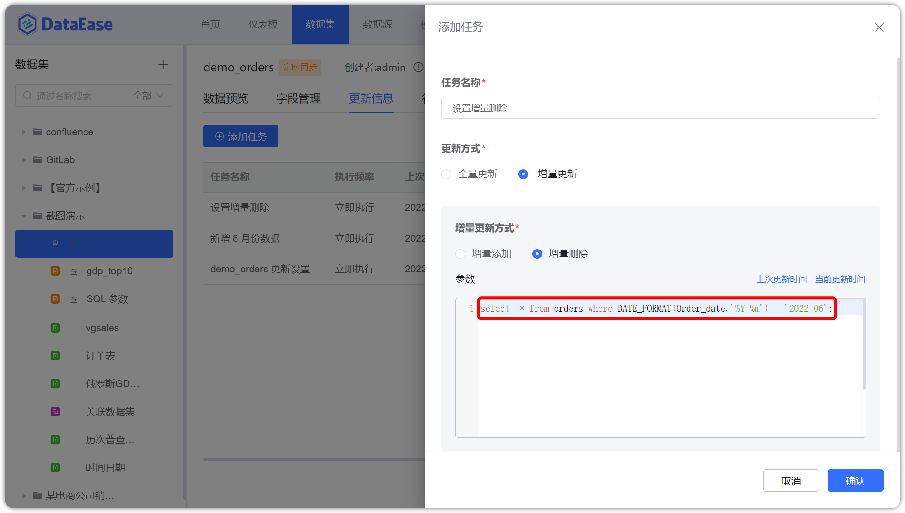{ width="900px" }

!!! Abstract ""
    如下图所示，定时同步任务执行完成后，2022 年 6 月份已被删除。

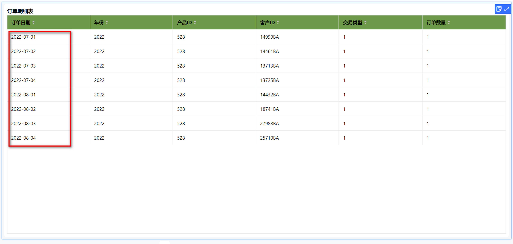{ width="900px" }



