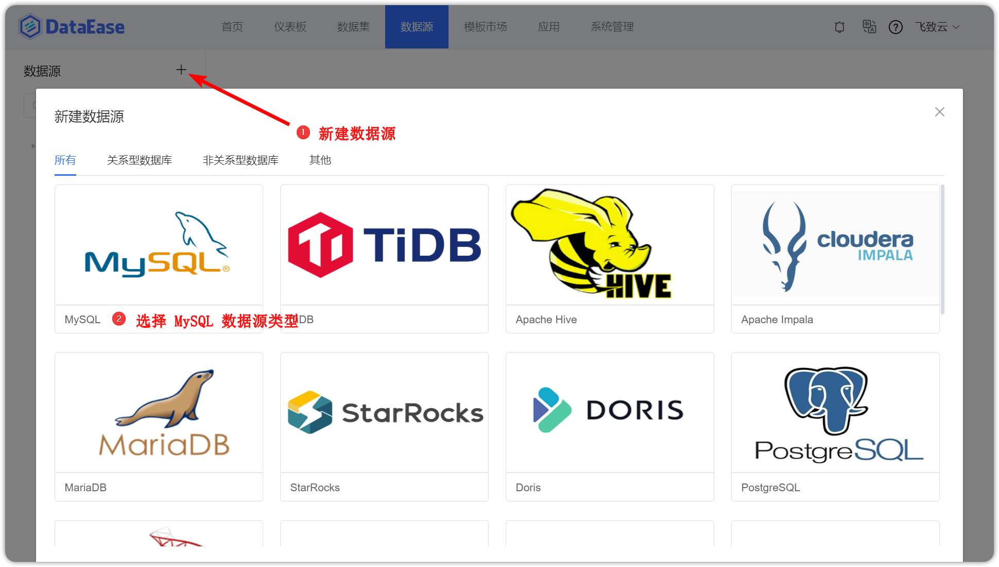
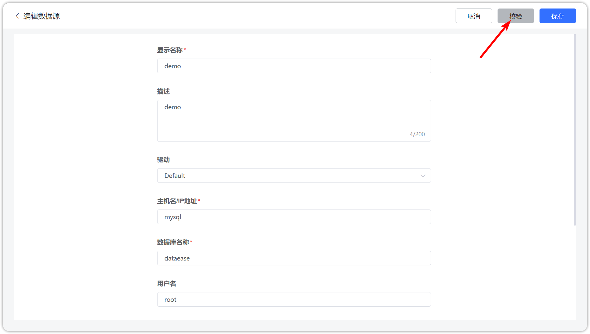

## 1 新建数据连接

!!! Abstract ""
    以 MySQL 数据库为示例：  
    点击【新建数据连接】按钮，跳转至新建数据连接页面。在新建页面输入连接的名称、选择连接类型为 MySQL、填入 ip 地址、填写数据库名称、用户名和密码等。
 

## 2 数据源校验

!!! Abstract ""
    如下图所示，点击【校验】，若校验成功，点击保存，则新连接成功添加；若校验失败，需重新输入连接信息，直至校验通过，方可保存成功，也可以点击左上方箭头返回之前页面。

