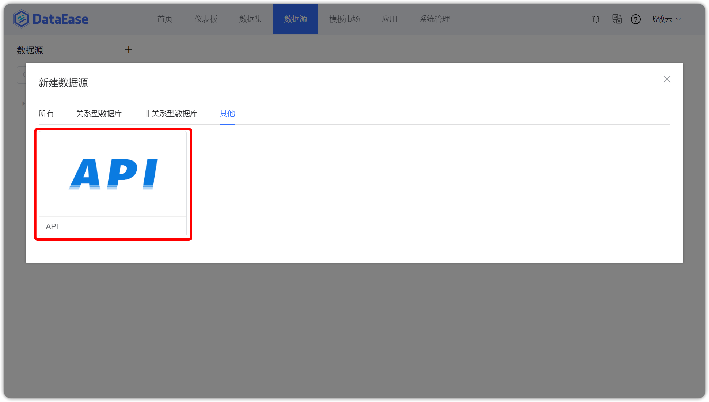
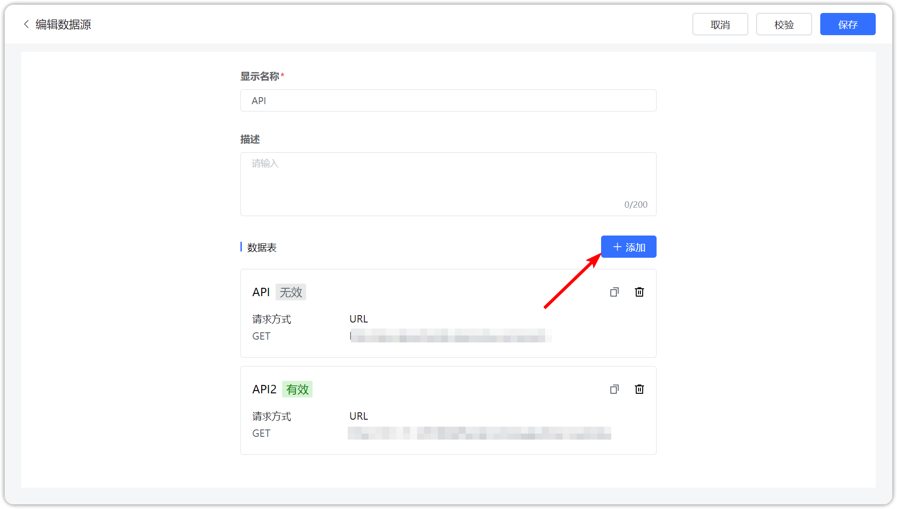

## 1 新建数据连接

!!! Abstract ""
    点击【新建数据连接】按钮，跳转至新建数据连接页面，填入新建数据源的名称，在【类型】下拉框选定 "API" 数据源。
 

## 2 添加API数据表

!!! Abstract ""
    点击【数据表】，跳转至添加 API 数据表页面，若添加成功则再次返回新建数据源页面，一个 API 数据源可添加多张 API 数据表。

## 3 步骤一

!!! Abstract ""
    - 填写 API 数据表的基础信息，包括数据表名称、完整的请求地址和请求方式，请求方式支持 GET 和 POST， GET 即获取，一般用于获取/查询资源信息，POST 即提交，一般用来提交数据进行请求处理；
    - 填写请求参数，包括请求头、请求体，POST 请求一般通过 body 传递参数，认证配置支持 No Auth 和 Basic Auth，选择好认证方式后，用 JsonPath 填入数据路径，点击下一步。
    - 提示：此处示例请求类型选择 GET，填入完整的请求地址(注意是 **http** 开头)，认证方式为 No Auth。

## 4 步骤二

!!! Abstract ""
    如下图，预览显示相应的字段与数据后，点击【保存】即可，否则返回上一步，再次检查填写的参数，直至数据预览成功。

## 5 数据源校验

!!! Abstract ""
    新建数据连接页面点击【校验】，校验通过可点击【保存】，提示保存成功后回到"数据源"页面。

