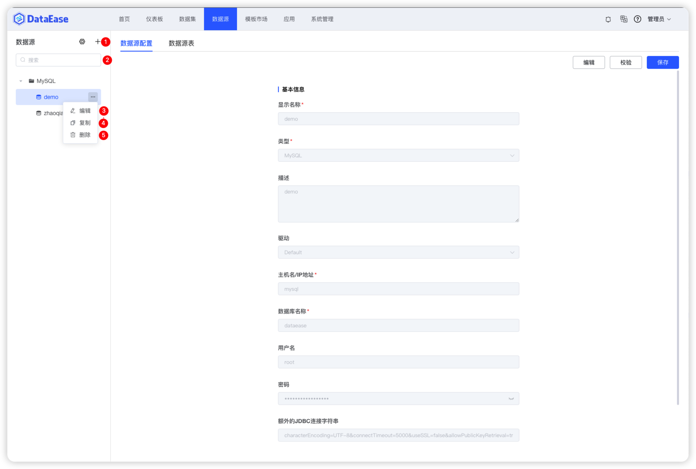

## 1 功能概述

!!! Abstract ""
    "数据源"用来管理各类数据源连接信息，是后续数据分析操作中数据的来源。点击"数据源"，进入数据源管理功能模块，该页面包括数据连接的新增（序号1）、搜索（序号2）、删除（序号3）、编辑（序号4）等功能。

## 2 支持的数据源类型

!!! Abstract ""
    - **数据仓库/数据湖：** AWS RedShift
    - **OLTP：** MySQL、MongoDB、SQL Server、Oracle、PostgreSQL、MariaDB、Db2
    - **OLAP：** Apache Hive、Elasticsearch、ClickHouse、Doris
    - **数据文件：** Excel
    - **API 数据源**