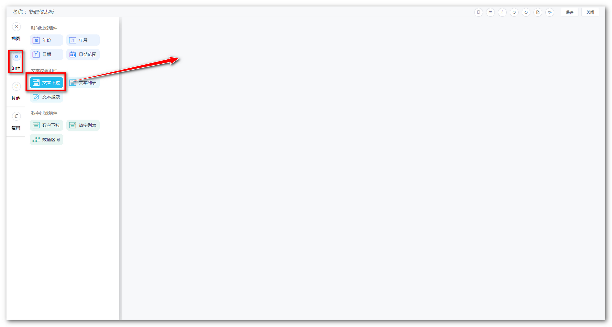
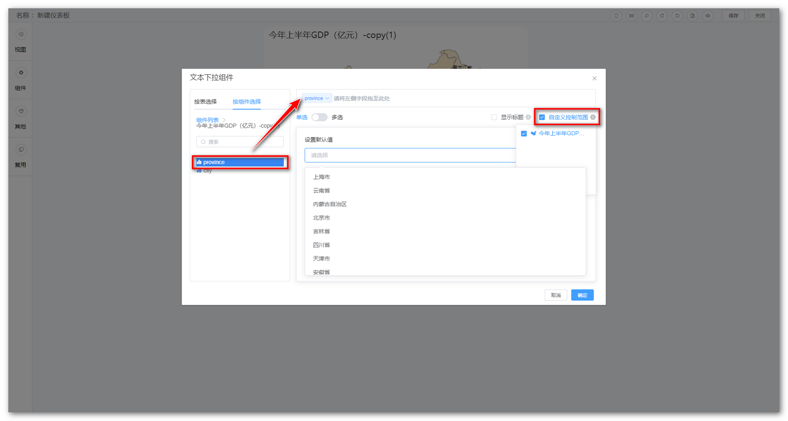
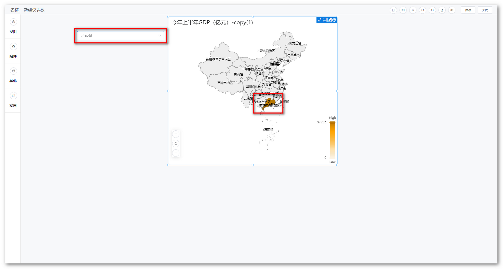

## 1 新建过滤组件

!!! Abstract ""
    仪表板编辑页面左侧，点击【组件】，弹出过滤组件页面，如下图所示，将过滤组件拖动到仪表板下。

## 2 建立组件与表的关联

!!! Abstract ""
    如下图所示，将字段拖动到箭头所指的位置，支持拖动多个字段；  
    自定义范围可调整过滤组件的控制范围。

## 3 过滤组件展示结果

!!! Abstract ""
    点击【确定】后，完成过滤组件的添加。

