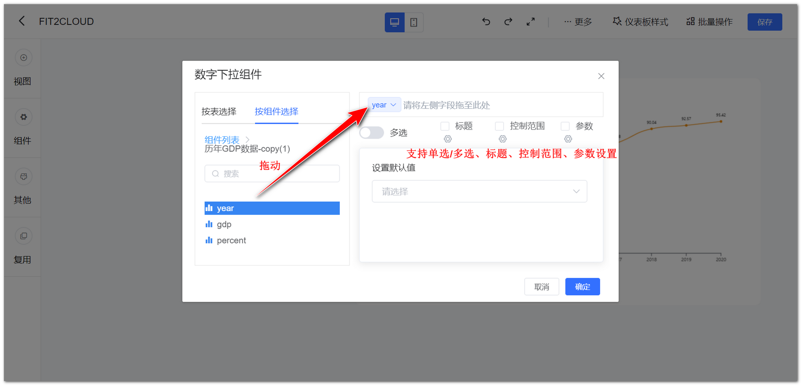
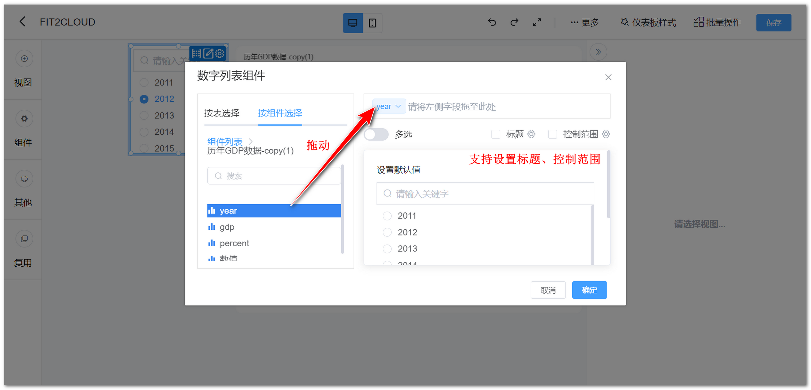
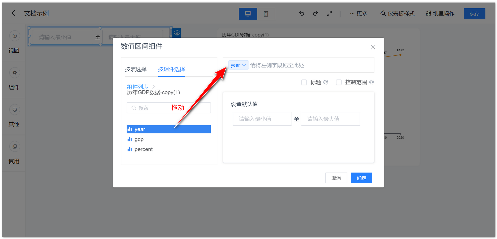

## 1 数字下拉组件

!!! Abstract ""
	可通过与视图组件的数值型字段绑定，过滤视图组件的数据。

{ width="900px" }

## 2 数字列表组件

!!! Abstract ""
	可通过与视图组件的数值型字段绑定，过滤视图组件的数据。

{ width="900px" }

## 3 数值区间组件

!!! Abstract ""
	可通过与视图组件的数值型字段绑定，自定义数值区间过滤视图数据。

{ width="900px" }
