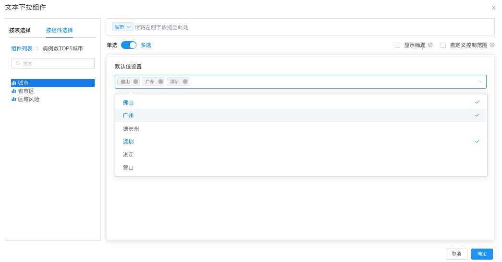
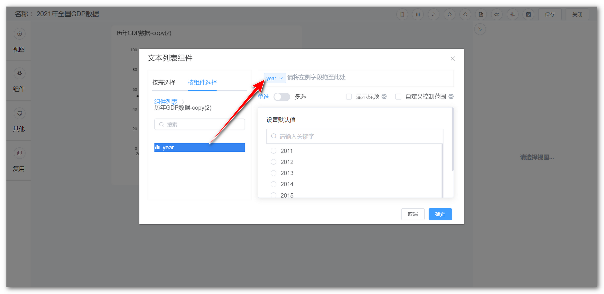
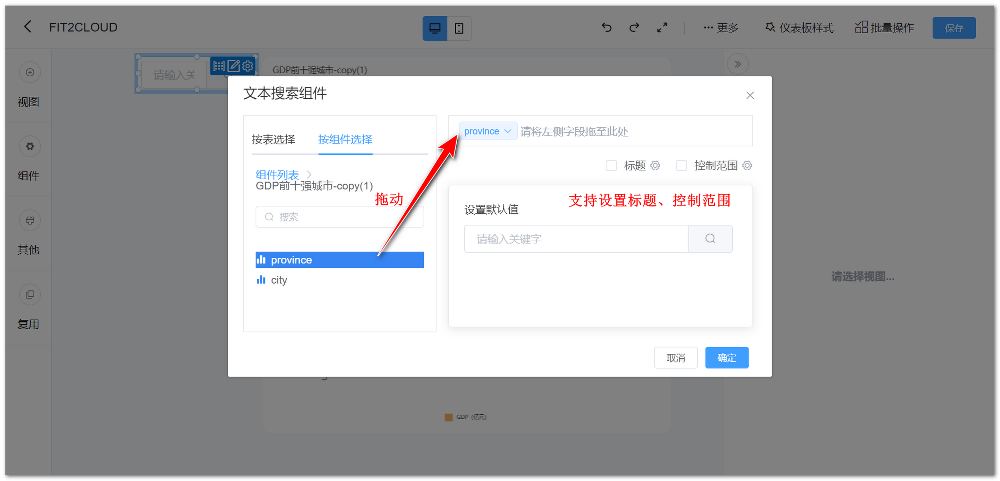

## 1 文本下拉组件

!!! Abstract ""
	可通过与视图组件的文本型字段绑定，过滤视图组件的数据。

{ width="900px" }

## 2 文本列表组件

!!! Abstract ""
	可通过与视图组件的文本型字段绑定，过滤视图组件的数据。

{ width="900px" }
 
## 3 文本搜索组件
!!! Abstract ""
	可通过与视图组件的文本型字段绑定，搜索并展示符合条件的视图组件的数据。

{ width="900px" }
