## 1 复制

!!! Abstract ""
	点击下图中所示的位置，复制组件。

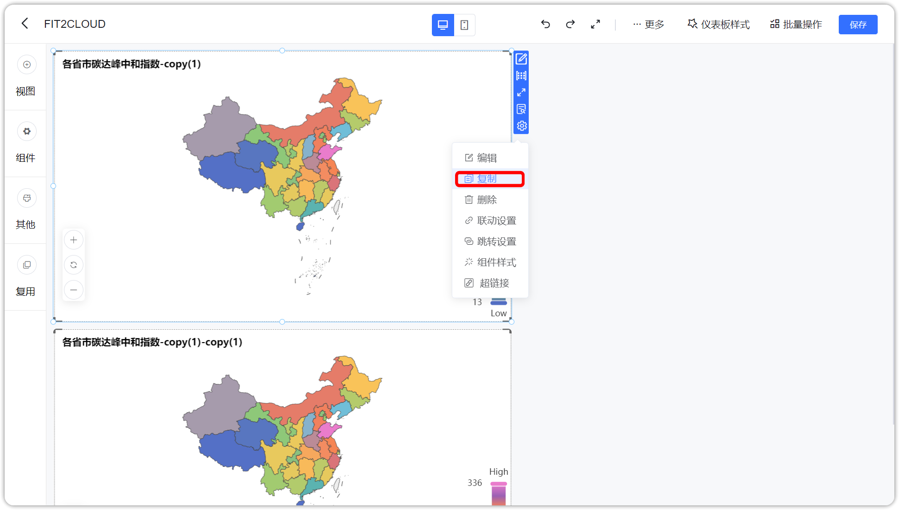{ width="900px" }

## 2 删除

!!! Abstract ""
	点击下图所示的位置，删除组件。

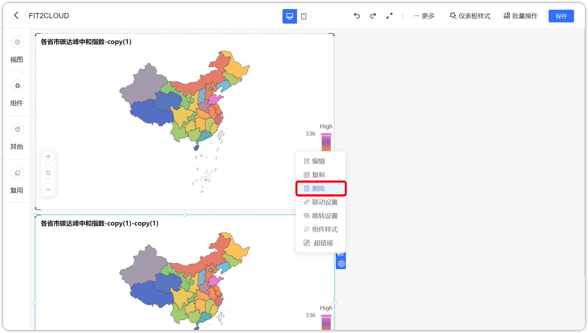{ width="900px" }

## 3 图层置顶

!!! Abstract ""
	点击下图所示的位置，组件图层置顶。

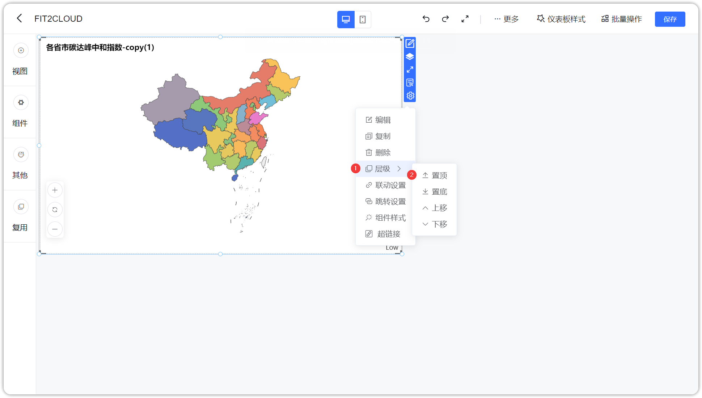{ width="900px" }

## 4 图层置底

!!! Abstract ""
	点击下图所示的位置，组件图层置底。

{ width="900px" }

## 5 图层上移

!!! Abstract ""
	点击下图所示的位置，组件图层上移一层。

{ width="900px" }

## 6 图层下移

!!! Abstract ""
	点击下图所示的位置，组件图层下移一层。

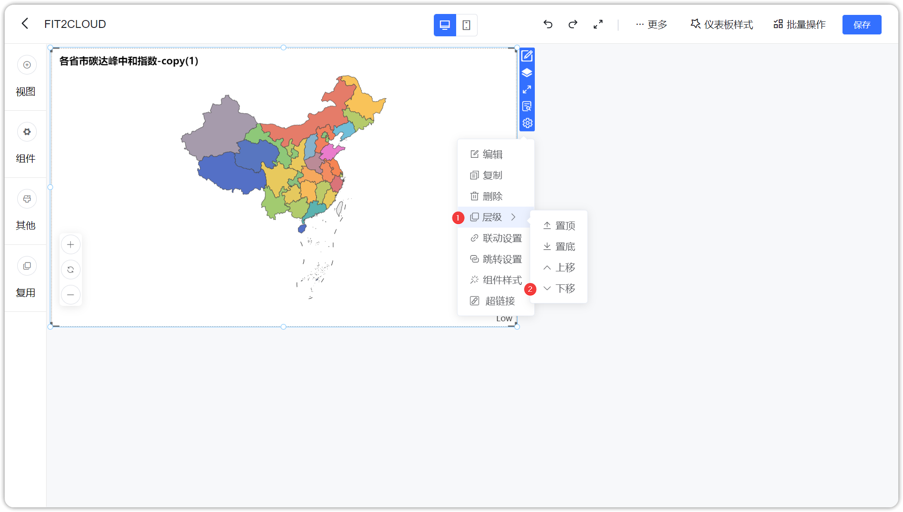{ width="900px" }

## 7 分布方式调整

!!! Abstract ""
	点击下图所示的位置，切换组件在仪表板中的分布方式，可切换为悬浮或矩阵。

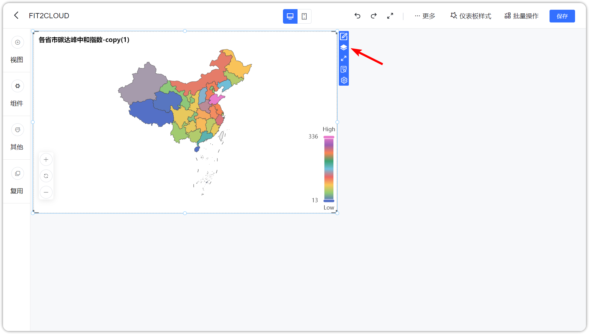{ width="900px" }

## 8 联动设置

!!! Abstract ""
	如下图，点击展开功能菜单，开始【联动设置】。

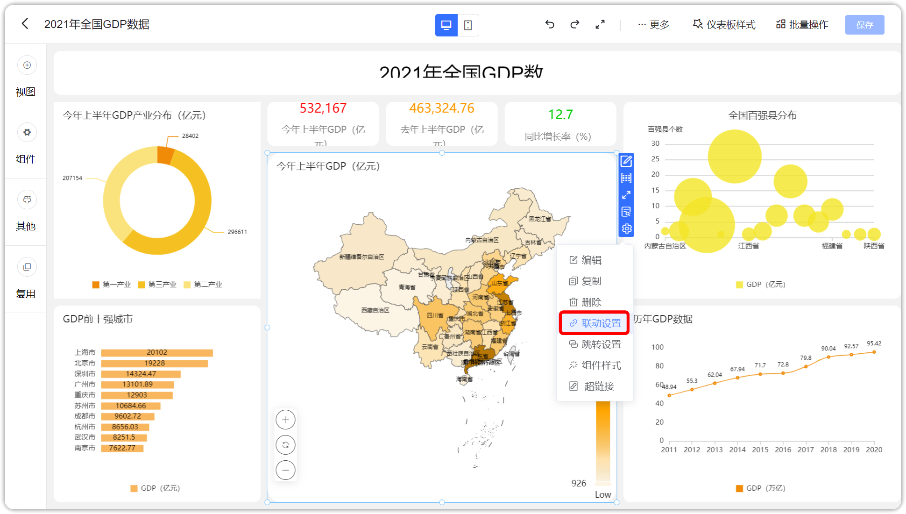{ width="900px" }

!!! Abstract ""
	如下图，当设置两个视图联动时，设置相对应的数据集的联动字段。设置完成后，点击【确定】，联动设置完成。

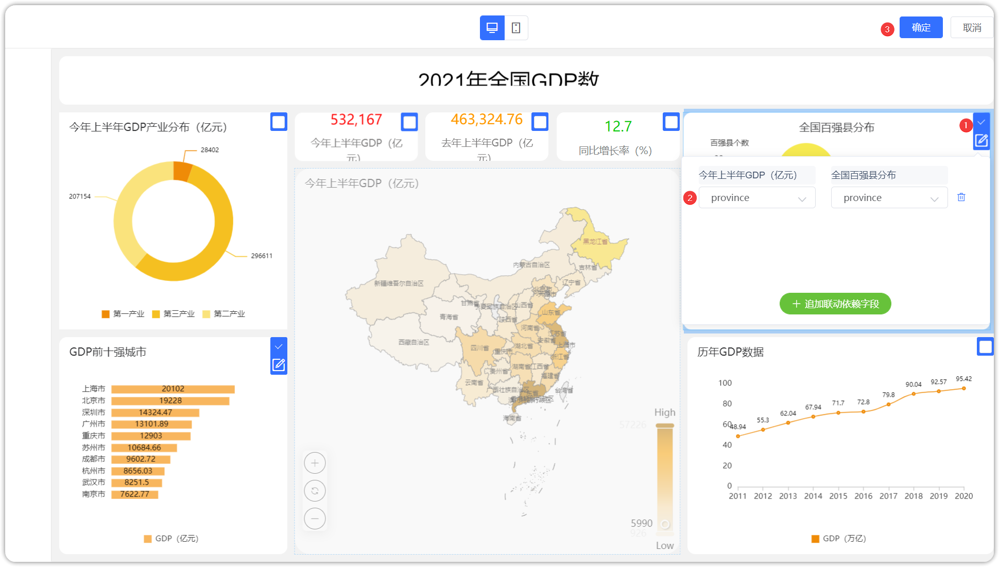{ width="900px" }

!!! Abstract ""
	第一步，点击【浙江省】，并选择【联动】。
!!! Danger ""
	如果视图同时设置了联动和钻取，那么当点击时由用户选择执行联动，或者钻取；当只设置了联动时，默认执行联动；当只设置了钻取时，默认执行钻取。

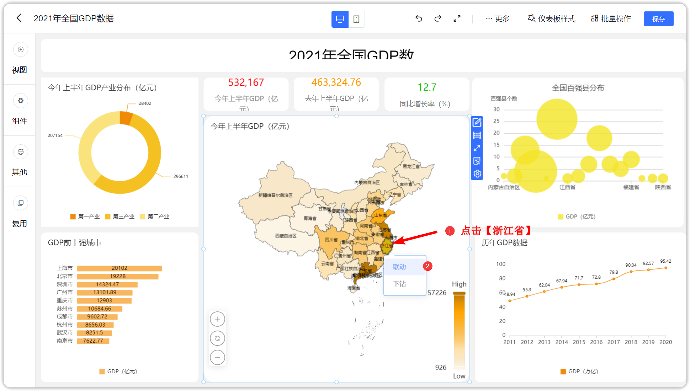{ width="900px" }

!!! Abstract ""
	第二步，联动结果展示，如下图，设置了联动的视图，只展示浙江省的数据。

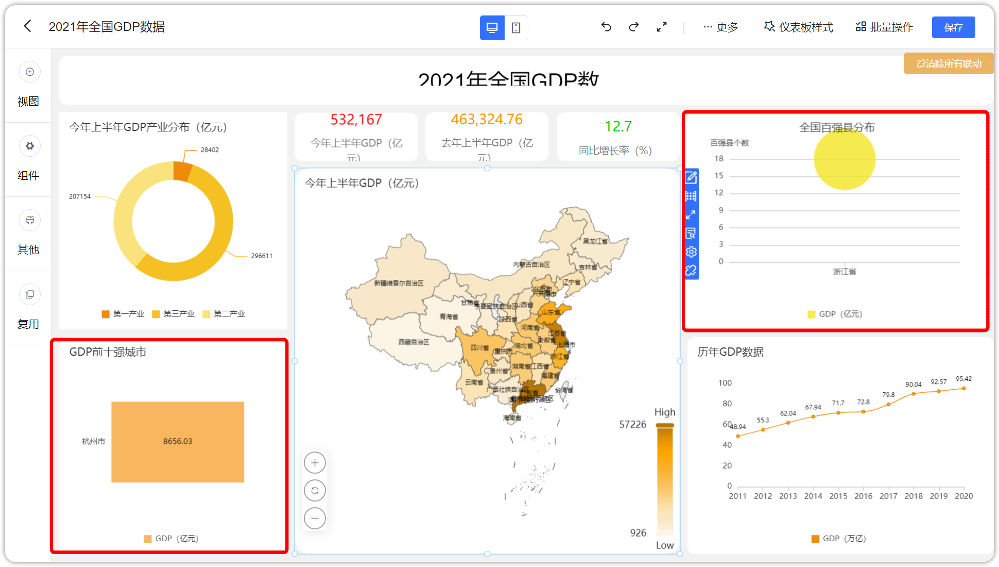{ width="900px" }

!!! Abstract ""
	第三步，可点击下图所示位置，清除局部联动和所有联动。

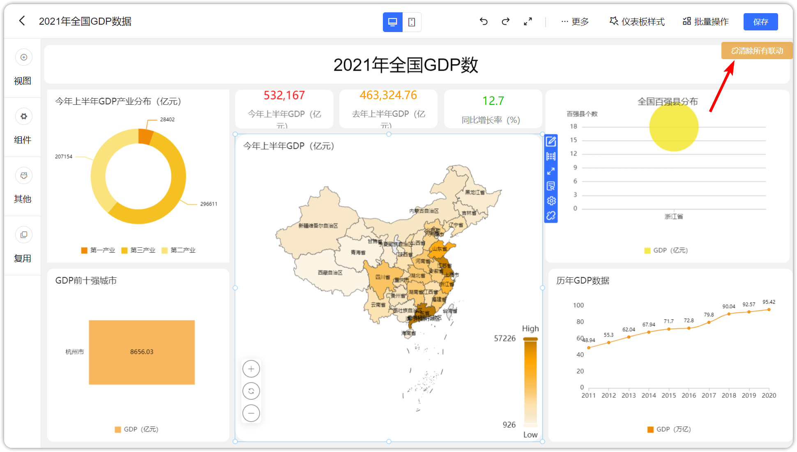{ width="900px" }

## 9 跳转设置

!!! Abstract ""
	如下图，点击展开功能菜单，开始【跳转设置】。

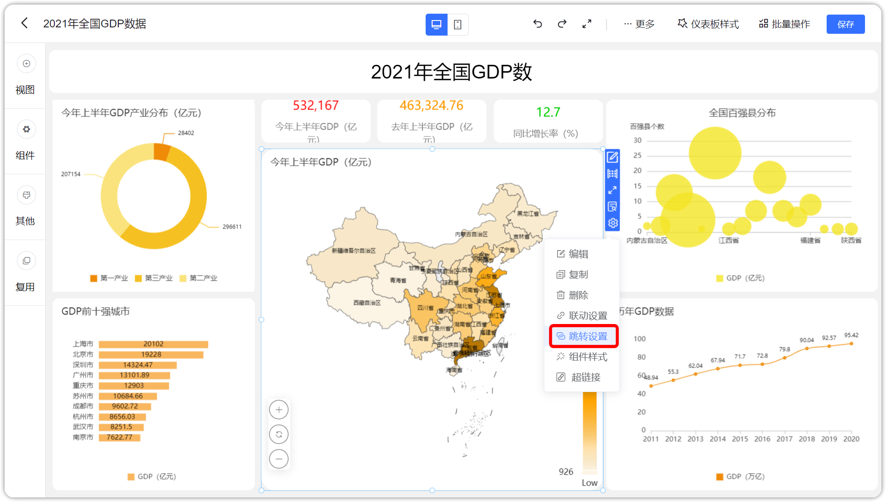{ width="900px" }

!!! Abstract ""
	第一种，仪表板间跳转，如下图所示，设置原视图与目标仪表板的视图的联动字段（请注意：当前用户至少拥有目标仪表板的查看权限）。  
	第一步：启动跳转设置，第二步：设置启用字段，选择链接类型为仪表板，选定跳转的仪表板，第三步：选择关联视图和联动字段，设置完成后，点击【确定】，跳转设置完成。

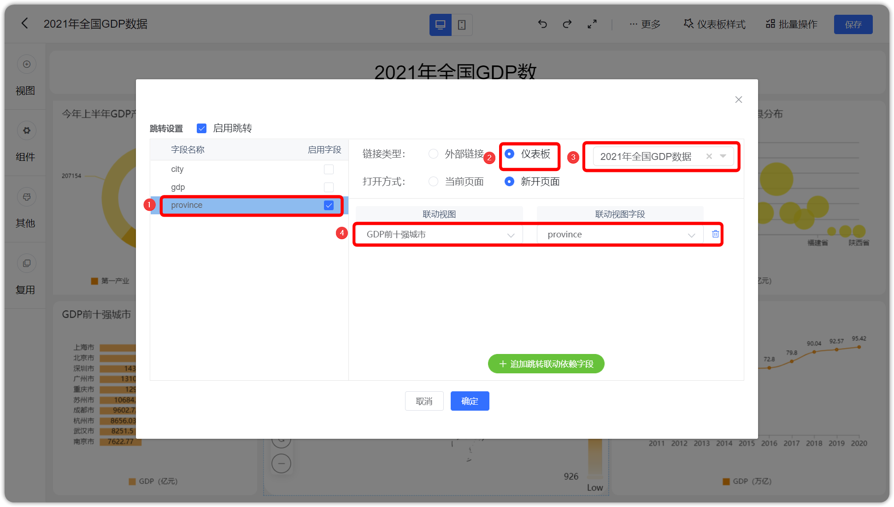{ width="900px" }

!!! Abstract ""
	第二种，外部链接跳转，如下图所示，输入链接 URL。设置完成后，点击【确定】，跳转设置完成。

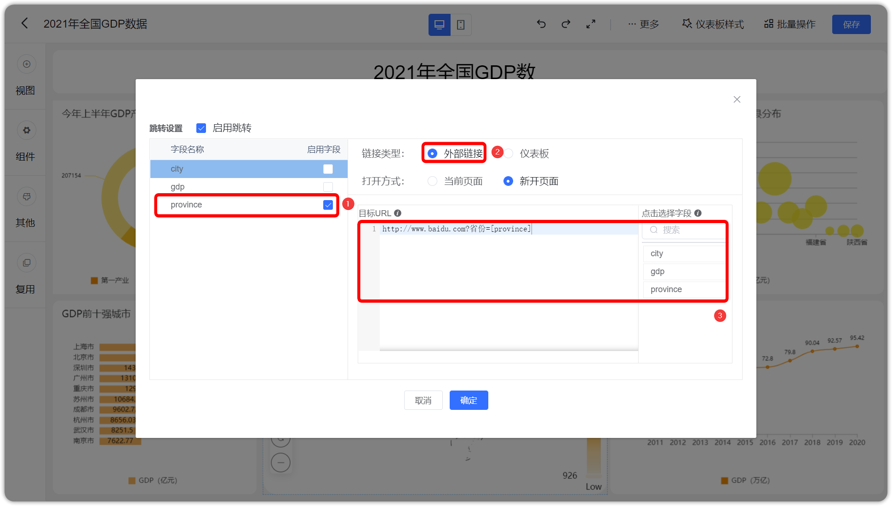{ width="900px" }

!!! Abstract ""
	点击下图所示位置，触发跳转。

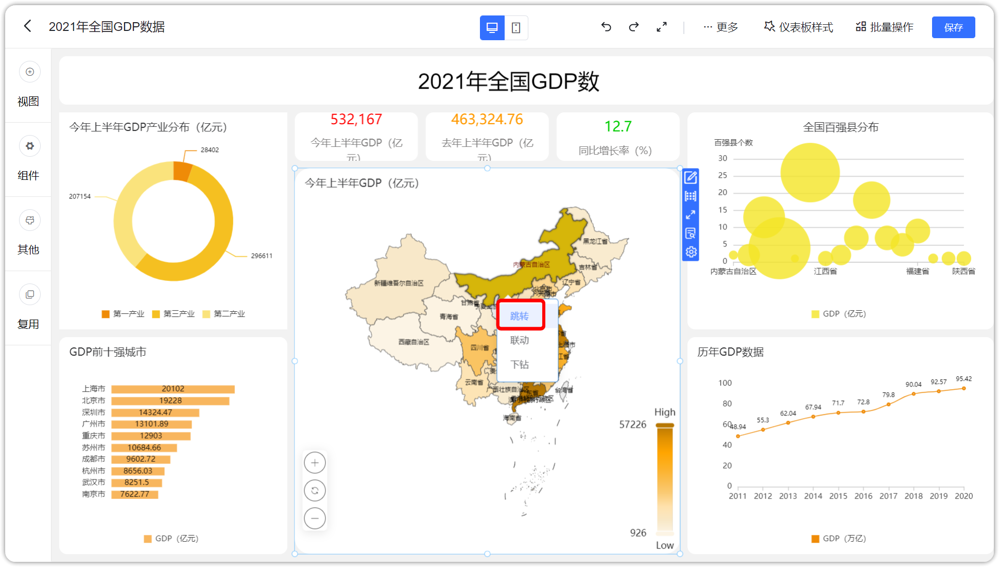{ width="900px" }

!!! Abstract ""
	如果选择的是仪表板跳转，那么跳转至目标仪表板，并联动目标仪表板的视图，如果不需要，可点击右上角清除联动。

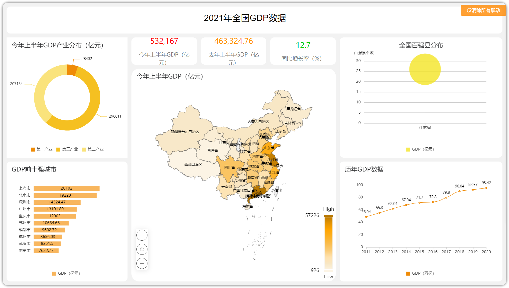{ width="900px" }

!!! Abstract ""
	第二种，如果选择的是外部链接跳转，那么跳转至第三方平台。

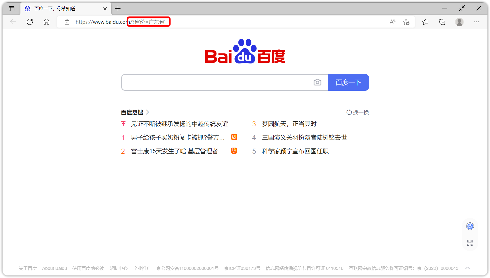{ width="900px" }s

## 10 背景设置

!!! Abstract ""
	如下图，点击展开功能菜单，开始【设置背景】。

{ width="900px" }

!!! Abstract ""
	如下图，背景可选择图片或边框，确定后点击【启用】，背景设置完成。   
	**注意** 在视图样式背景中设置的背景会覆盖当前的设置。

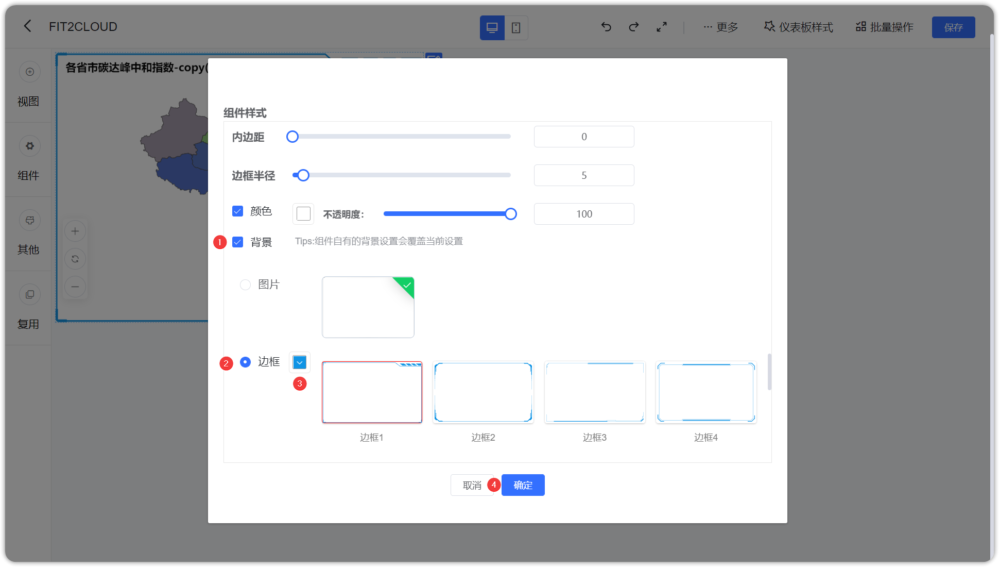{ width="900px" }

