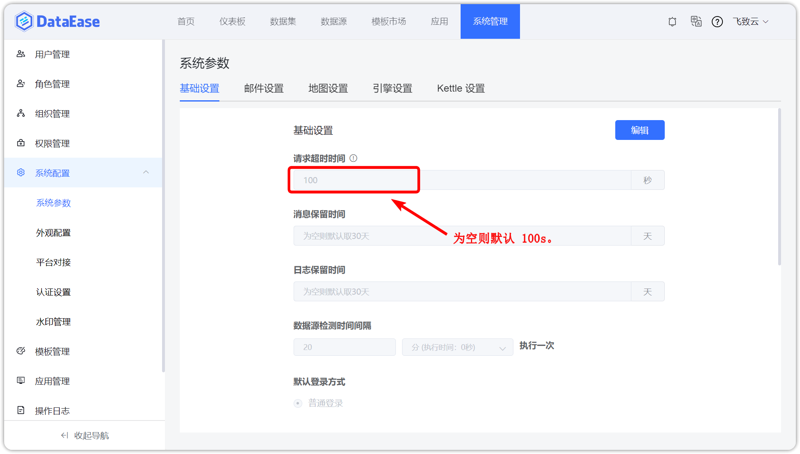
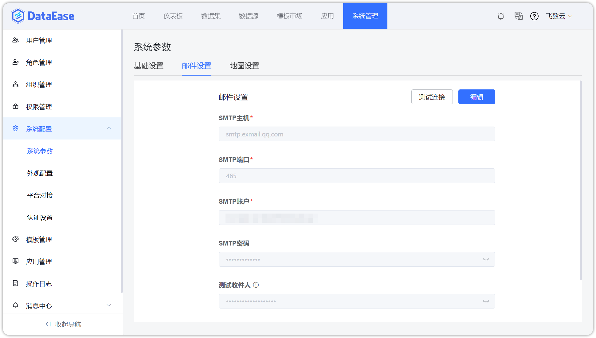
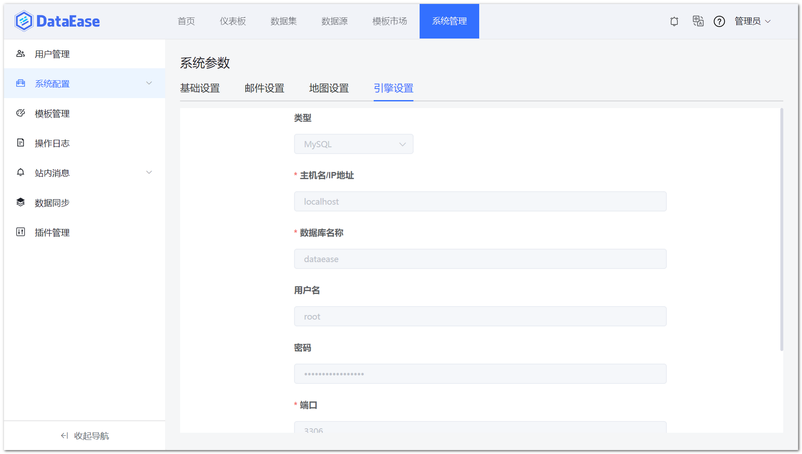
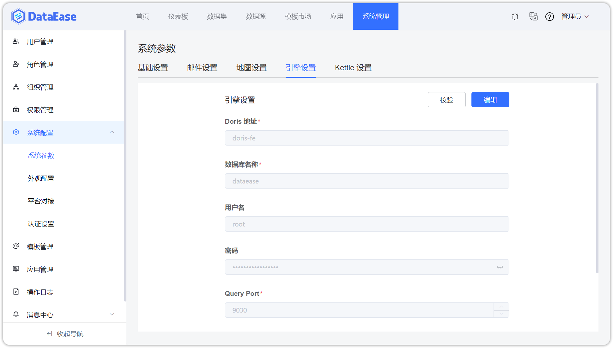
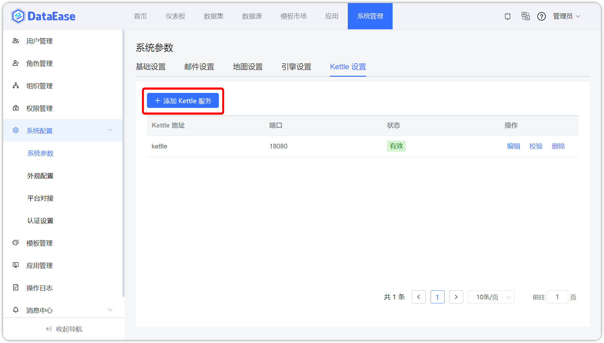
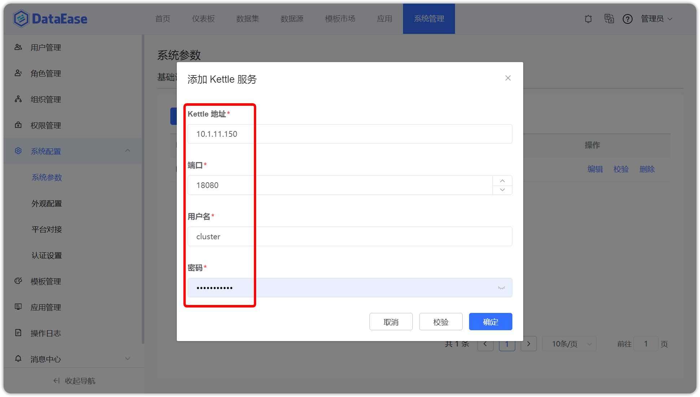

## 1 基础设置

!!! Abstract ""
    如下图所示，可设置请求超时时间，消息保留时间，以及是否显示首页。

{ width="900" }

## 2 邮件设置

!!! Abstract ""
    用户可通过配置邮件的基本信息，来接收仪表板分享、数据集同步或数据源失效的信息。

{ width="900" }

## 3 引擎设置

!!! Abstract ""
    精简模式下，需手动配置引擎的参数，目前仅支持 MySQL 数据库。精简模式部署，默认配置了 MySQL 组件，具体的参数可按下图示例：

{ width="900" }

!!! Abstract ""
    集群模式下，需要手动配置 Doris 组件的参数。

{ width="900" }

## 4 Kettle 设置

!!! Abstract ""
    此项设置，只有在集群模式存在，集群模式可手动配置 Kettle 的基本信息，并可添加多个 kettle 组件。

{ width="900" }  
{ width="900" }

    