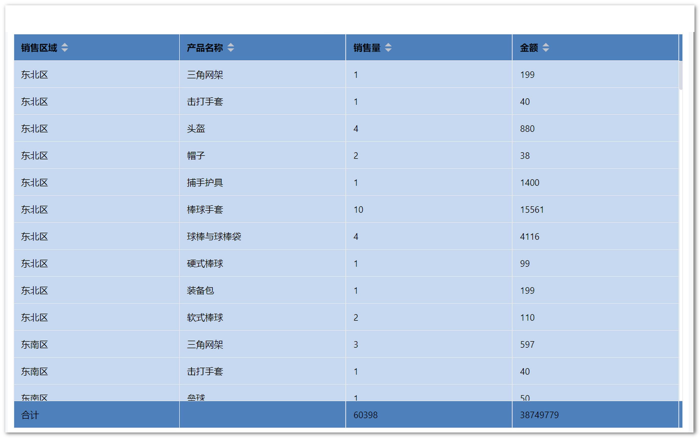
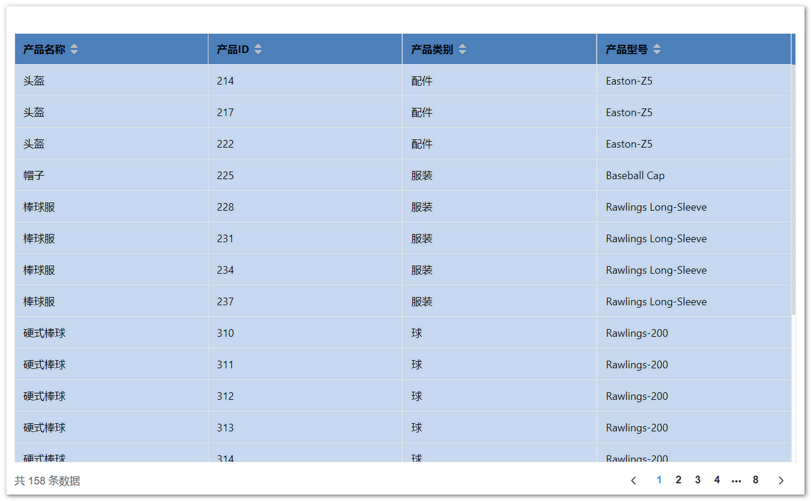
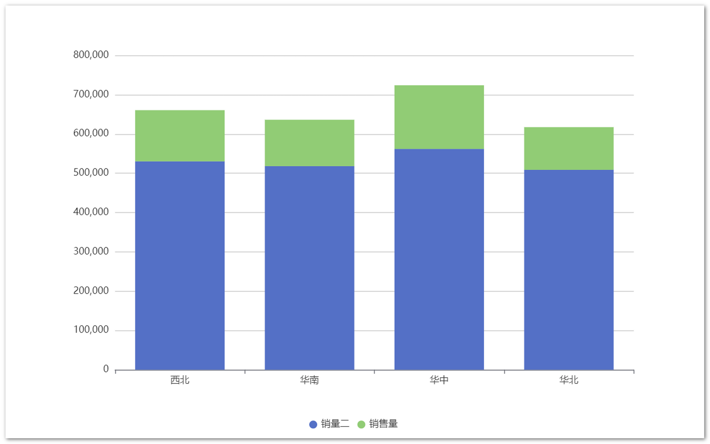
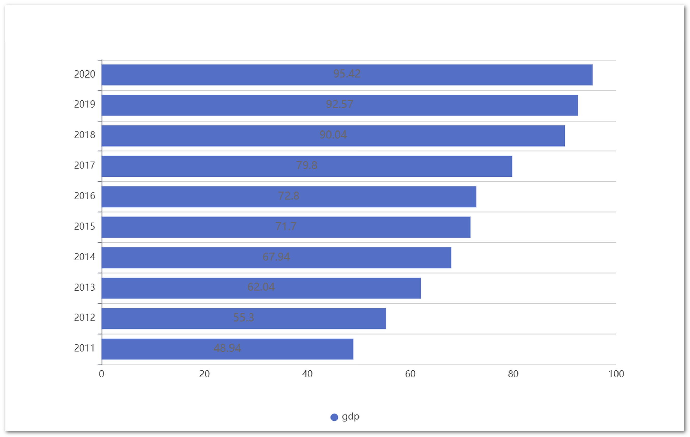
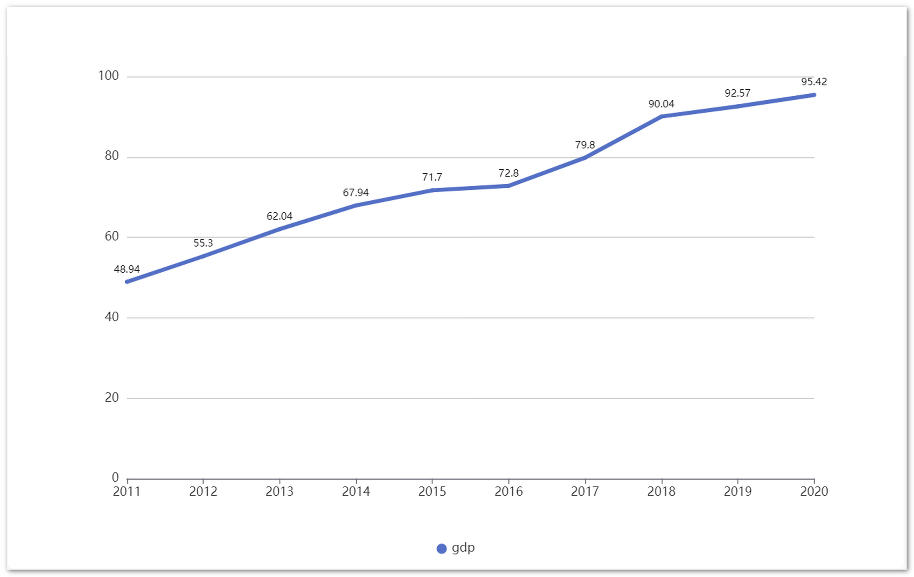

## 1 ECharts

!!! Abstract ""
    ECharts 图库属于 Apache 基金会下，一个基于 JavaScript 的开源可视化图表库。

### 1.1 表格

!!! Abstract "汇总表格"

    

!!! Abstract "明细表格"

    

### 1.2 指标卡

!!! Abstract ""

    

### 1.3 柱状图

!!! Abstract "基础柱状图"

    

!!! Abstract "堆叠柱状图"

    

!!! Abstract "横向柱状图"

    

!!! Abstract "横向堆叠柱状图"

    

### 1.4 折线图

!!! Abstract "基础折现图"

    

!!! Abstract "堆叠折线图"

    

### 1.5 组合图
### 1.6 散点图
### 1.7 气泡图
### 1.8 雷达图
### 1.9 仪表盘
### 1.10 饼图

!!! Abstract "基础饼图"
!!! Abstract "环形饼图"

### 1.11 南丁格尔玫瑰
### 1.12 漏斗图
### 1.13 矩形树图
### 1.14 地图（普通地图、气泡地图）

!!! Abstract "普通地图"
!!! Abstract "气泡地图"

## 2 AntV

!!! Abstract ""
    蚂蚁集团可视化团队下一款开源的图表库

### 2.1 表格

!!! Abstract "明细表格"
!!! Abstract "汇总表格"
!!! Abstract "透视表"

### 2.2 指标卡
### 2.3 柱状图

!!! Abstract "基础柱状图"
!!! Abstract "堆叠柱状图"
!!! Abstract "横向柱状图"
!!! Abstract "横向堆叠柱状图"

### 2.4 折线图

!!! Abstract "基础折线图"
!!! Abstract "堆叠折线图"

### 2.5 散点图
### 2.6 气泡图
### 2.7 雷达图
### 2.8 仪表盘
### 2.9 饼图

!!! Abstract "基础饼图"
!!! Abstract "环形饼图"

### 2.10 南丁格尔玫瑰
### 2.11 漏斗图
### 2.12 矩形树图
### 2.13 瀑布图
### 2.14 水波图
### 2.15 词云图
