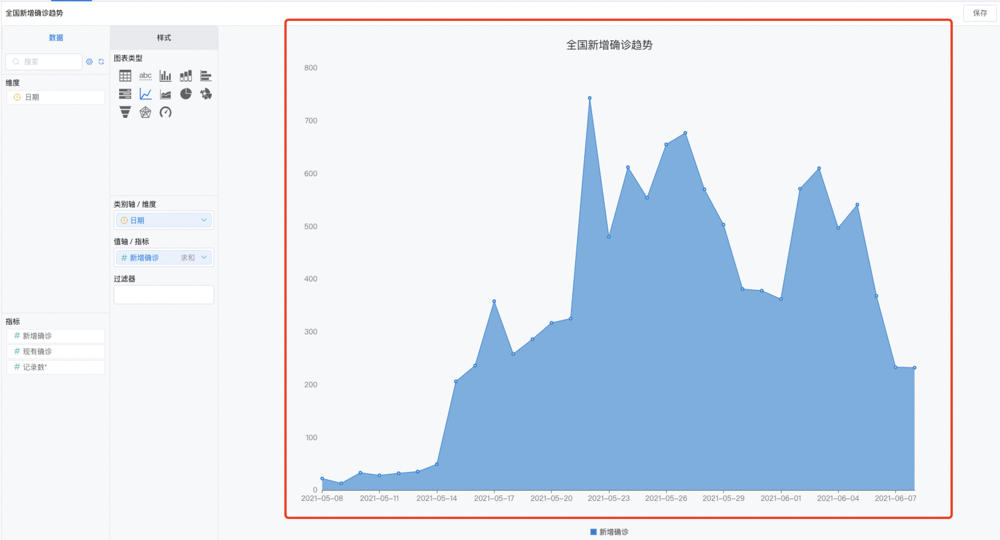
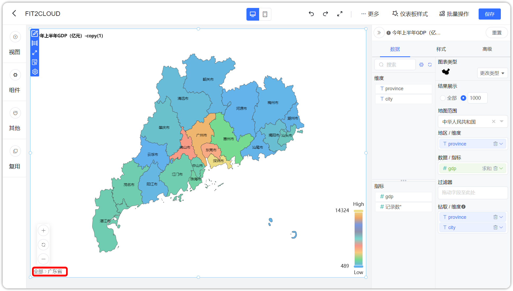

## 功能概述
> 点击菜单栏中"视图"，进入视图设计模块，可通过简单的拖拉拽生成各种图表，并设置图表的颜色、大小、标签、图例、标题等属性。 目前支持的图表类型如下：

- 表格（明细表格、汇总表格）
- 指标卡
- 柱状图（基础柱状图、横向柱状图、横向堆叠柱状图）
- 折线图（基础折线图、堆叠折线图）
- 组合图（柱状折线图等）
- 散点图
- 气泡图
- 色彩地图
- 雷达图
- 仪表盘
- 饼图（基础饼图、环形饼图）
- 南丁格尔玫瑰
- 漏斗图
- 矩形树图
- 水波图

## 1 视图添加
> 如下图所示，点击【添加视图】；

> 从左侧的目录中选择数据集，修改视图名称，最后点击【确认】提交，视图添加成功。

## 2 视图设计
### 2.1 界面功能区
>通过点击左侧的视图，设计该视图，视图设计的11大功能区介绍： 
>序号1：数据、样式切换 序号2：搜索 序号3：字段编辑 序号4：更换数据集 序号5：可选维度列表 序号6：可选指标列表 序号7：图表类型 序号8：选择维度指标 序号9：选择指标 序号10：结果过滤器 序号11：图表展示

### 2.2 数据、样式切换
> 点击样式，切换至样式设计界面，可设置样式优先级（通过设置样式优先级，如果优先级设置为【视图】，那么仪表板展示视图样式），亦可设置视图的颜色、大小、标签、标题、横轴、纵轴等属性。

### 2.3 搜索
> 使用方式，请查阅通用功能 [「搜索」](../general/#_6)

### 2.4 字段编辑
> 点击，可编辑对应数据集的字段，如修改字段类型、名称、切换为维度或指标等

### 2.5 更换数据集
> 点击可为视图更换数据集。

### 2.6 可选维度列表
> 展示所有维度，当选择数据集后，维度与指标由系统自动分配，分配原则：文本型字段默认为维度、数值型字段默认为指标，因此如果需要某个字段作为指标，在数据集中编辑字段，将其设置为维度。

### 2.7 可选指标列表
> 展示所有指标，当选择数据集后，维度与指标由系统自动分配，分配原则：文本型字段默认为维度、数值型字段默认为指标，因此如果需要某个字段作为指标，在数据集中编辑字段，将其设置为指标。

### 2.8 图表类型
> 展示所有图表类型，如柱形图，折线图，组合图、雷达图等，可通过点击图标进行图表类型的切换。

### 2.9 维度选择
#### 2.9.1 维度选择
> 如下图所示，通过拖拉的形式，从"维度可选列表中"拖拉至"维度选择"，图表根据所选择的维度去统计分析数据。

#### 2.9.2 维度设置
> 如下图所示，点击维度上的小箭头，弹出设置窗口，可设置维度排序（升序、降序）、过滤条件、显示名等。

### 2.10 指标选择
#### 2.10.1 指标选择
> 如下图所示，通过拖拉的形式，从"指标可选列表中"拖拉至"指标选择"，图表根据所选择的指标去汇总。

#### 2.10.2 指标设置
> 如下图所示，点击维度上的小箭头，弹出设置窗口，可设置指标汇总方式（求和，平均，最大值）、快速计算、排序（升序、降序、无）、以及过滤等。

### 2.10 结果过滤器
> 可点击设置过滤条件，对结果进行过滤

> 如下图所示，设置过滤条件，可设置多个

### 2.11 图表展示
> 图表展示区，展示视图设计的结果

## 3 视图钻取
### 3.1 设置钻取目录
> 生成全国的GDP地图后，拖拽钻取字段至【钻取/维度】，请注意：下钻目录与拖入的字段顺序有关，如下图所示，自上而下依次下钻。

### 3.2 下钻
> 第一步，点击【广东省】。

> 第二步，下钻结果展示，如下图，展示广东省地图。如果想返回上一级，点击视图左下角的【全部】，返回全国地图。

