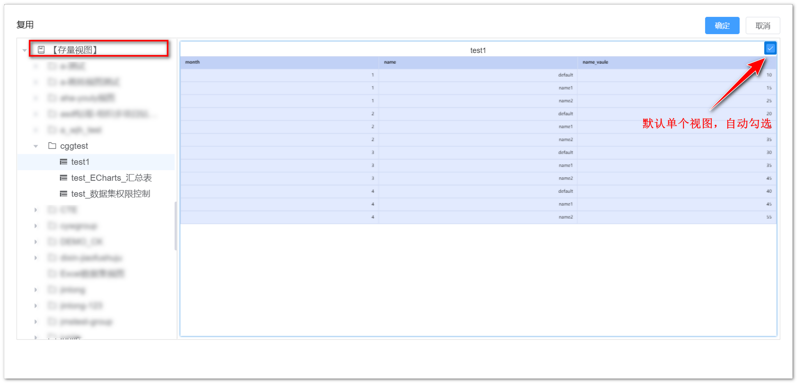
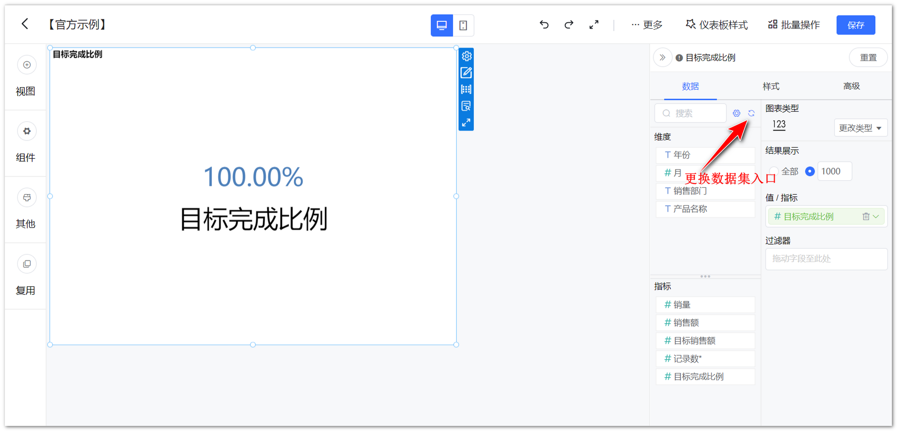
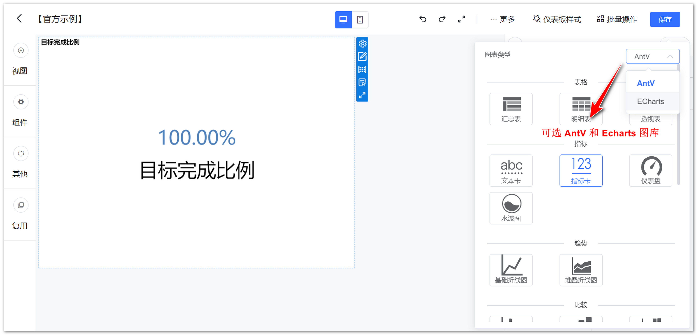
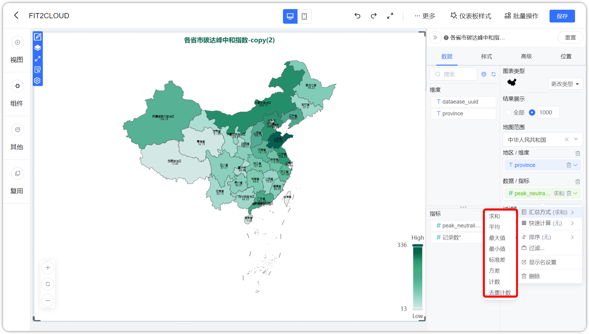
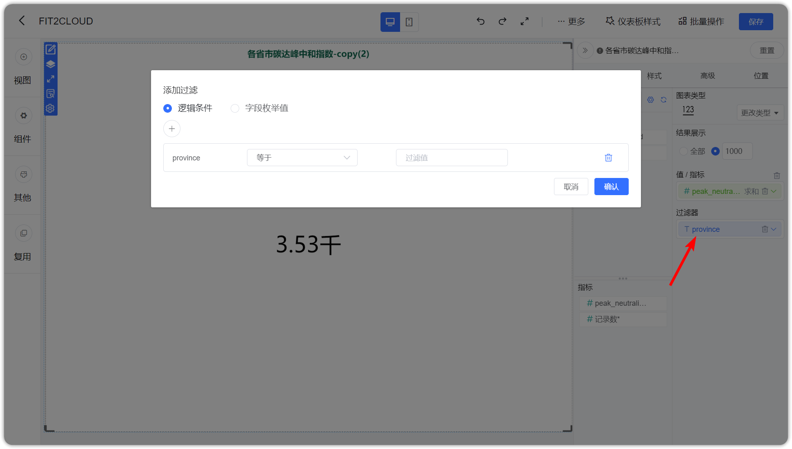
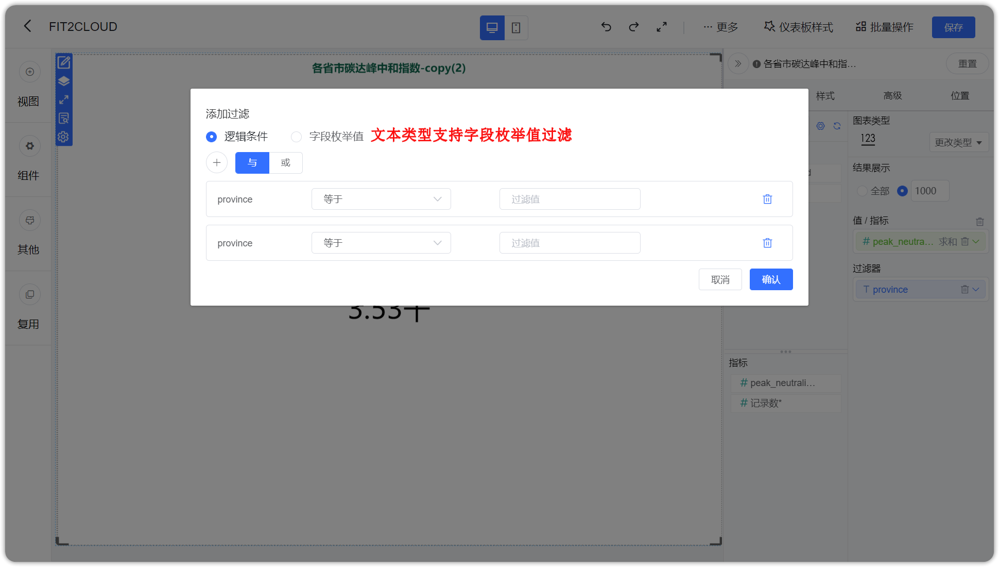

## 1 基础功能

!!! Abstract ""
    进入仪表板编辑界面，点击【视图】或【复用】为仪表板引入视图。  

!!! Abstract ""
    添加视图步骤：

    1. 选择一个数据集（支持搜索）后点击【下一步】； 
    2. 选择一个图表类型后，点击【确认】。

!!! Abstract ""
    **v1.7.0 及以前版本升级至 v1.8.0 时请注意，v1.8.0 版本将视图功能内置于仪表板内，权限跟随仪表板。直接使用 v1.8.0 版本则无需关注此内容。**

    - 存量视图之前如果被仪表板使用了，则该视图根据引用的仪表板的数量复制多份，每个仪表板具备一份，权限跟随仪表板。另外源视图保留在存量视图中；  
    - 仅 admin 用户可以在复用中看到【存量视图】列表（由于视图权限去掉，系统无法根据权限给用户查看对应视图，本着在原权限基础上缩小而不扩大权限范围的原则，全部回收到 admin 处）；

### 1.1 编辑字段

!!! Abstract ""
    点击，跳转到字段管理页面，可编辑对应数据集的字段，如修改字段类型、名称、切换为维度或指标等。

### 1.2 更换数据集

!!! Abstract ""
    点击，可为视图更换数据集。

### 1.3 更改图表类型

!!! Abstract ""
    展示所有图表类型，如柱形图，折线图，组合图、雷达图等，可通过点击图标进行图表类型的切换。

### 1.4 视图下钻

!!! Abstract ""
    生成全国的 GDP 地图后，拖拽钻取字段至【钻取/维度】。  
    **请注意：下钻目录与拖入的字段顺序有关，如下图所示，自上而下依次下钻。**

    

!!! Abstract ""
    第一步，点击【广东省】。

!!! Abstract ""
    第二步，下钻结果展示，如下图，展示广东省地图。如果想返回上一级，点击视图左下角的【全部】，返回全国地图。

## 2 数据设置

### 2.1 可选维度列表

!!! Abstract ""
    展示所有维度，当选择数据集后，维度与指标由系统自动分配，分配原则：文本型字段默认为维度、数值型字段默认为指标，因此如果需要某个字段作为指标，在数据集中编辑字段，将其设置为维度。

### 2.2 可选指标列表

!!! Abstract ""
    展示所有指标，当选择数据集后，维度与指标由系统自动分配，分配原则：文本型字段默认为维度、数值型字段默认为指标，因此如果需要某个字段作为指标，在数据集中编辑字段，将其设置为指标。

### 2.3 维度选择

!!! Abstract ""
    如下图所示，通过拖拉的形式，从"维度可选列表中"拖拉至"维度选择"，图表根据所选择的维度去统计分析数据。

!!! Abstract ""
    如下图所示，点击维度上的小箭头，弹出设置窗口，可设置维度排序（升序、降序）、过滤条件、显示名等。

### 2.4 指标选择

!!! Abstract ""
    如下图所示，通过拖拉的形式，从"指标可选列表中"拖拉至"指标选择"，图表根据所选择的指标去汇总。

!!! Abstract ""
    如下图所示，点击指标上的小箭头，弹出设置窗口，可设置指标汇总方式（求和，平均，最大值）、快速计算、排序（升序、降序、无），可选择高级计算如同比、环比，可设置过滤等。

### 2.5 结果过滤器

!!! Abstract ""
    可点击设置过滤条件，对结果进行过滤。

!!! Abstract ""
    如下图所示，设置过滤条件，可设置多个，并且支持逻辑条件过滤、字段枚举值过滤。

## 3 样式设置

!!! Abstract ""
    点击【样式】，切换至样式设计界面，该界面主要针对【图形属性】和【组件样式】进行调整，**不同的视图类型可支持的样式会有所差异，不同的图表库（Echarts、AntV）在样式上也有一些差异。**

### 3.1 样式优先级

!!! Abstract ""
    **注意：【样式优先级】可以选择为视图或仪表板。视图的颜色与仪表板的背景色等属性不同时，以样式优先级选择项为主来显示。**

### 3.2 图形属性

!!! Abstract ""
    如下图，支持修改图形的颜色，大小，标签等。

!!! Abstract ""
    支持配置系统方案（默认、复古、淡雅、未来、渐变、简洁、商务、柔和、科技、明亮、经典、清新、活力、火红、轻快、灵动）；  
    如下图，点击，也可以自定义配色。

### 3.3 组件样式

!!! Abstract ""
    支持修改组件的标题，图例，背景。

