## 1 基础功能

### 1.1 视图字段管理

!!! Abstract ""
    **DataEase v1.12.0 版本，原计算字段为数据集级别计算字段，新增视图级别计算字段支持，视图字段随视图，与视图字段不相互影响。**

    - 支持 Avg、Sum、Count、Min、Max 聚合函数；  
    - 新建的视图级别指标类字段，如果涉及到聚合函数，则不能单独出现该字段，必须是聚合函数和聚合函数的组合，比如可以 sum(salary)/count(user)，不能 salary/sum(salary)；  
    - 创建的字段若使用了聚合函数，则只能是指标，不能转维度。
    
    如下图所示，点击箭头指向的【齿轮】，选择【视图字段管理】，进入视图字段管理界面。

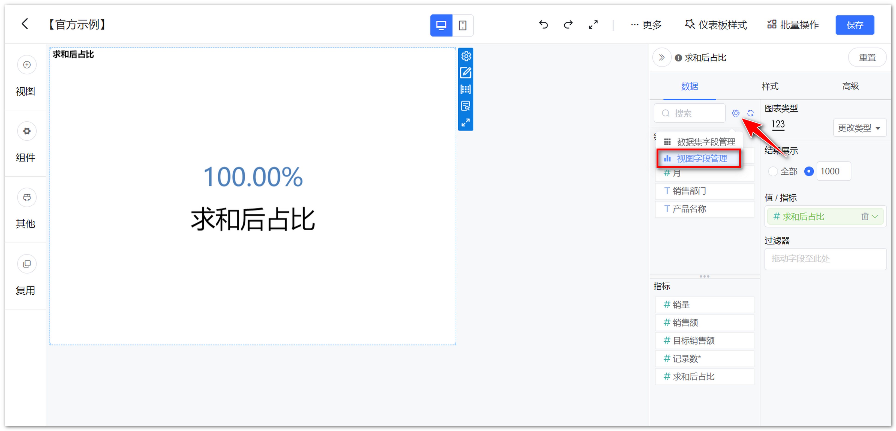{ width="900px" }

{ width="900px" }

!!! Abstract ""
    如下示例计算求和。

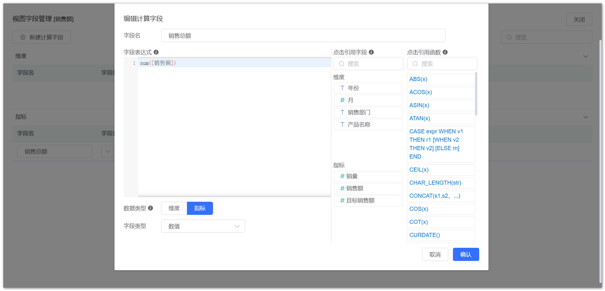{ width="900px" }

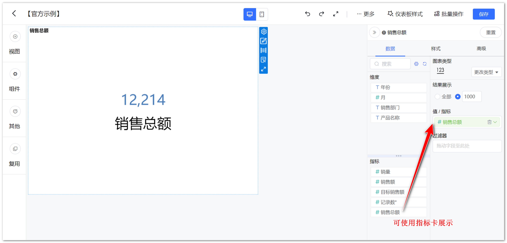{ width="900px" }

!!! Abstract ""
    如下示例计算求和后的占比。

{ width="900px"}

{ width="900px" }

### 1.2 数据集字段管理

!!! Abstract ""
    如下图所示，点击箭头指向的【齿轮】，选择【数据集字段管理】，可编辑对应数据集的字段，如修改字段类型、名称、切换为维度或指标等。

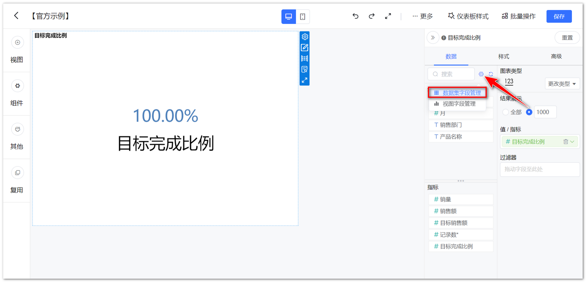{ width="900px" }

### 1.3 更换数据集

!!! Abstract ""
    如下图，点击箭头指向的位置，可为视图更换数据集，更换视图数据集时，系统会根据数据集字段名自动匹配（区分大小写），若字段名称、类型等无法匹配，则该字段会标红显示。  
    **提示：若更换后的数据集与原数据集字段发生变化，需重新制作视图，若更换后的数据集与原数据集字段可匹配上，视图数据自动根据更换后的数据集展示，不用再做调整。**

{ width="900px" }

!!! Abstract ""
    更换数据集，右侧显示出原数据集的内容，选定更换的数据集，点击【确定】即可。

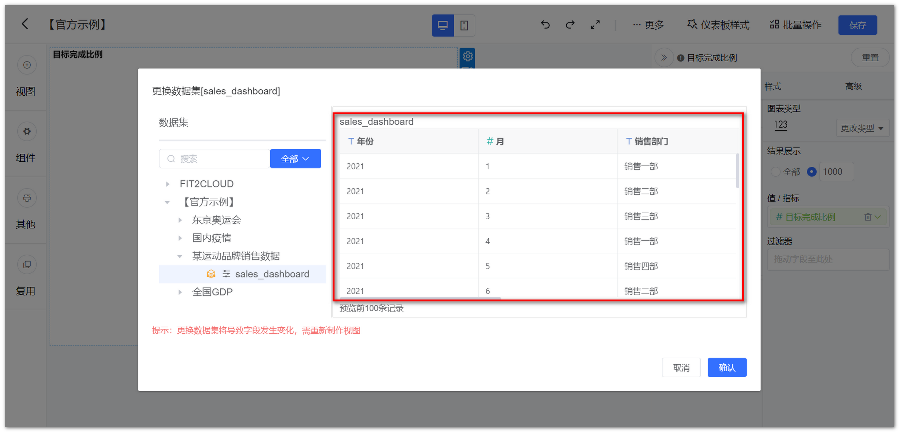{ width="900px" }

### 1.4 更改图表类型

!!! Abstract ""
    展示所有图表类型，如柱形图，折线图，组合图、雷达图等，可通过点击图标进行图表类型的切换。

{ width="900px" }

### 1.5 视图下钻

!!! Abstract ""
    如下示例，生成全国的 GDP 地图后，拖拽钻取字段至【钻取/维度】，  
    **注意：下钻目录与拖入的字段顺序有关，如下图所示，自上而下依次下钻。**

{ width="900px" }

!!! Abstract ""
    第一步，点击【广东省】。

{ width="900px" }

!!! Abstract ""
    第二步，下钻结果展示，如下图，展示广东省地图。如果想返回上一级，点击视图左下角的【全部】，返回全国地图。

{ width="900px" }

### 1.6 重置

!!! Abstract ""
    如下图所示，点击【重置】，可将本次对于该视图的编辑全部还原。  
    **提示：** 根据用户反馈，有时会误点重置按钮，v1.12.0 版本开始，视图重置增加了确认提示。

{ width="900px" }

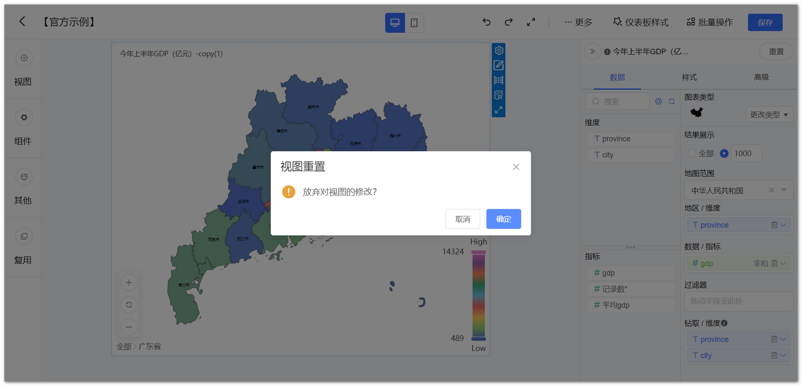{ width="900px" }

## 2 数据设置

### 2.1 可选维度列表

!!! Abstract ""
    展示所有可选维度，当选择数据集后，维度与指标由系统自动分配，分配原则：文本型字段默认为维度、数值型字段默认为指标，因此如果需要某个字段作为指标，在数据集中编辑字段，将其设置为维度。

{ width="900px" }

### 2.2 可选指标列表

!!! Abstract ""
    展示所有可选指标，当选择数据集后，维度与指标由系统自动分配，分配原则：文本型字段默认为维度、数值型字段默认为指标，因此如果需要某个字段作为指标，在数据集中编辑字段，将其设置为指标。

{ width="900px" }

### 2.3 维度选择

!!! Abstract ""
    如下图所示，通过拖拉的形式，从"维度可选列表中"拖拉至"维度选择"，图表根据所选择的维度去统计分析数据；  
    v1.11.0 版本开始，维度选择过程中，对于拖入到各个框中的元素，提供便捷删除图标，直接点击后便可快速删除。

{ width="900px" }

!!! Abstract ""
    如下图所示，点击维度上的小箭头，弹出设置窗口，可设置维度排序（升序、降序）、显示名，时间类型的维度还可设置日期显示和日期格式。

{ width="900px" }

!!! Abstract ""
    支持更改维度显示名称，同时保留该字段原始的字段名称，如下图所示。

{ width="900px" }

{ width="900px" }

!!! Abstract ""
    维度支持自定义排序，具体操作步骤如下图所示。  
    **注意：**

    - 数值型的不提供自定义排序；
    - 时间类型不支持自定义排序；
    - 透视表只支持数据列维度；
    - 堆叠类图表只支持类别轴维度。

    Tips：可以根据前面的图标快速判断当前设置的排序方式。

{ width="900px" }

{ width="900px" }

### 2.4 指标选择

!!! Abstract ""
    如下图所示，通过拖拉的形式，从"指标可选列表中"拖拉至"指标选择"，图表根据所选择的指标进一步分析展示数据；  
    v1.11.0 版本开始，指标选择过程中，对于拖入到各个框中的元素，提供便捷删除图标，直接点击后便可快速删除。

{ width="900px" }

!!! Abstract ""
    如下图所示，点击指标上的小箭头，弹出设置窗口，可设置指标汇总方式（求和、平均、最大值、最小值、标准差、方差、计数、去重统计）、快速计算（同比环比）、排序（升序、降序、无），可设置过滤等。

{ width="900px" }

!!! Abstract ""
    支持更改指标显示名称，同时保留该字段原始的字段名称，如下图所示。
    
{ width="900px" }

{ width="900px" }

!!! Abstract ""
    **注意：使用同比环比功能，需字段为日期类型，若【同比环比】不可点击，请检查维度字段是否为日期类型。**

{ width="900px" }

!!! Abstract ""
    如下图所示，可调整汇总方式为去重计数。

{ width="900px" }

!!! Abstract ""
    设置数值格式化，目前仅 AntV 图库表格组件与指标卡支持数值格式化。

    - 支持数量单位：千、万、百万、亿；
    - 支持设置小数位数；
    - 支持设置为百分比格式；
    - 支持设置单位后缀；
    - 支持打开千分位，即每三位数，以逗号隔开的方式，20,000,000。

    下图以 AntV 图库指标卡示例。

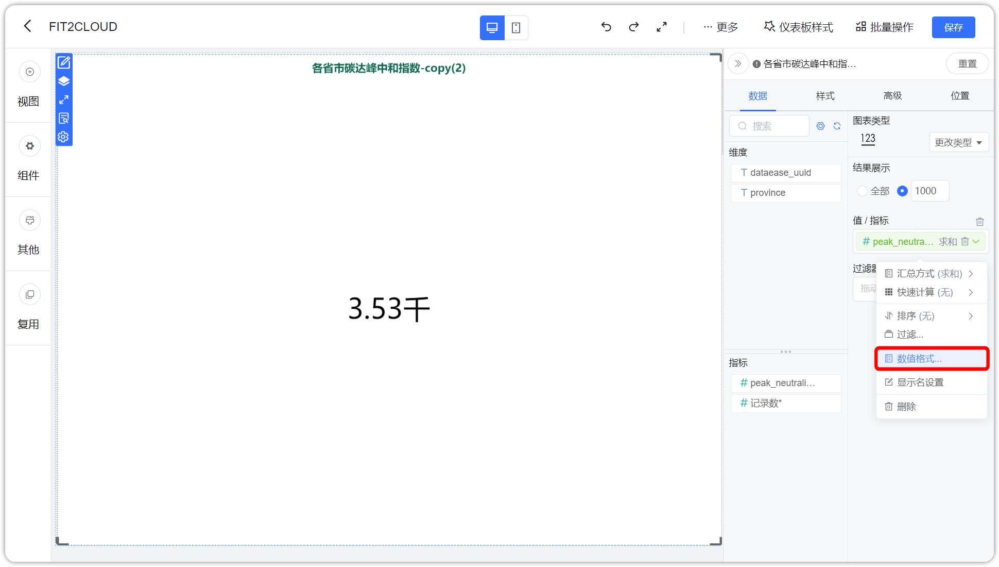{ width="900px" }

{ width="900px" }

### 2.5 结果过滤器

!!! Abstract ""
    可点击设置过滤条件，对结果进行过滤。

{ width="900px" }

!!! Abstract ""
    如下图所示，可设置多个过滤条件，并且支持逻辑条件过滤（或、与），可选择等于、不等于、包含、不包含、为空、不为空，支持字段枚举值过滤。

{ width="900px" }

## 3 样式设置

!!! Abstract ""
    点击【样式】，切换至样式设计界面，该界面主要针对【图形属性】和【组件样式】进行调整，**不同的视图类型可支持的样式会有所差异，不同的图表库（Echarts、AntV）在样式上也有一些差异。**

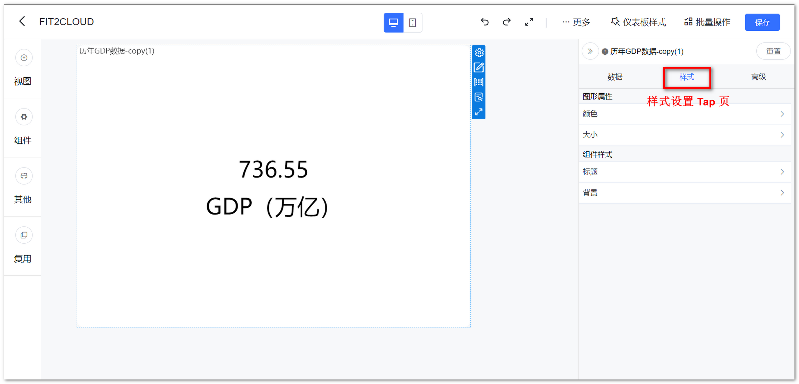{ width="900px" }

### 3.1 样式优先级

!!! Abstract ""
    **注意：【样式优先级】可以选择为视图或仪表板。视图的颜色与仪表板的背景色等属性不同时，以样式优先级选择项为主来显示。**

{ width="900px" }

### 3.2 图形属性

!!! Abstract ""
    如下图，支持修改图形的颜色，大小，标签等。

{ width="900px" }

!!! Abstract ""
    支持配置系统方案（默认、复古、淡雅、未来、渐变、简洁、商务、柔和、科技、明亮、经典、清新、活力、火红、轻快、灵动）；  
    如下图，点击，也可以自定义配色。

{ width="900px" }

!!! Abstract ""
    应用配色方案后，仍然可以进一步调整颜色，如下图所示，整个视图应用到的颜色都会在下方列出来，修改时不需要再在配色方案中选中，自行修改颜色后，配色方案中所展示的颜色将不会跟着改变。  
    **注意：** 此项设置目前只支持 AntV 图库视图，且只包含以下列出的视图，ECharts 图库未支持。
    
    - 柱状图：基础柱状图、堆叠柱状图、横向柱状图、堆叠横向柱状图；
    - 折线图：基础折线图、堆叠折线图；
    - 饼图：饼图、玫瑰图；
    - 雷达图；
    - 漏斗图；
    - 散点图；
    
    其中柱状图、折线图、散点图、支持系列设置颜色，其余支持维度枚举值设置颜色，如下图所示。

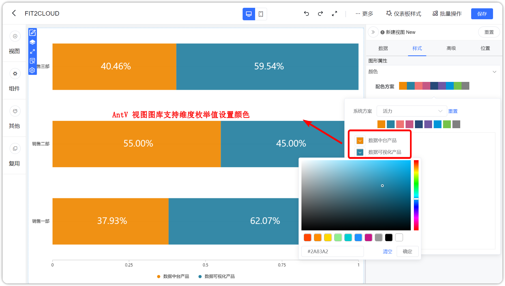{ width="900px" }

### 3.3 组件样式

!!! Abstract ""
    支持修改组件的标题（标题名称、字体大小、字体颜色、水平位置、垂直位置、字体样式），图例（图标、方向、字体大小、字体颜色、水平位置、垂直位置）等。

{ width="900px" }

!!! Abstract ""
    视图提示支持背景选项。

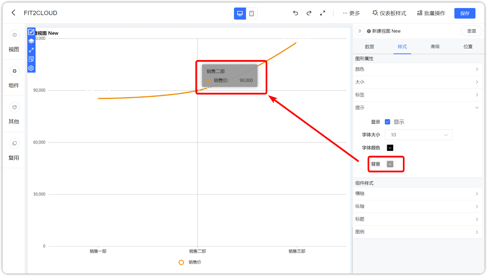{ width="900px" }  

!!! Abstract ""
    **提示：** AntV 图库仪表盘视图支持在组件样式设置最小值、刻度间隔数，标签支持设置数值格式。

{ width="900px" }

!!! Abstract ""
    DataEase v1.12.0 版本，有坐标轴的视图（柱状图、折线图等），轴值支持数值格式化设置，如下图所示，在样式的纵轴(横向图则为横轴)设置中。

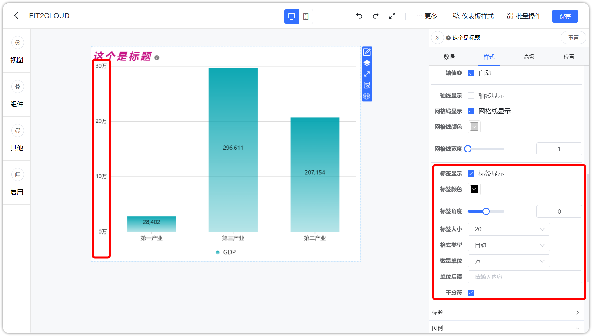{ width="900px" }

## 4 高级设置

!!! Abstract ""
    DataEase v1.9.0 版本，视图编辑区新增【高级】模块，不同视图存在差异，根据各视图特性具备不同的高级功能。

{ width="900" }

### 4.1 缩略轴

!!! Abstract ""
    **柱状图和折线图支持设置缩略轴，可通过调整缩略轴快速调整显示的维度范围；**  
    如下图所示，切换至【高级】，点击功能设置，勾选【显示】缩略轴，调整维度显示范围。

{ width="900" }

### 4.2 辅助线

!!! Abstract ""
    **对于具备横纵坐标系的视图（柱状图、折线图）支持设置辅助线；**  
    辅助线支持设置名称、数值展示，且名称和数值的展示位置跟随坐标轴，当坐标轴分别放置在左右两侧时，辅助线的内容将跟随变化，此外也可设置短划线类型（实线、线型虚线、点型虚线）、短划线颜色，支持同一图表设置多条辅助线；  
    如下图所示，切换至【高级】，点击【编辑】辅助线，弹出辅助线设置框，填写预警值名称及其他参数，点击【确定】即可。

{ width="900px" }

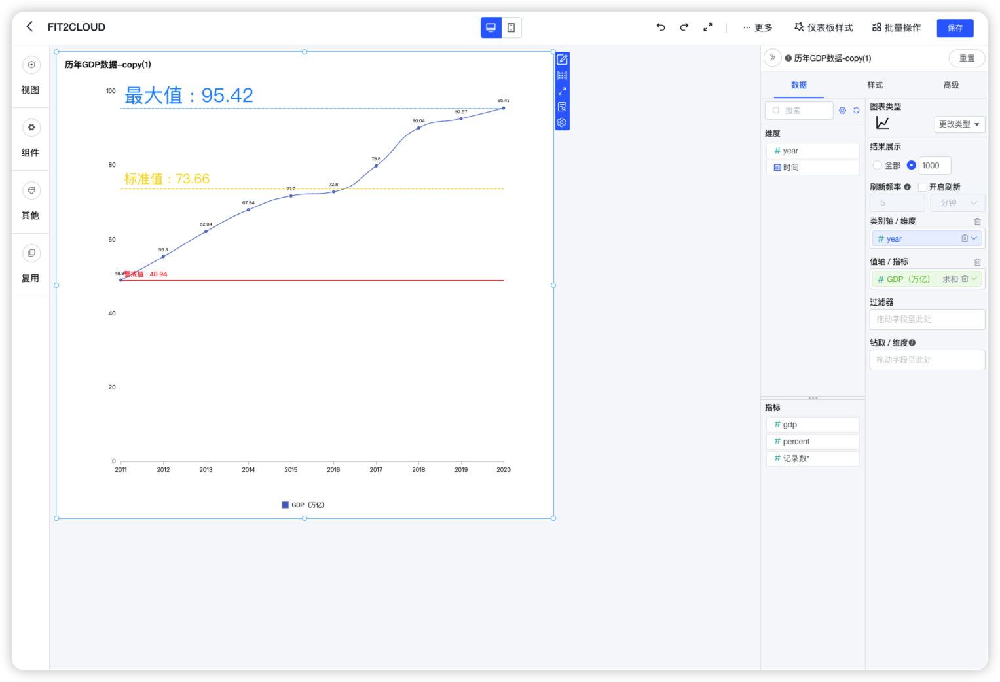{ width="900px" }

### 4.3 阈值

!!! Abstract ""
    如下图所示，切换至【高级】，点击【编辑】设置阈值，可选判断条件等于、不等于、小于、大于、小于等于、大于等于。  
    **提示：** 目前支持的视图有指标卡、仪表盘。

{ width="900px" }  
{ width="900px" }

!!! Abstract ""
    仪表盘阈值设置如下图所示，切换至【高级】，进入【阈值区间】设置，支持范围（0-100），逐级递增，若为空则不开启阈值，示例输入 30，70，表示分 3 段，分别为[0,30]，(30,70]，(70,100]。

{ width="900px" }

### 4.4 滚动

!!! Abstract ""
    DataEase v1.12.0 版本，Echarts 明细表、汇总表，AntV 明细表，汇总表支持滚动设置，支持滚动行数和时间间隔设置；  
    开启滚动后，鼠标在表格的滚动事件仍然有效，无法改变当前自动滚动的位置，即：鼠标触发滚动事件后，下次自动滚动，仍然从上一次自动滚动后的位置开始，不会从鼠标滚轮滚动后的位置开始，比如：目前自动滚动到第三行，下次应该滚动第四行，但在这之间，鼠标滚动了一下到第五行，下次自动滚动仍然为第四行。  
    **注意：** 透视表不支持滚动，明细表需设置分页模式为下拉时滚动才能生效。

{ width="900px" }