## 1 ECharts

!!! Abstract ""
    ECharts 图库属于 Apache 基金会下，一个基于 JavaScript 的开源可视化图表库。

### 1.1 表格

!!! Abstract ""
    汇总表格

    

!!! Abstract ""
    明细表格

    

### 1.2 指标卡

!!! Abstract ""

    

### 1.3 柱状图

!!! Abstract ""
    基础柱状图

    

!!! Abstract ""
    堆叠柱状图

    

!!! Abstract ""
    横向柱状图

    

!!! Abstract ""
    横向堆叠柱状图

    

### 1.4 折线图

!!! Abstract ""
    基础折线图

    

!!! Abstract ""
    堆叠折线图

    

### 1.5 组合图

!!! Abstract ""

    

### 1.6 散点图

!!! Abstract ""
    基础散点图

    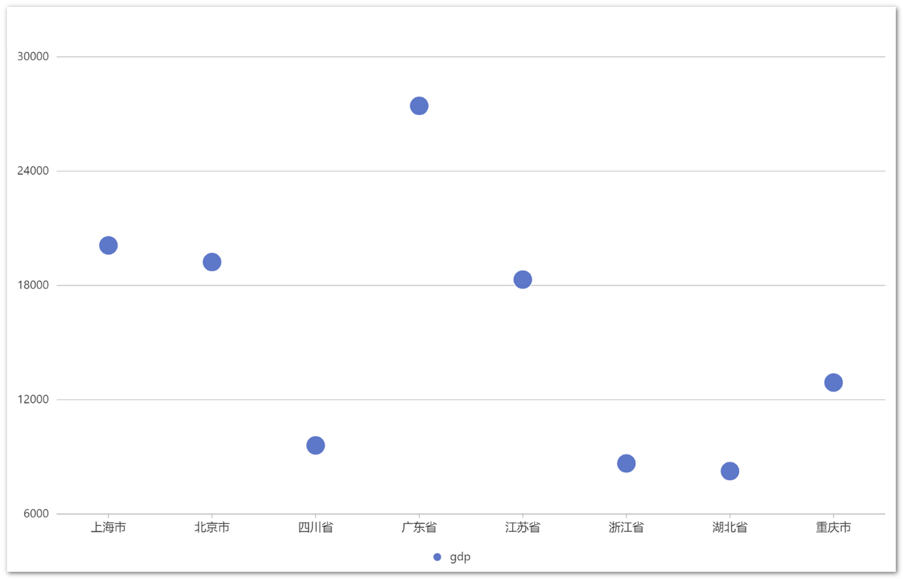

!!! Abstract ""
    气泡图

    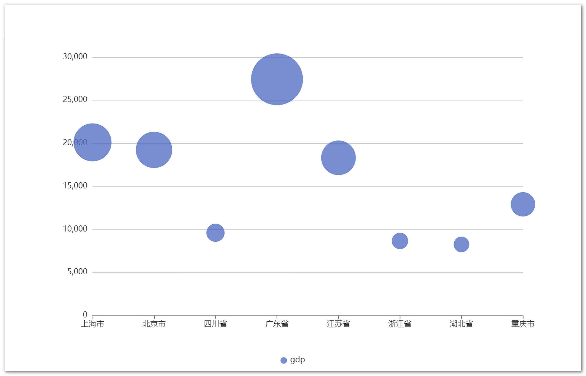

### 1.7 雷达图

!!! Abstract ""

    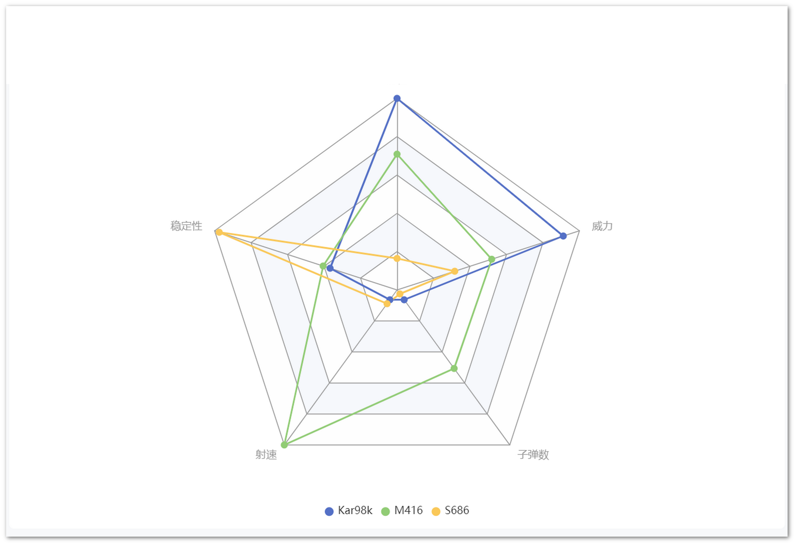

### 1.8 仪表盘

!!! Abstract ""

    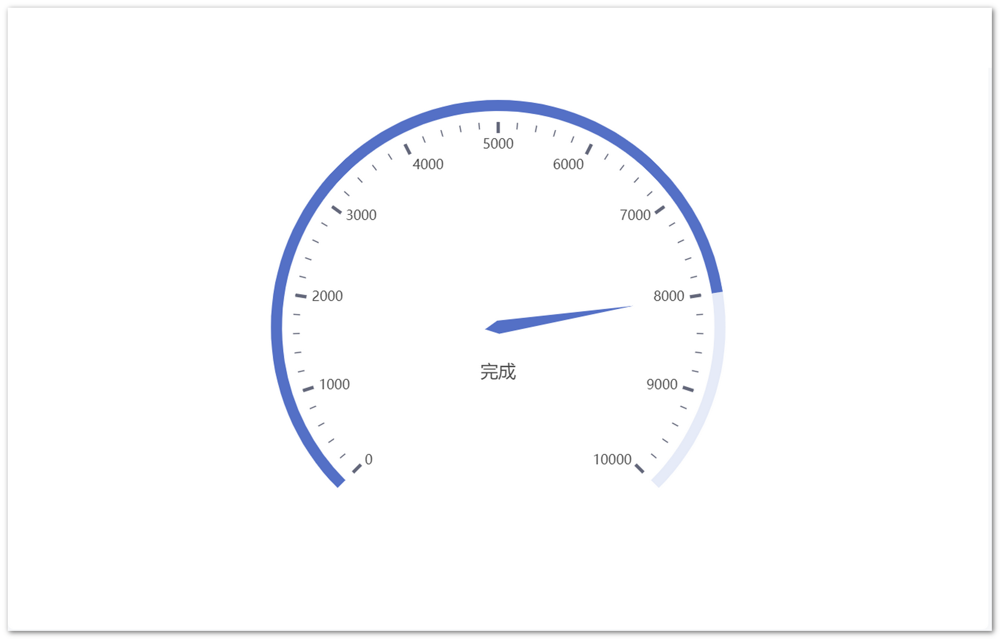

### 1.9 饼图

!!! Abstract ""
    基础饼图

    

!!! Abstract ""
    环形饼图

    

### 1.10 南丁格尔玫瑰

!!! Abstract ""

    

### 1.11 漏斗图

!!! Abstract ""

    

### 1.12 矩形树图

!!! Abstract ""

    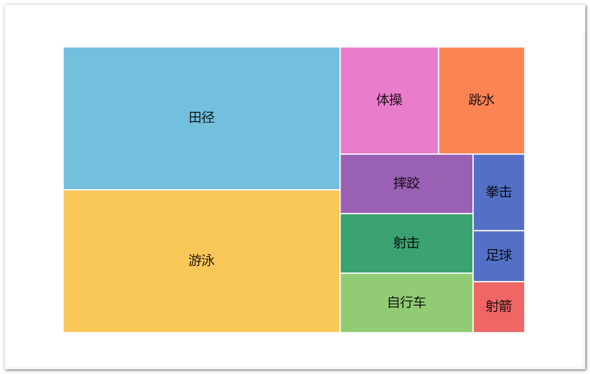

### 1.13 地图

!!! Abstract ""
    普通地图

    

!!! Abstract ""
    气泡地图

    

## 2 AntV

!!! Abstract ""
    蚂蚁集团可视化团队下一款开源的图表库。

### 2.1 表格

!!! Abstract ""
    明细表格

    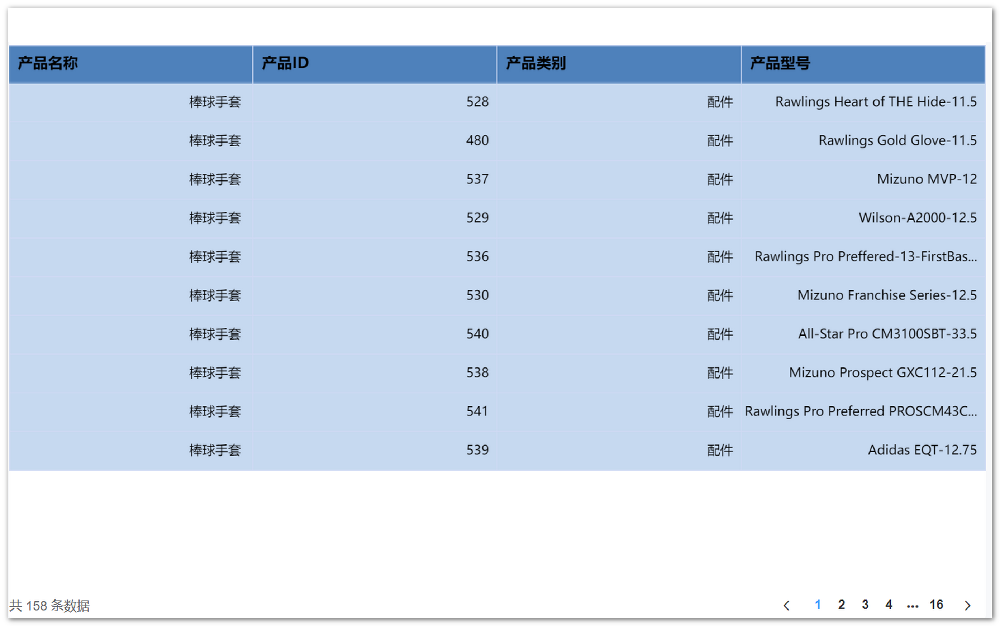

!!! Abstract ""
    汇总表格

    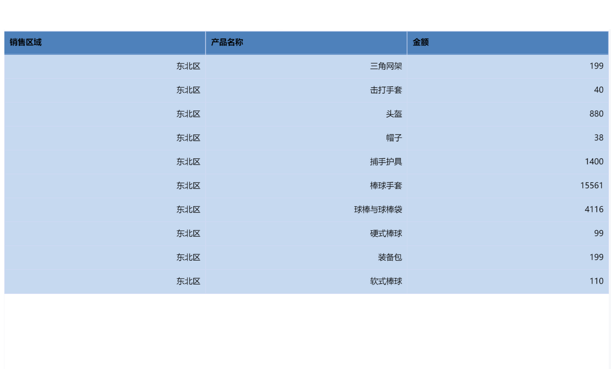

!!! Abstract ""
    透视表

    

### 2.2 指标卡

!!! Abstract ""

    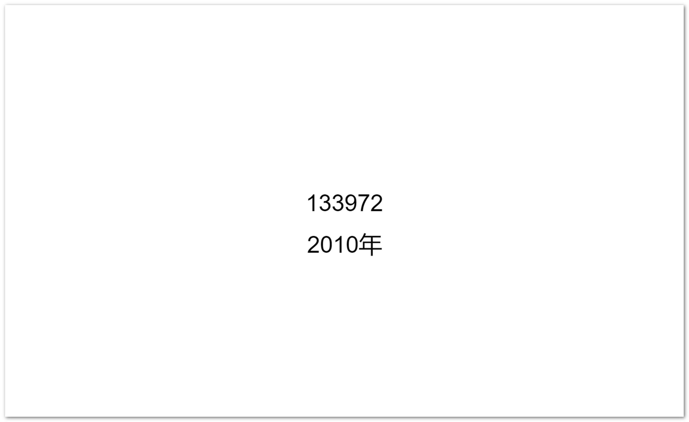

### 2.3 柱状图

!!! Abstract ""
    基础柱状图

    

!!! Abstract ""
    堆叠柱状图

    

!!! Abstract ""
    横向柱状图

    

!!! Abstract ""
    横向堆叠柱状图

    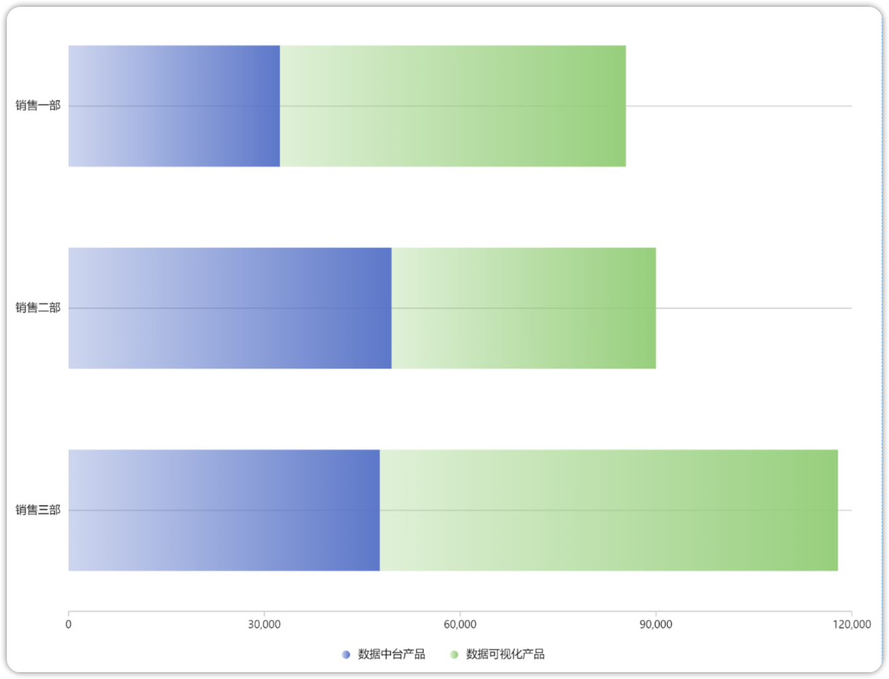

### 2.4 折线图

!!! Abstract ""
    基础折线图

    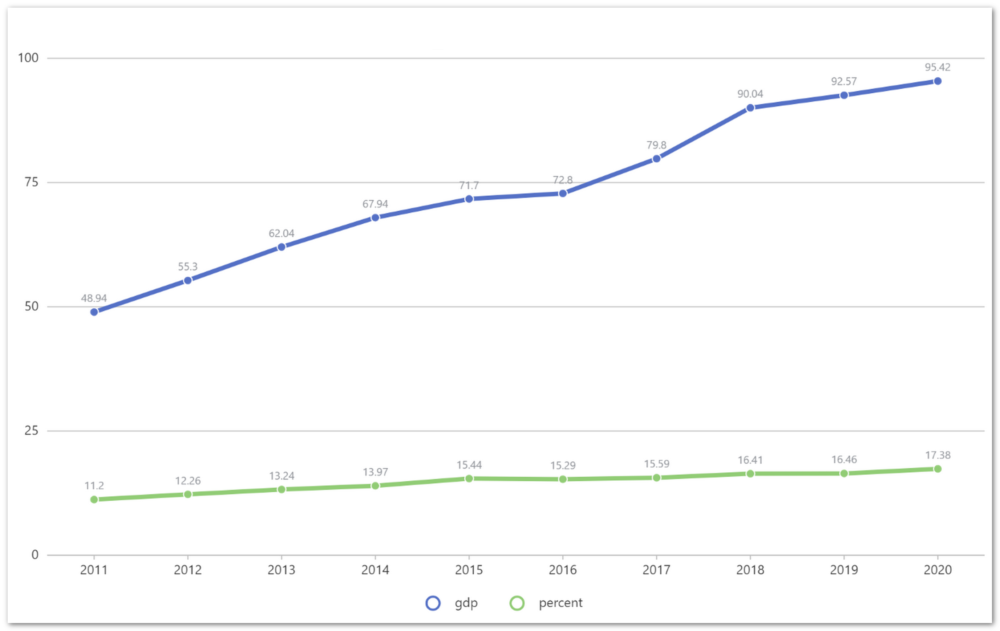

!!! Abstract ""
    堆叠折线图

    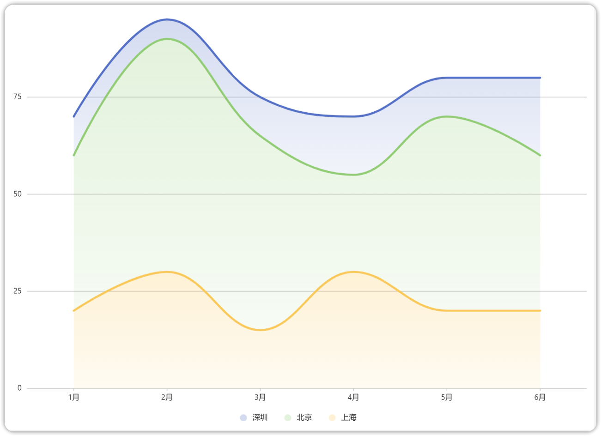

### 2.5 散点图

!!! Abstract ""
    基础散点图

    

!!! Abstract ""
    气泡图

    

### 2.6 雷达图

!!! Abstract ""

    

### 2.7 仪表盘

!!! Abstract ""

    

### 2.8 饼图

!!! Abstract ""
    基础饼图

    

!!! Abstract ""
    环形饼图

    

### 2.9 南丁格尔玫瑰

!!! Abstract ""

    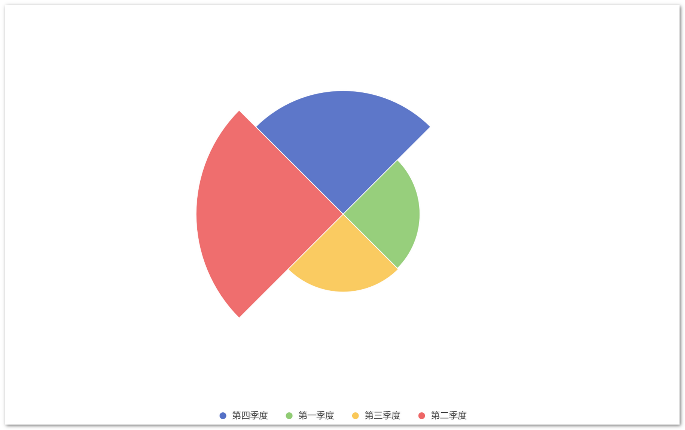

### 2.10 漏斗图

!!! Abstract ""

    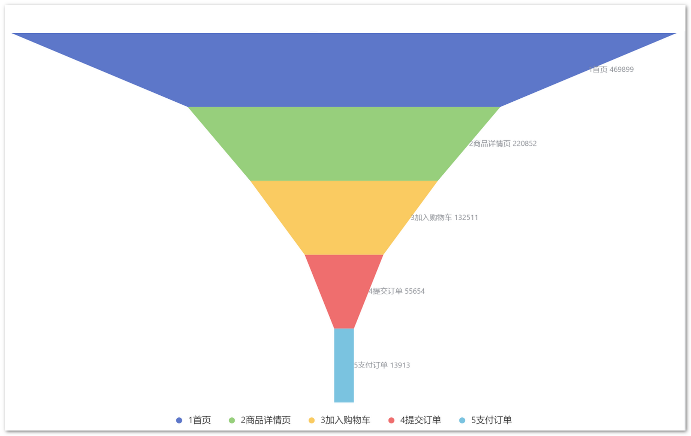

### 2.11 矩形树图

!!! Abstract ""

    

### 2.12 瀑布图

!!! Abstract ""

    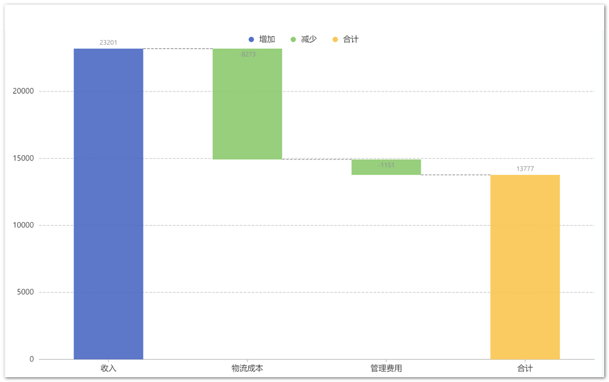

### 2.13 水波图

!!! Abstract ""

    

### 2.14 词云图

!!! Abstract ""

    