## 1 权限介绍

!!! Abstract ""
    支持"按用户配置权限"和"按资源配置权限"两种配置权限类型，下图介绍"按用户配置权限"；  
    支持"组织"、"角色"、"用户"三种维度配置权限，最终用户所具备的权限为所在组织、所拥有的角色及用户本身的权限之和；  
    粒度包括数据源、数据集、仪表板、菜单和操作，粒度对应的权限类型有"使用"、"管理"、"授权"、"行列权限"、"查看"、"导出" 6 种。

    **提示：** 不同粒度拥有的权限类型是不同的，例如，数据集拥有"使用"、"管理"、"授权"、"行列权限"权限类型，而仪表板粒度拥有"查看"、"导出"、"管理"、"授权"权限类型。

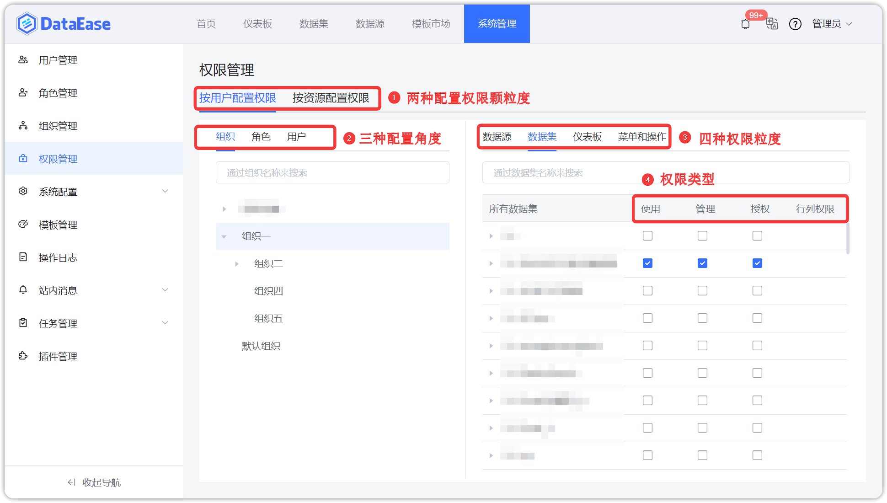{ width="900px" }

!!! Abstract ""
    支持"按用户配置权限"和"按资源配置权限"两种配置权限类型，下图介绍"按资源配置权限"；  
    支持"数据源"、"数据集"、"仪表板"、"菜单和操作"
    四种维度配置权限。最终用户所具备的权限为数据源、数据集、仪表板、菜单和操作配置的权限之和；  
    粒度包括具体的"组织"、"角色"、"用户"三种维度配置权限，权限类型分为"使用"、"管理"、"授权"、"行列权限"、"查看"、"导出" 6 种维度。

    **提示：** 不同维度拥有的权限类型内容不同，例如，数据集拥有"使用"、"管理"、"授权"、"行列权限"权限类型，而数据源拥有"使用"、"管理"、"授权"权限类型。

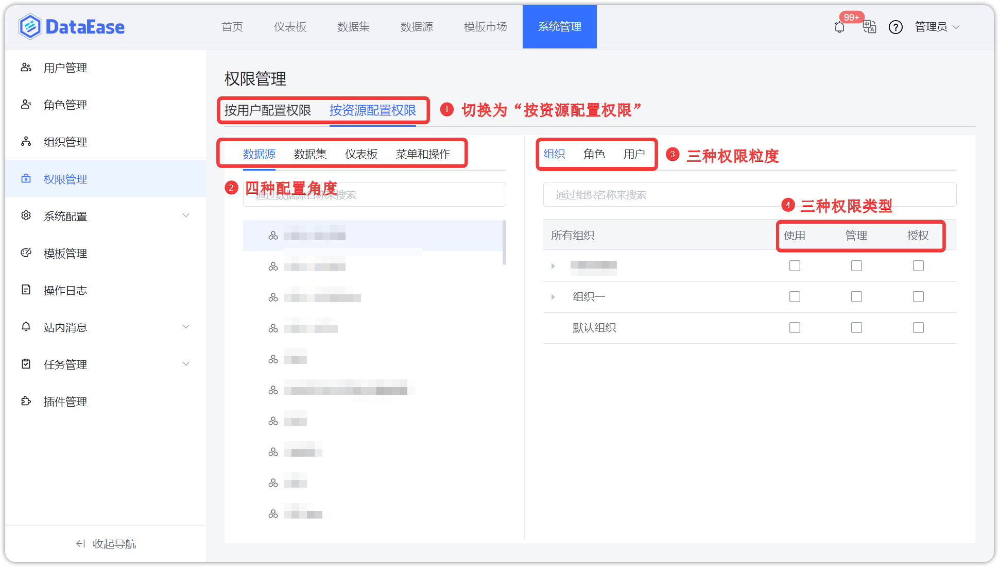{ width="900px" }

## 2 权限搜索

### 2.1 权限维度搜索

!!! Abstract ""
    在权限配置界面，各类信息均支持搜索，例如下图为搜索组织信息。

    **提示：** 其他维度的搜索，如"角色"、"用户"的搜索可参考搜索组织的步骤。

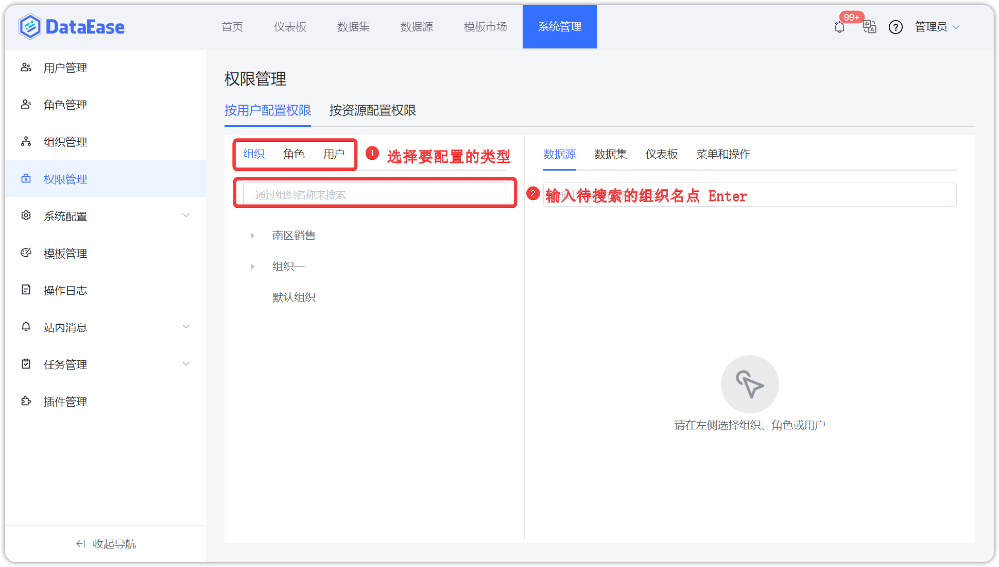{ width="900px" }

### 2.2 权限类型搜索

!!! Abstract ""
    下图为搜索某一权限粒度信息。

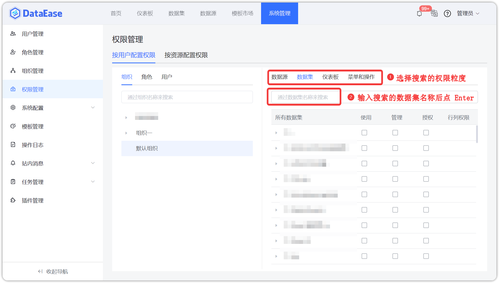{ width="900px" }

## 3 行列权限

!!! Abstract ""

    "行列权限"是数据集的权限类型之一，对行列权限的设置可以达到针对同一个数据集数据，不同的维度能查看对应权限的数据资源的目的；  
    "行权限"是对行数据的权限进行不同维度的重新分配，例如，可以通过行权限的配置，使"运维部门"员工仅能查看运维相关的数据；  
    "列权限"是对列数据的过滤，包括对列数据的"禁用"和"脱敏"操作。配置"禁用"后的整列，字段名和数据都不会被看见；"脱敏"后的列数据，能看见字段名，数据会被以 "******" 展示；  
    "行列权限白名单"，是指白名单中的人员不受该规则限制，白名单可添加多人。

### 3.1 行权限

!!! Abstract ""  
    系统支持从 4 种不同的维度配置行权限（维度包括"组织"、"角色"、"用户"、"系统变量"）；  
    其中"系统变量"是：数据集管理员通过对"用户 ID"、"用户名"、"用户邮件"、"用户来源"、"用户角色"、"组织"等常见系统变量的配置，使数据集数据与系统内置数据建立联系，可以实现轻松快捷地实现不同的用户访问各自所属的数据资源。

!!! Abstract ""   
    下面以给"仪表板大赛"角色配置"冬奥会奖牌榜-Sheet2"数据集的行权限（权限范围为仅允许查看"国家"是"瑞典"的数据）为例；  
    首先展示"冬奥会奖牌榜-Sheet2"数据集的人员角色信息和原始数据。

{ width="900px" }

{ width="900px" }

!!! Abstract ""    
    配置行权限的操作如下。

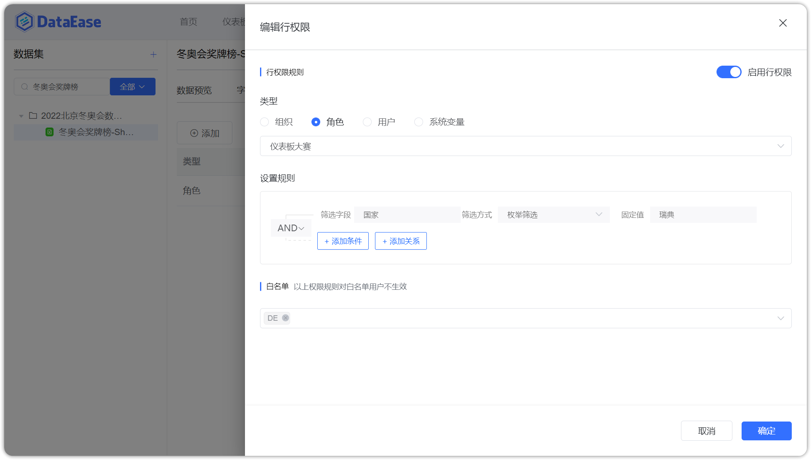{ width="900px" }

!!! Abstract ""    
    下面展示给"仪表板大赛"角色配置"冬奥会奖牌榜-Sheet2"数据集的行权限成功后的结果，用户"飞致云"拥有"仪表板大赛"角色，登录后只能看到"国家"是"瑞典"的数据。

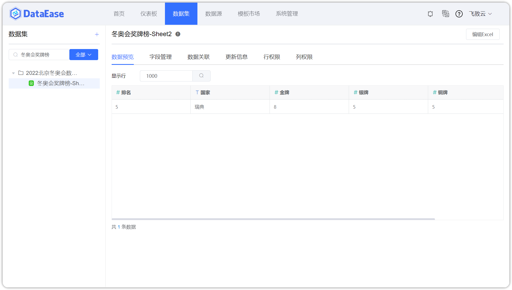{ width="900px" }

!!! Abstract ""    
    用户"DE"拥有"仪表板大赛"角色，但属于白名单中的人员，登录后能看到所有数据。

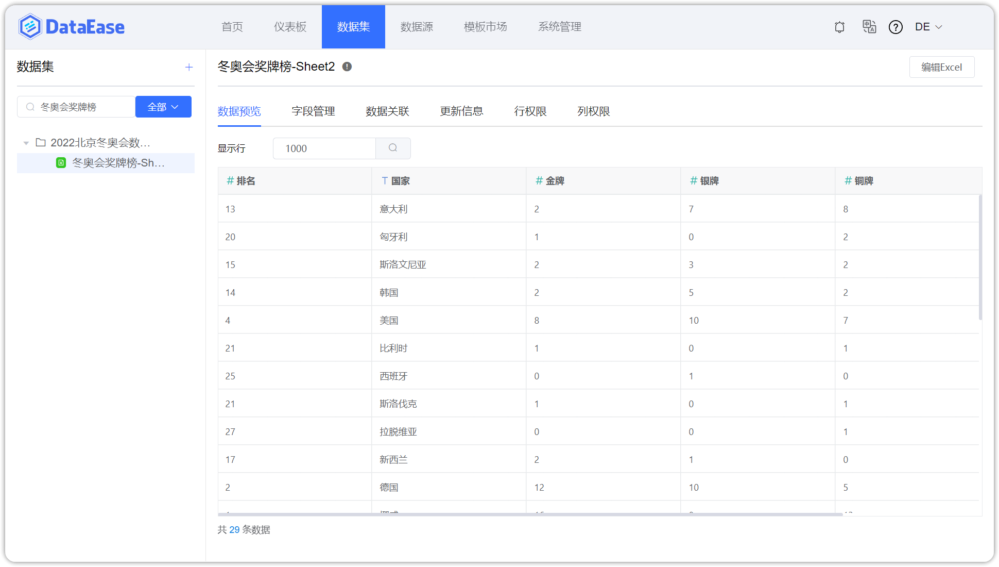{ width="900px" }

### 3.2 列权限

!!! Abstract ""    
    下面以给"普通员工"角色配置"冬奥会奖牌榜-Sheet2"数据集的列权限（把"排名"列数据脱敏）为例；  
    首先展示"冬奥会奖牌榜-Sheet2"数据集的人员角色信息和原始数据。

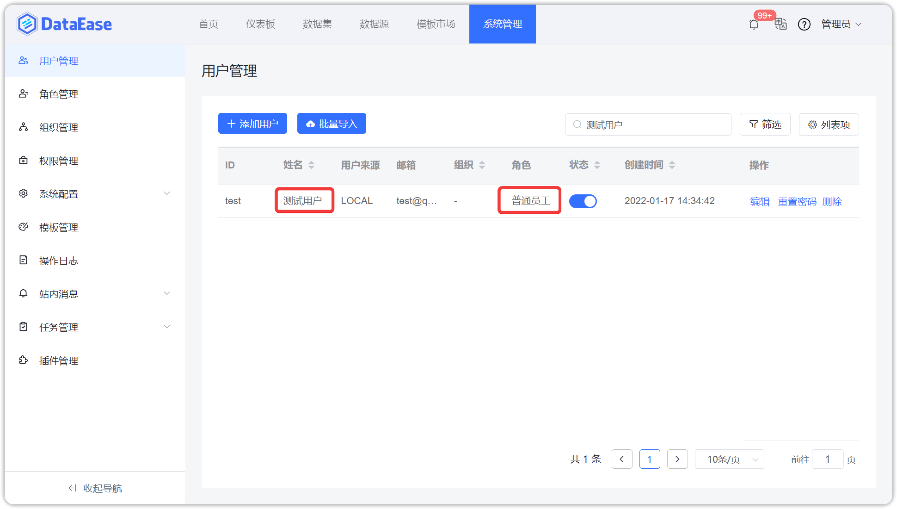{ width="900px" }
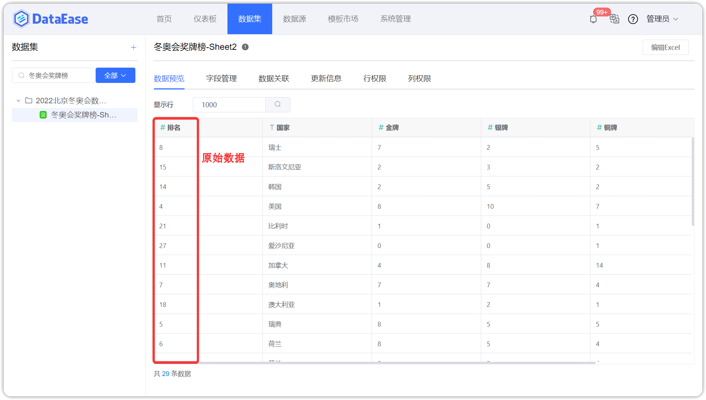{ width="900px" }

!!! Abstract ""    
    配置列权限的操作如下。

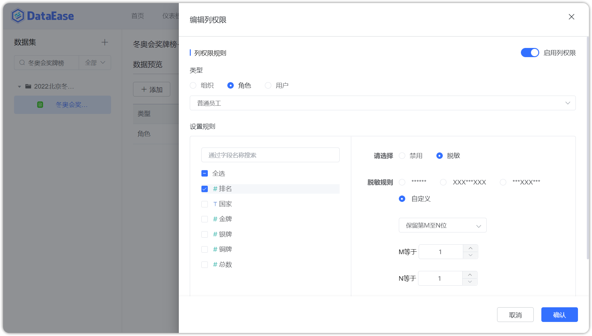{ width="900px" }

!!! Abstract ""    
    下面展示给"普通员工"角色配置"冬奥会奖牌榜-Sheet2"数据集的列权限成功后的结果，用户"测试用户"拥有"普通员工"角色，登录后能看到脱敏后的"排名"数据。

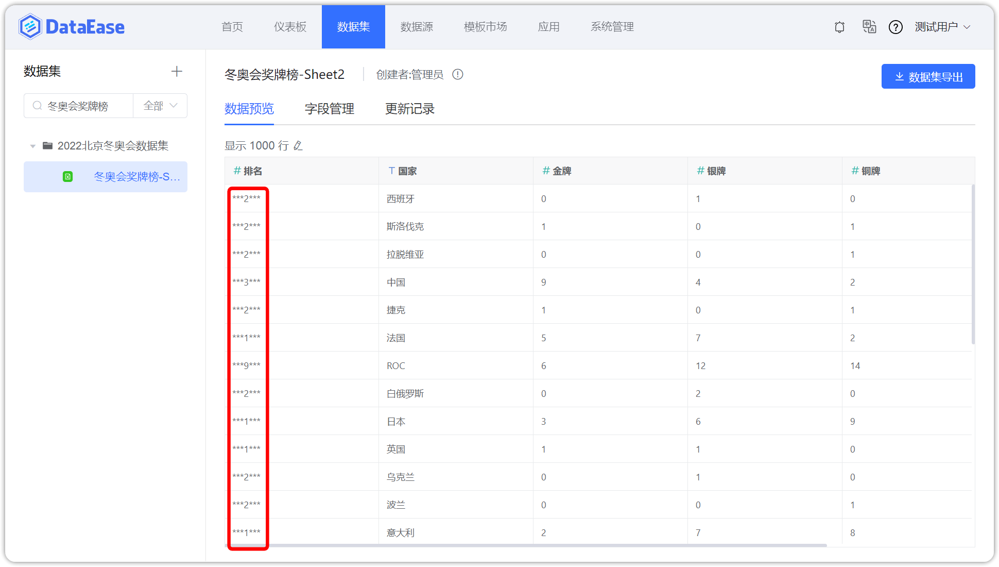{ width="900px" }

!!! Abstract ""    
    用户"DE"拥有"普通员工"角色，但属于白名单中的人员，登录后能看到原始的“排名”数据。

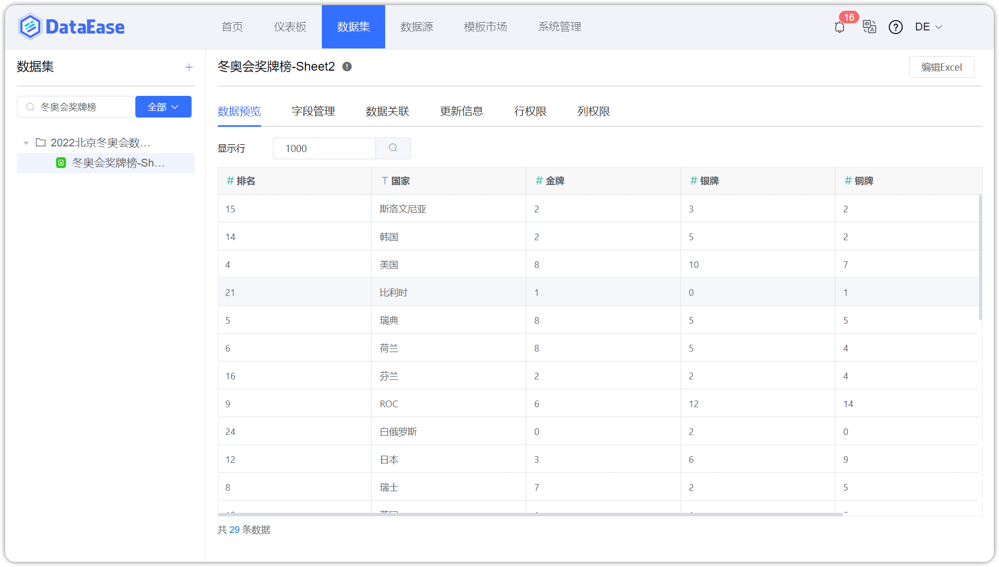{ width="900px" }

!!! Abstract ""   
    支持相对复杂的脱敏规则；  
    脱敏规则在多条列规则之间可能会有冲突，比如组织、角色、用户三个层面都对同一个数据集的列进行了脱敏规则的设置；  
    系统设定了一个优先级：用户 > 角色 > 组织。  
    下面以给"这个是测试用户"配置有普通员工角色"冬奥会奖牌榜-Sheet2"数据集的列权限（把"排名"列数据脱敏）为例，展示脱敏规则优先级用户 > 角色 ，配置列权限的操作如下。

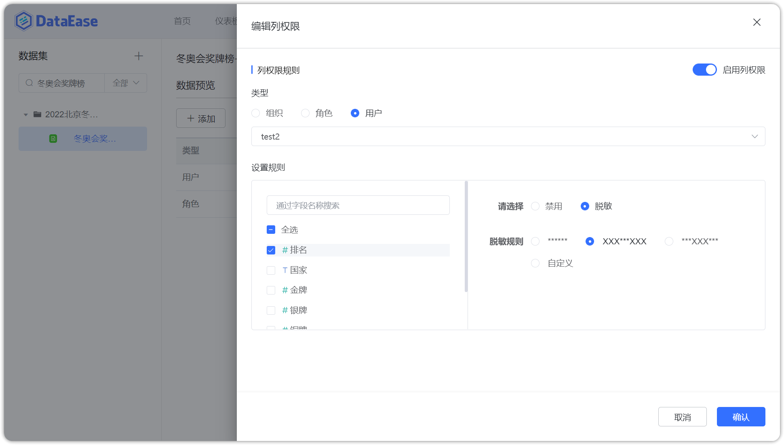{ width="900px" }

!!! Abstract ""    
    下面展示给"这个是测试用户"用户配置"冬奥会奖牌榜-Sheet2"数据集的列权限成功后的结果，用户"这个是测试用户"拥有"普通员工"角色，登录后则是能看到脱敏为 "XXX***XXX" 后的"排名"数据。

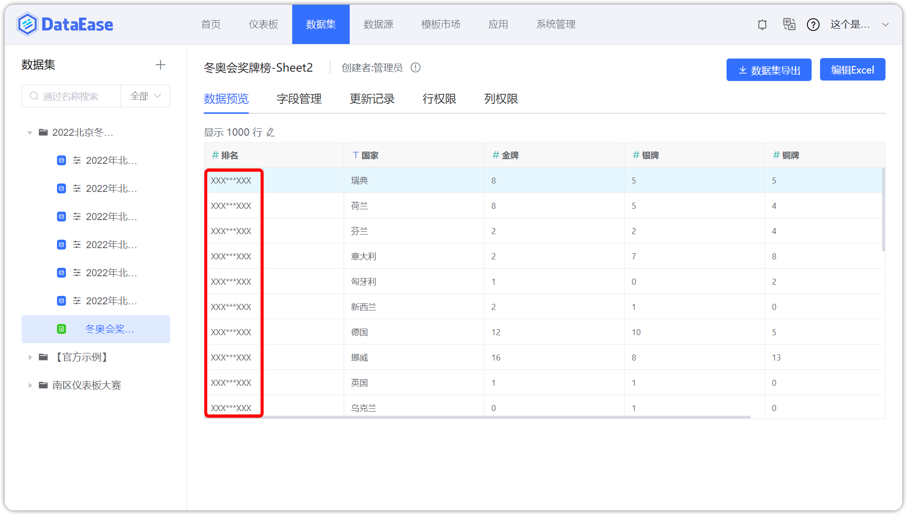{ width="900px" }

## 4 调整权限

!!! Abstract ""
    可以通过点击图中的按钮来开启或关闭权限。可以分别对不同的维度配置不同的权限类型。

    **提示：** 下层权限会跟随上层的变更而批量变更，例如当开启和关闭"组织一"的权限时，下层的"组织二"会自动开启和关闭权限。

{ width="900px" }

!!! Abstract ""
    下面以给"飞致云"用户配置开放【模板市场】菜单为例；  
    如下图所示，先以管理员身份登录系统。

{ width="900px" }

!!! Abstract ""
    以"飞致云"用户登录系统，并在【系统管理】的【系统参数】中显示模板市场。

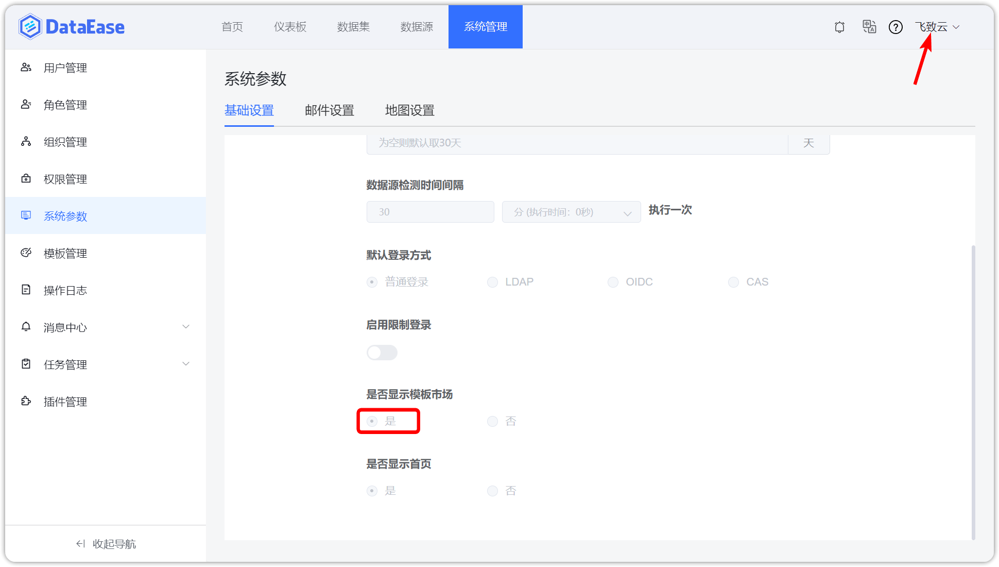{ width="900px" }

!!! Abstract ""
    以管理员的身份登录系统，在【权限管理】中为"飞致云"用户开放模板市场菜单。

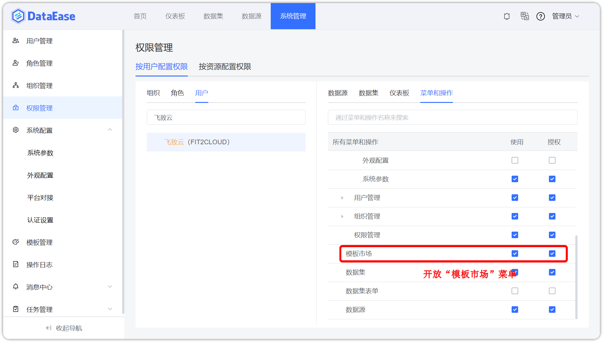{ width="900px" }

## 5 查看权限

!!! Abstract ""
    用户列表支持同时显示用户姓名与ID，系统支持查看用户最终权限，灰色勾选表示当前用户的权限来自其所属组织或角色，蓝色表示权限为当前用户直接被授权。鼠标移动到灰色状态勾选框上，会展示权限来自的组织和角色信息，弹框中也可独自为该用户进行授权。

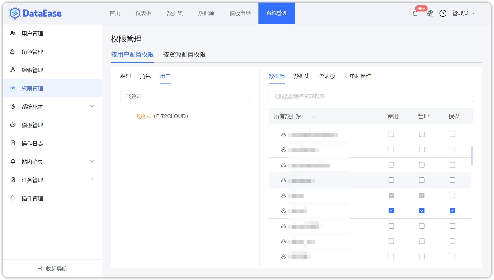{ width="900px" }